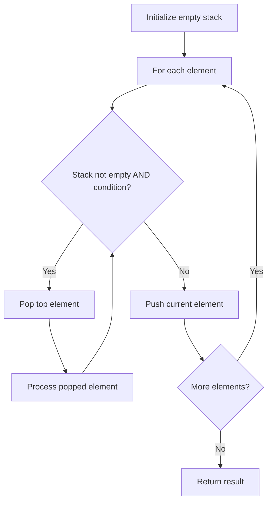

# Problem 1006: Clumsy Factorial

**Difficulty:** Medium  
**Tags:** Math, Stack, Simulation  
**Pattern:** Stack  
**Link:** [leetcode.com/problems/clumsy-factorial](https://leetcode.com/problems/clumsy-factorial/)

## Description

The **factorial** of a positive integer `n` is the product of all positive integers less than or equal to `n`.

	- For example, `factorial(10) = 10 * 9 * 8 * 7 * 6 * 5 * 4 * 3 * 2 * 1`.

We make a **clumsy factorial** using the integers in decreasing order by swapping out the multiply operations for a fixed rotation of operations with multiply `'*'`, divide `'/'`, add `'+'`, and subtract `'-'` in this order.

	- For example, `clumsy(10) = 10 * 9 / 8 + 7 - 6 * 5 / 4 + 3 - 2 * 1`.

However, these operations are still applied using the usual order of operations of arithmetic. We do all multiplication and division steps before any addition or subtraction steps, and multiplication and division steps are processed left to right.

Additionally, the division that we use is floor division such that `10 * 9 / 8 = 90 / 8 = 11`.

Given an integer `n`, return *the clumsy factorial of *`n`.

 

Example 1:

```

**Input:** n = 4
**Output:** 7
**Explanation:** 7 = 4 * 3 / 2 + 1

```

Example 2:

```

**Input:** n = 10
**Output:** 12
**Explanation:** 12 = 10 * 9 / 8 + 7 - 6 * 5 / 4 + 3 - 2 * 1

```

 

**Constraints:**

	- `1 <= n <= 10^4`

## Approach: Stack

Use a stack (LIFO) to process elements. Push elements when they might be needed later; pop when a matching or resolving condition is found. Common uses: parentheses matching, expression evaluation, next greater element.

## Pseudocode

```
1. Initialize empty stack
2. For each element:
   a. While stack is not empty and condition met:
      - Pop and process top element
   b. Push current element onto stack
3. Process remaining elements in stack if needed
4. Return result
```

## Algorithm Flow



## Complexity Analysis

- **Time:** O(n)
- **Space:** O(n)

## Solution (Python3)

```python
class Solution:
    def clumsy(self, n: int) -> int:
        # Stack-based approach - O(n) time
        stack = []
        for ch in n:
            if stack and self._matches(stack[-1], ch):
                stack.pop()
            else:
                stack.append(ch)
        return len(stack) == 0 if isinstance(0, bool) else stack

    def _matches(self, a, b):
        pairs = {'(': ')', '[': ']', '{': '}'}
        return pairs.get(a) == b
```

## Solution (C++)

```cpp
#include <stack>
#include <string>
#include <unordered_map>
#include <vector>
using namespace std;

class Solution {
public:
    int clumsy(int n) {
        // Stack-based approach - O(n) time
        stack<char> st;
        unordered_map<char, char> pairs = {{'(', ')'}, {'[', ']'}, {'{', '}'}};
        for (char ch : n) {
            if (!st.empty() && pairs.count(st.top()) && pairs[st.top()] == ch) {
                st.pop();
            } else {
                st.push(ch);
            }
        }
        return st.empty();
    }
};
```
