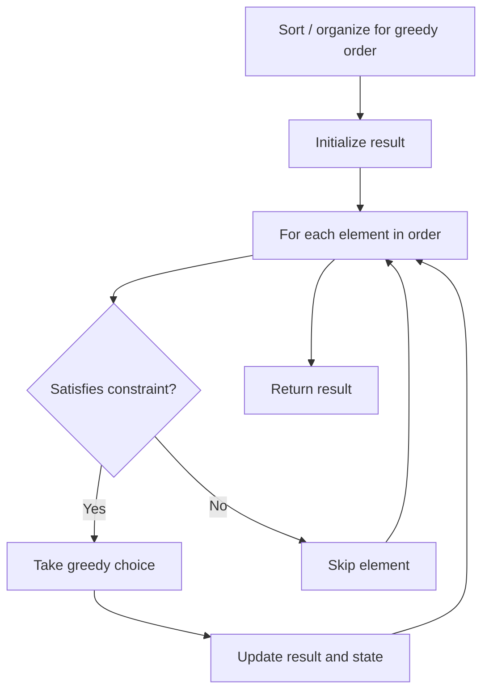

# Problem 1007: Minimum Domino Rotations For Equal Row

**Difficulty:** Medium  
**Tags:** Array, Greedy  
**Pattern:** Greedy  
**Link:** [leetcode.com/problems/minimum-domino-rotations-for-equal-row](https://leetcode.com/problems/minimum-domino-rotations-for-equal-row/)

## Description

In a row of dominoes, `tops[i]` and `bottoms[i]` represent the top and bottom halves of the `i^th` domino. (A domino is a tile with two numbers from 1 to 6 - one on each half of the tile.)

We may rotate the `i^th` domino, so that `tops[i]` and `bottoms[i]` swap values.

Return the minimum number of rotations so that all the values in `tops` are the same, or all the values in `bottoms` are the same.

If it cannot be done, return `-1`.

 

Example 1:

```

**Input:** tops = [2,1,2,4,2,2], bottoms = [5,2,6,2,3,2]
**Output:** 2
**Explanation:** 
The first figure represents the dominoes as given by tops and bottoms: before we do any rotations.
If we rotate the second and fourth dominoes, we can make every value in the top row equal to 2, as indicated by the second figure.

```

Example 2:

```

**Input:** tops = [3,5,1,2,3], bottoms = [3,6,3,3,4]
**Output:** -1
**Explanation:** 
In this case, it is not possible to rotate the dominoes to make one row of values equal.

```

 

**Constraints:**

	- `2 <= tops.length <= 2 * 10^4`
	- `bottoms.length == tops.length`
	- `1 <= tops[i], bottoms[i] <= 6`

## Approach: Greedy

Make the locally optimal choice at each step, trusting it leads to a global optimum. Greedy works when the problem has the greedy-choice property and optimal substructure.

## Pseudocode

```
1. Sort or organize data for greedy ordering
2. Initialize result
3. For each element in greedy order:
   a. If element satisfies constraint:
      - Take the greedy choice
      - Update result and state
4. Return result
```

## Algorithm Flow



## Complexity Analysis

- **Time:** O(n log n)
- **Space:** O(1)

## Solution (Python3)

```python
class Solution:
    def minDominoRotations(self, tops: List[int], bottoms: List[int]) -> int:
        # Greedy approach - O(n) time
        result = 0
        curr_max = 0
        for i in range(len(tops)):
            if isinstance(tops[i], int):
                curr_max = max(curr_max, tops[i])
                result = max(result, curr_max)
            else:
                result += 1
        return result
```

## Solution (C++)

```cpp
#include <algorithm>
#include <string>
#include <vector>
using namespace std;

class Solution {
public:
    int minDominoRotations(vector<int>& tops, vector<int>& bottoms) {
        // Greedy approach - O(n) time
        int result = 0, curr_max = 0;
        for (int i = 0; i < (int)tops.size(); i++) {
            curr_max = max(curr_max, tops[i]);
            result = max(result, curr_max);
        }
        return result;
    }
};
```
