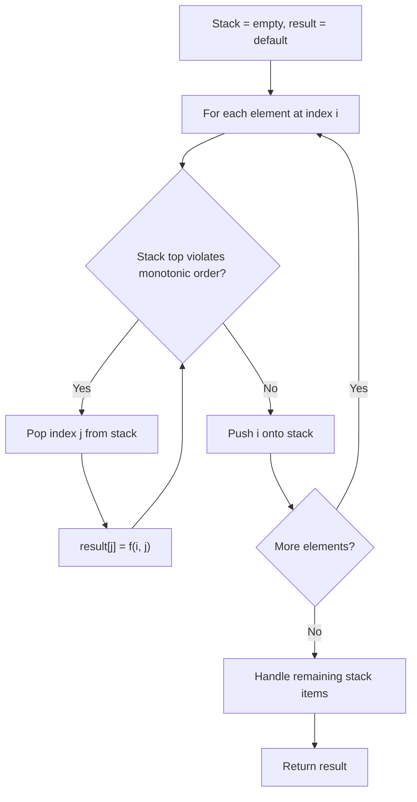
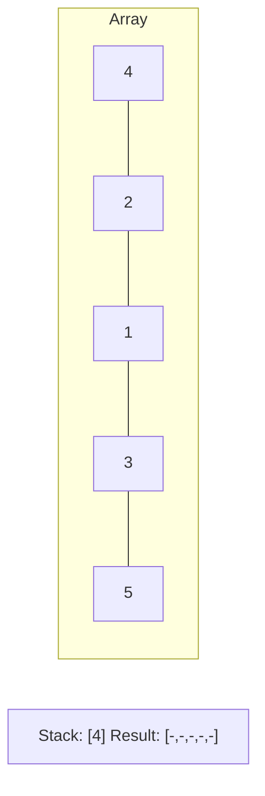
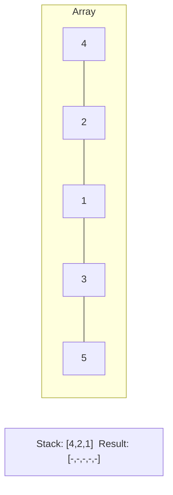
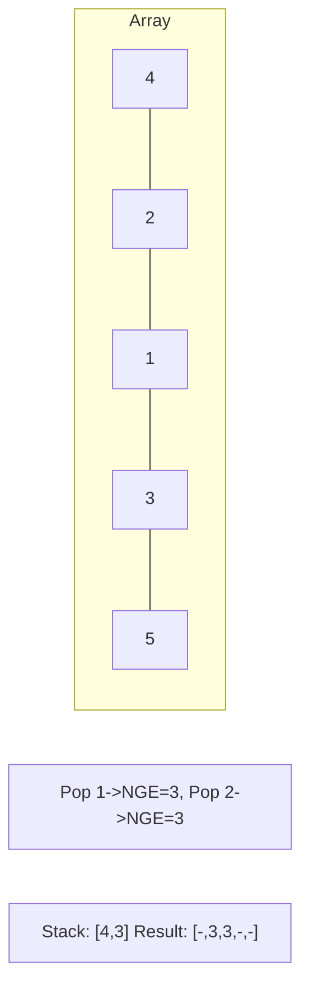
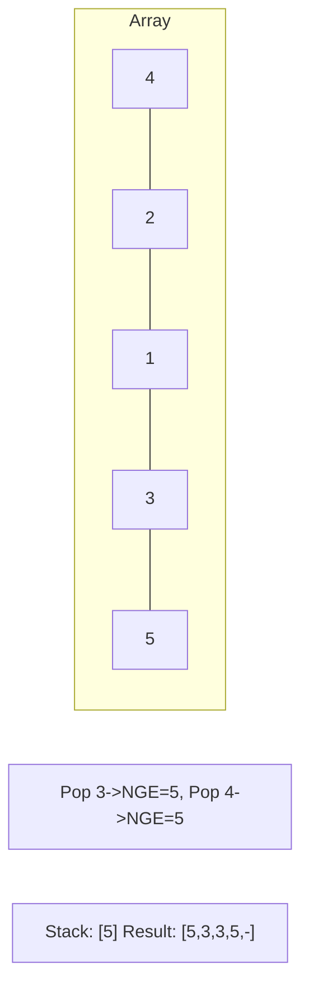

# Problem 1008: Construct Binary Search Tree from Preorder Traversal

**Difficulty:** Medium  
**Tags:** Array, Stack, Tree, Binary Search Tree, Monotonic Stack, Binary Tree  
**Pattern:** Monotonic Stack  
**Link:** [leetcode.com/problems/construct-binary-search-tree-from-preorder-traversal](https://leetcode.com/problems/construct-binary-search-tree-from-preorder-traversal/)

## Description

Given an array of integers preorder, which represents the **preorder traversal** of a BST (i.e., **binary search tree**), construct the tree and return *its root*.

It is **guaranteed** that there is always possible to find a binary search tree with the given requirements for the given test cases.

A **binary search tree** is a binary tree where for every node, any descendant of `Node.left` has a value **strictly less than** `Node.val`, and any descendant of `Node.right` has a value **strictly greater than** `Node.val`.

A **preorder traversal** of a binary tree displays the value of the node first, then traverses `Node.left`, then traverses `Node.right`.

 

Example 1:

```

**Input:** preorder = [8,5,1,7,10,12]
**Output:** [8,5,10,1,7,null,12]

```

Example 2:

```

**Input:** preorder = [1,3]
**Output:** [1,null,3]

```

 

**Constraints:**

	- `1 <= preorder.length <= 100`
	- `1 <= preorder[i] <= 1000`
	- All the values of `preorder` are **unique**.

## Approach: Monotonic Stack

Maintain a stack where elements are always in monotonic order (increasing or decreasing). When a new element violates the monotonic property, pop elements and compute results (e.g., next greater/smaller element, spans, areas).

## Pseudocode

```
1. Initialize empty stack, result array
2. For each element (index i):
   a. While stack not empty and arr[i] breaks monotonic order:
      - Pop index j from stack
      - result[j] = compute(i, j)
   b. Push i onto stack
3. Handle remaining elements in stack
4. Return result
```

## Algorithm Flow



## Visual State Transitions

**Monotonic Stack (Next Greater Element):**

**Frame 1: Process first elements**


**Frame 2: Push smaller elements**


**Frame 3: Element 3 pops 1 and 2**


**Frame 4: Element 5 pops all**



## Complexity Analysis

- **Time:** O(n)
- **Space:** O(n)

## Solution (Python3)

```python
class Solution:
    def bstFromPreorder(self, preorder: List[int]) -> Optional[TreeNode]:
        # Monotonic stack - O(n) time, O(n) space
        n = len(preorder)
        result = [0] * n
        stack = []  # indices
        for i in range(n):
            while stack and preorder[i] > preorder[stack[-1]]:
                idx = stack.pop()
                result[idx] = i - idx
            stack.append(i)
        return result
```

## Solution (C++)

```cpp
#include <stack>
#include <string>
#include <vector>
using namespace std;

class Solution {
public:
    TreeNode* bstFromPreorder(vector<int>& preorder) {
        // Monotonic stack - O(n) time, O(n) space
        int n = preorder.size();
        vector<int> result(n, 0);
        stack<int> st;
        for (int i = 0; i < n; i++) {
            while (!st.empty() && preorder[i] > preorder[st.top()]) {
                int idx = st.top(); st.pop();
                result[idx] = i - idx;
            }
            st.push(i);
        }
        return result;
    }
};
```
