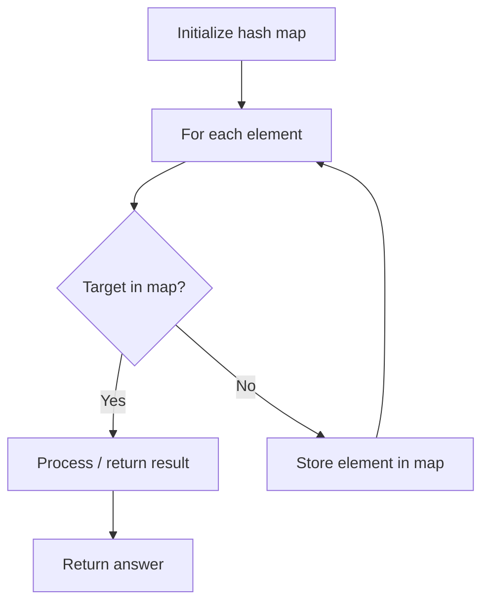

# Problem 1010: Pairs of Songs With Total Durations Divisible by 60

**Difficulty:** Medium  
**Tags:** Array, Hash Table, Counting  
**Pattern:** Hash Map Lookup  
**Link:** [leetcode.com/problems/pairs-of-songs-with-total-durations-divisible-by-60](https://leetcode.com/problems/pairs-of-songs-with-total-durations-divisible-by-60/)

## Description

You are given a list of songs where the `i^th` song has a duration of `time[i]` seconds.

Return *the number of pairs of songs for which their total duration in seconds is divisible by* `60`. Formally, we want the number of indices `i`, `j` such that `i < j` with `(time[i] + time[j]) % 60 == 0`.

 

Example 1:

```

**Input:** time = [30,20,150,100,40]
**Output:** 3
**Explanation:** Three pairs have a total duration divisible by 60:
(time[0] = 30, time[2] = 150): total duration 180
(time[1] = 20, time[3] = 100): total duration 120
(time[1] = 20, time[4] = 40): total duration 60

```

Example 2:

```

**Input:** time = [60,60,60]
**Output:** 3
**Explanation:** All three pairs have a total duration of 120, which is divisible by 60.

```

 

**Constraints:**

	- `1 <= time.length <= 6 * 10^4`
	- `1 <= time[i] <= 500`

## Approach: Hash Map Lookup

Use a hash map (dictionary) to store elements for O(1) lookup. Iterate through the input, checking membership or counting frequencies in the map.

## Pseudocode

```
1. Initialize hash map
2. Iterate through elements:
   a. Check if target/complement exists in map
   b. If found: process result
   c. Otherwise: store element in map
3. Return result
```

## Algorithm Flow



## Complexity Analysis

- **Time:** O(n)
- **Space:** O(n)

## Solution (Python3)

```python
class Solution:
    def numPairsDivisibleBy60(self, time: List[int]) -> int:
        # Hash map approach - O(n) time, O(n) space
        seen = {}
        for i, val in enumerate(time):
            complement = time - val
            if complement in seen:
                return [seen[complement], i]
            seen[val] = i
        return 0
```

## Solution (C++)

```cpp
#include <string>
#include <unordered_map>
#include <vector>
using namespace std;

class Solution {
public:
    int numPairsDivisibleBy60(vector<int>& time) {
        // Hash map approach - O(n) time, O(n) space
        unordered_map<int, int> seen;
        for (int i = 0; i < time.size(); i++) {
            int complement = time - time[i];
            if (seen.count(complement)) {
                return {seen[complement], i};
            }
            seen[time[i]] = i;
        }
        return 0;
    }
};
```
