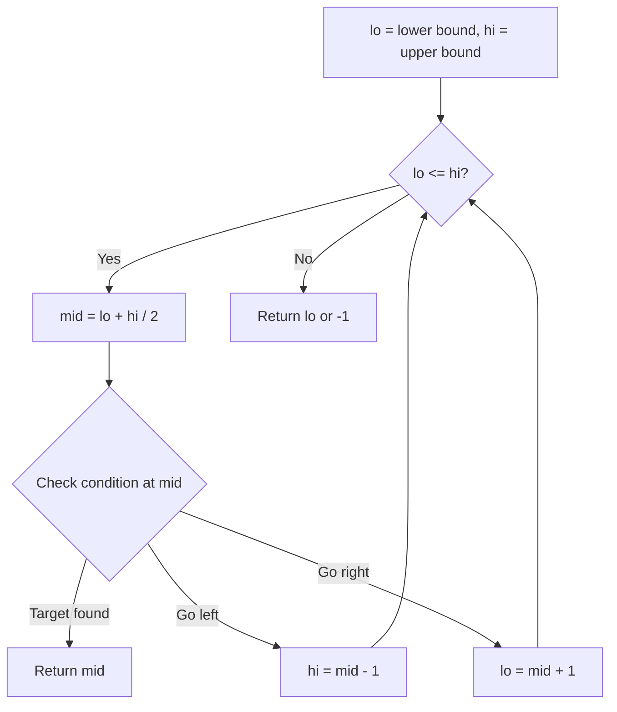
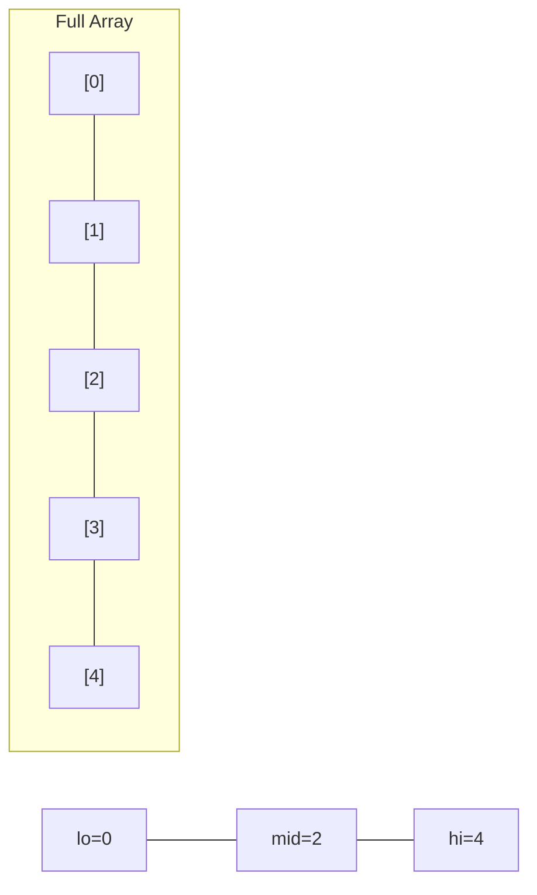
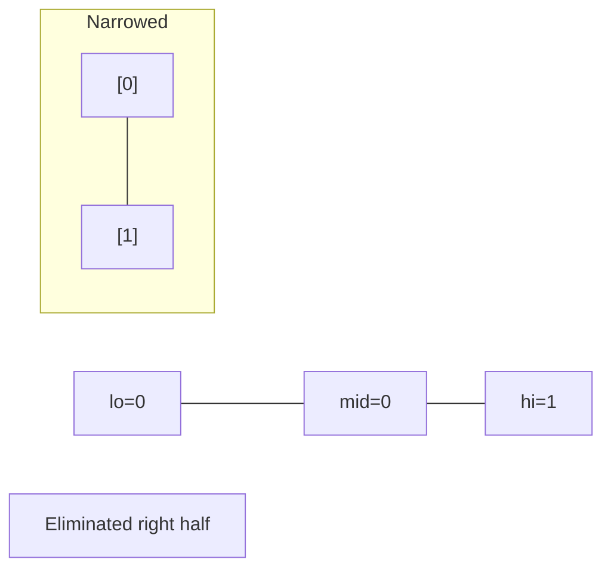
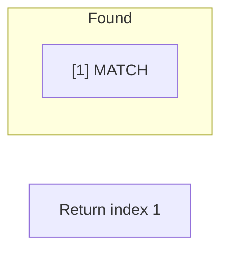

# Problem 1011: Capacity To Ship Packages Within D Days

**Difficulty:** Medium  
**Tags:** Array, Binary Search  
**Pattern:** Binary Search on Answer  
**Link:** [leetcode.com/problems/capacity-to-ship-packages-within-d-days](https://leetcode.com/problems/capacity-to-ship-packages-within-d-days/)

## Description

A conveyor belt has packages that must be shipped from one port to another within `days` days.

The `i^th` package on the conveyor belt has a weight of `weights[i]`. Each day, we load the ship with packages on the conveyor belt (in the order given by `weights`). We may not load more weight than the maximum weight capacity of the ship.

Return the least weight capacity of the ship that will result in all the packages on the conveyor belt being shipped within `days` days.

 

Example 1:

```

**Input:** weights = [1,2,3,4,5,6,7,8,9,10], days = 5
**Output:** 15
**Explanation:** A ship capacity of 15 is the minimum to ship all the packages in 5 days like this:
1st day: 1, 2, 3, 4, 5
2nd day: 6, 7
3rd day: 8
4th day: 9
5th day: 10

Note that the cargo must be shipped in the order given, so using a ship of capacity 14 and splitting the packages into parts like (2, 3, 4, 5), (1, 6, 7), (8), (9), (10) is not allowed.

```

Example 2:

```

**Input:** weights = [3,2,2,4,1,4], days = 3
**Output:** 6
**Explanation:** A ship capacity of 6 is the minimum to ship all the packages in 3 days like this:
1st day: 3, 2
2nd day: 2, 4
3rd day: 1, 4

```

Example 3:

```

**Input:** weights = [1,2,3,1,1], days = 4
**Output:** 3
**Explanation:**
1st day: 1
2nd day: 2
3rd day: 3
4th day: 1, 1

```

 

**Constraints:**

	- `1 <= days <= weights.length <= 5 * 10^4`
	- `1 <= weights[i] <= 500`

## Approach: Binary Search on Answer

Binary search on ship capacity. For each capacity, check if packages fit in 'days' days.

## Pseudocode

```
1. lo = lower_bound, hi = upper_bound
2. While lo <= hi (or lo < hi):
   a. mid = (lo + hi) // 2
   b. If condition(mid) is satisfied: record answer, search left half
   c. Else: search right half
3. Return answer
```

## Algorithm Flow



## Visual State Transitions

**Binary Search Step-by-Step:**

**Frame 1: Initial search space**


**Frame 2: Compare mid, narrow search**


**Frame 3: Found target**



## Complexity Analysis

- **Time:** O(n log S)
- **Space:** O(1)

## Solution (Python3)

```python
class Solution:
    def shipWithinDays(self, weights: list[int], days: int) -> int:
        lo, hi = max(weights), sum(weights)
        while lo < hi:
            mid = (lo + hi) // 2
            d, curr = 1, 0
            for w in weights:
                if curr + w > mid:
                    d += 1
                    curr = 0
                curr += w
            if d <= days:
                hi = mid
            else:
                lo = mid + 1
        return lo
```

## Solution (C++)

```cpp
#include <string>
#include <vector>
using namespace std;

class Solution {
public:
    int shipWithinDays(vector<int>& weights, int days) {
        // Binary search - O(log n) time, O(1) space
        int lo = 0, hi = weights.size() - 1;
        while (lo <= hi) {
            int mid = lo + (hi - lo) / 2;
            if (weights[mid] == days) {
                return mid;
            } else if (weights[mid] < days) {
                lo = mid + 1;
            } else {
                hi = mid - 1;
            }
        }
        return 0;
    }
};
```
