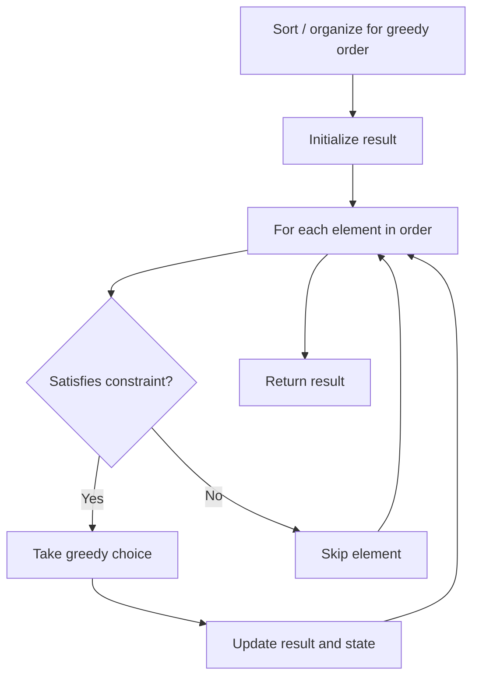

# Problem 1013: Partition Array Into Three Parts With Equal Sum

**Difficulty:** Easy  
**Tags:** Array, Greedy  
**Pattern:** Greedy  
**Link:** [leetcode.com/problems/partition-array-into-three-parts-with-equal-sum](https://leetcode.com/problems/partition-array-into-three-parts-with-equal-sum/)

## Description

Given an array of integers `arr`, return `true` if we can partition the array into three **non-empty** parts with equal sums.

Formally, we can partition the array if we can find indexes `i + 1 < j` with `(arr[0] + arr[1] + ... + arr[i] == arr[i + 1] + arr[i + 2] + ... + arr[j - 1] == arr[j] + arr[j + 1] + ... + arr[arr.length - 1])`

 

Example 1:

```

**Input:** arr = [0,2,1,-6,6,-7,9,1,2,0,1]
**Output:** true
**Explanation: **0 + 2 + 1 = -6 + 6 - 7 + 9 + 1 = 2 + 0 + 1

```

Example 2:

```

**Input:** arr = [0,2,1,-6,6,7,9,-1,2,0,1]
**Output:** false

```

Example 3:

```

**Input:** arr = [3,3,6,5,-2,2,5,1,-9,4]
**Output:** true
**Explanation: **3 + 3 = 6 = 5 - 2 + 2 + 5 + 1 - 9 + 4

```

 

**Constraints:**

	- `3 <= arr.length <= 5 * 10^4`
	- `-10^4 <= arr[i] <= 10^4`

## Approach: Greedy

Make the locally optimal choice at each step, trusting it leads to a global optimum. Greedy works when the problem has the greedy-choice property and optimal substructure.

## Pseudocode

```
1. Sort or organize data for greedy ordering
2. Initialize result
3. For each element in greedy order:
   a. If element satisfies constraint:
      - Take the greedy choice
      - Update result and state
4. Return result
```

## Algorithm Flow



## Complexity Analysis

- **Time:** O(n log n)
- **Space:** O(1)

## Solution (Python3)

```python
class Solution:
    def canThreePartsEqualSum(self, arr: List[int]) -> bool:
        # Greedy approach - O(n) time
        result = 0
        curr_max = 0
        for i in range(len(arr)):
            if isinstance(arr[i], int):
                curr_max = max(curr_max, arr[i])
                result = max(result, curr_max)
            else:
                result += 1
        return result
```

## Solution (C++)

```cpp
#include <algorithm>
#include <string>
#include <vector>
using namespace std;

class Solution {
public:
    bool canThreePartsEqualSum(vector<int>& arr) {
        // Greedy approach - O(n) time
        int result = 0, curr_max = 0;
        for (int i = 0; i < (int)arr.size(); i++) {
            curr_max = max(curr_max, arr[i]);
            result = max(result, curr_max);
        }
        return result;
    }
};
```
