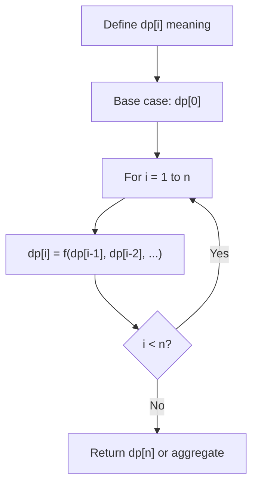
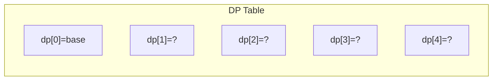
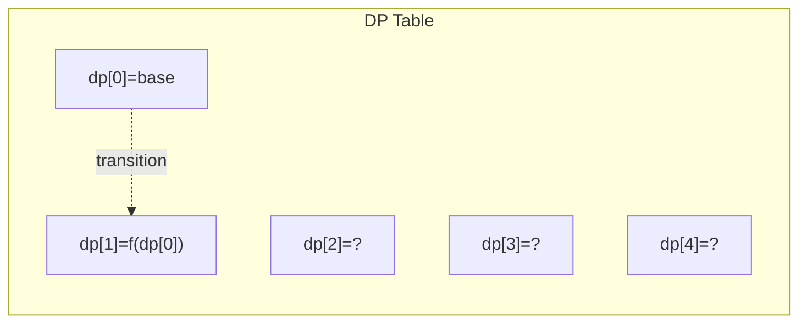
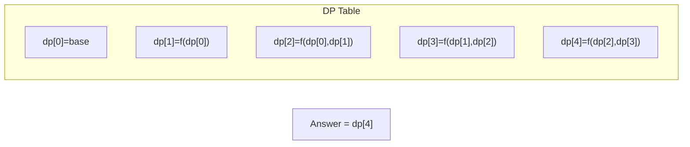

# Problem 1014: Best Sightseeing Pair

**Difficulty:** Medium  
**Tags:** Array, Dynamic Programming  
**Pattern:** Dynamic Programming (1D)  
**Link:** [leetcode.com/problems/best-sightseeing-pair](https://leetcode.com/problems/best-sightseeing-pair/)

## Description

You are given an integer array `values` where values[i] represents the value of the `i^th` sightseeing spot. Two sightseeing spots `i` and `j` have a **distance** `j - i` between them.

The score of a pair (`i < j`) of sightseeing spots is `values[i] + values[j] + i - j`: the sum of the values of the sightseeing spots, minus the distance between them.

Return *the maximum score of a pair of sightseeing spots*.

 

Example 1:

```

**Input:** values = [8,1,5,2,6]
**Output:** 11
**Explanation:** i = 0, j = 2, values[i] + values[j] + i - j = 8 + 5 + 0 - 2 = 11

```

Example 2:

```

**Input:** values = [1,2]
**Output:** 2

```

 

**Constraints:**

	- `2 <= values.length <= 5 * 10^4`
	- `1 <= values[i] <= 1000`

## Approach: Dynamic Programming (1D)

Break the problem into overlapping subproblems. Define dp[i] as the optimal value for the subproblem ending at or considering index i. Build the solution bottom-up, using previously computed dp values.

## Pseudocode

```
1. Define dp[i] = optimal value for subproblem i
2. Base case: dp[0] = initial value
3. For i from 1 to n:
   a. dp[i] = recurrence(dp[i-1], dp[i-2], ...)
4. Return dp[n] or max/min of dp
```

## Algorithm Flow



## Visual State Transitions

**1D Dynamic Programming Table Build:**

**Frame 1: Initialize base cases**


**Frame 2: Fill dp[1] from dp[0]**


**Frame 3: Fill remaining cells**



## Complexity Analysis

- **Time:** O(n)
- **Space:** O(n)

## Solution (Python3)

```python
class Solution:
    def maxScoreSightseeingPair(self, values: List[int]) -> int:
        # Dynamic programming (1D) - O(n) time, O(n) space
        if not values:
            return 0
        n = len(values) if isinstance(values, list) else values
        dp = [0] * (n + 1)
        dp[0] = 1  # base case
        for i in range(1, n + 1):
            dp[i] = dp[i-1]  # transition (customize per problem)
            if i >= 2:
                dp[i] += dp[i-2]
        return dp[n]
```

## Solution (C++)

```cpp
#include <string>
#include <vector>
using namespace std;

class Solution {
public:
    int maxScoreSightseeingPair(vector<int>& values) {
        // Dynamic programming (1D) - O(n) time, O(n) space
        int n = values;
        if (n <= 0) return 0;
        vector<int> dp(n + 1, 0);
        dp[0] = 1;
        for (int i = 1; i <= n; i++) {
            dp[i] = dp[i-1];
            if (i >= 2) dp[i] += dp[i-2];
        }
        return dp[n];
    }
};
```
