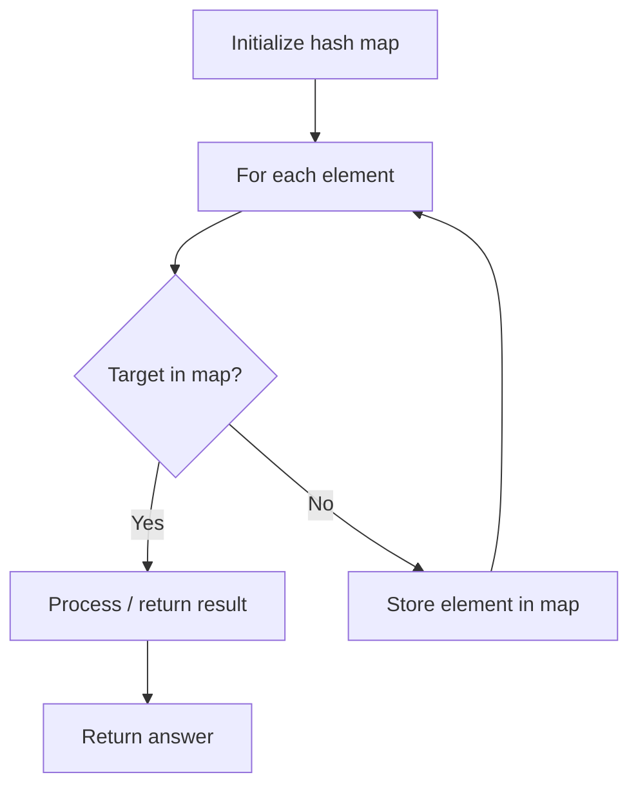

# Problem 1015: Smallest Integer Divisible by K

**Difficulty:** Medium  
**Tags:** Hash Table, Math  
**Pattern:** Hash Map Lookup  
**Link:** [leetcode.com/problems/smallest-integer-divisible-by-k](https://leetcode.com/problems/smallest-integer-divisible-by-k/)

## Description

Given a positive integer `k`, you need to find the **length** of the **smallest** positive integer `n` such that `n` is divisible by `k`, and `n` only contains the digit `1`.

Return *the **length** of *`n`. If there is no such `n`, return -1.

**Note:** `n` may not fit in a 64-bit signed integer.

 

Example 1:

```

**Input:** k = 1
**Output:** 1
**Explanation:** The smallest answer is n = 1, which has length 1.

```

Example 2:

```

**Input:** k = 2
**Output:** -1
**Explanation:** There is no such positive integer n divisible by 2.

```

Example 3:

```

**Input:** k = 3
**Output:** 3
**Explanation:** The smallest answer is n = 111, which has length 3.

```

 

**Constraints:**

	- `1 <= k <= 10^5`

## Approach: Hash Map Lookup

Use a hash map (dictionary) to store elements for O(1) lookup. Iterate through the input, checking membership or counting frequencies in the map.

## Pseudocode

```
1. Initialize hash map
2. Iterate through elements:
   a. Check if target/complement exists in map
   b. If found: process result
   c. Otherwise: store element in map
3. Return result
```

## Algorithm Flow



## Complexity Analysis

- **Time:** O(n)
- **Space:** O(n)

## Solution (Python3)

```python
class Solution:
    def smallestRepunitDivByK(self, k: int) -> int:
        # Hash map approach - O(n) time, O(n) space
        seen = {}
        for i, val in enumerate(k):
            complement = k - val
            if complement in seen:
                return [seen[complement], i]
            seen[val] = i
        return 0
```

## Solution (C++)

```cpp
#include <string>
#include <unordered_map>
#include <vector>
using namespace std;

class Solution {
public:
    int smallestRepunitDivByK(int k) {
        // Hash map approach - O(n) time, O(n) space
        unordered_map<int, int> seen;
        for (int i = 0; i < k.size(); i++) {
            int complement = k - k[i];
            if (seen.count(complement)) {
                return {seen[complement], i};
            }
            seen[k[i]] = i;
        }
        return 0;
    }
};
```
