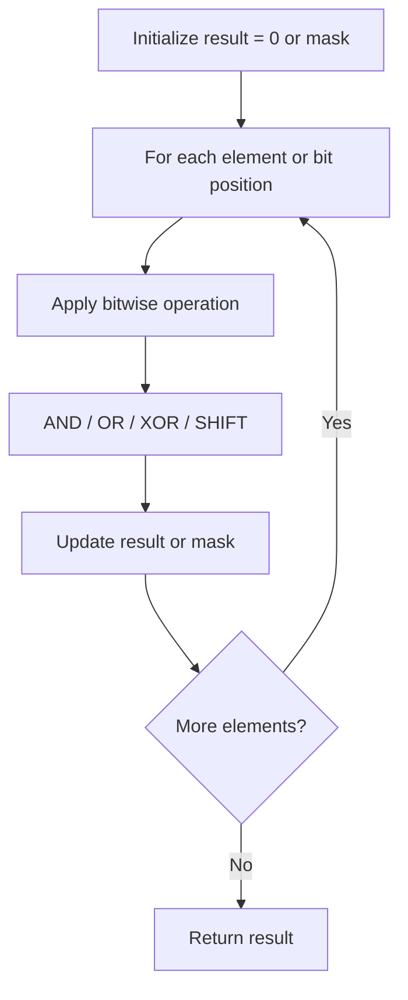

# Problem 1018: Binary Prefix Divisible By 5

**Difficulty:** Easy  
**Tags:** Array, Bit Manipulation  
**Pattern:** Bit Manipulation  
**Link:** [leetcode.com/problems/binary-prefix-divisible-by-5](https://leetcode.com/problems/binary-prefix-divisible-by-5/)

## Description

You are given a binary array `nums` (**0-indexed**).

We define `xi` as the number whose binary representation is the subarray `nums[0..i]` (from most-significant-bit to least-significant-bit).

	- For example, if `nums = [1,0,1]`, then `x0 = 1`, `x1 = 2`, and `x2 = 5`.

Return *an array of booleans *`answer`* where *`answer[i]`* is *`true`* if *`xi`* is divisible by *`5`.

 

Example 1:

```

**Input:** nums = [0,1,1]
**Output:** [true,false,false]
**Explanation:** The input numbers in binary are 0, 01, 011; which are 0, 1, and 3 in base-10.
Only the first number is divisible by 5, so answer[0] is true.

```

Example 2:

```

**Input:** nums = [1,1,1]
**Output:** [false,false,false]

```

 

**Constraints:**

	- `1 <= nums.length <= 10^5`
	- `nums[i]` is either `0` or `1`.

## Approach: Bit Manipulation

Operate on individual bits using bitwise operators (AND, OR, XOR, shift). Common tricks: x & (x-1) removes lowest set bit, x ^ x = 0, XOR all elements to find unique.

## Pseudocode

```
1. Apply bitwise operations:
   - XOR all elements to cancel paired bits
   - Use bitmask to track state
   - Shift and mask to extract/set individual bits
2. Return result
```

## Algorithm Flow



## Complexity Analysis

- **Time:** O(n) or O(log n)
- **Space:** O(1)

## Solution (Python3)

```python
class Solution:
    def prefixesDivBy5(self, nums: List[int]) -> List[bool]:
        # Bit manipulation - O(n) time, O(1) space
        result = 0
        for val in nums:
            result ^= val
        return result
```

## Solution (C++)

```cpp
#include <string>
#include <vector>
using namespace std;

class Solution {
public:
    vector<bool> prefixesDivBy5(vector<int>& nums) {
        // Bit manipulation - O(n) time, O(1) space
        int result = 0;
        for (int val : nums) {
            result ^= val;
        }
        return result;
    }
};
```
