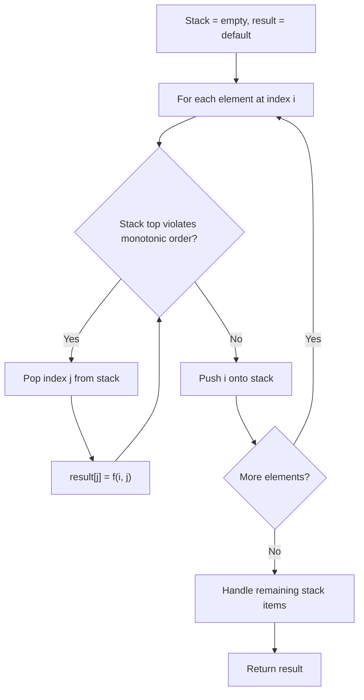
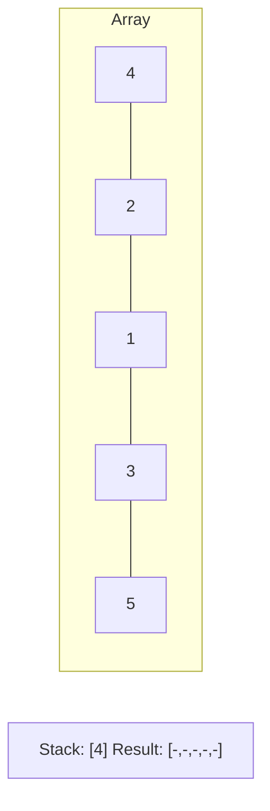
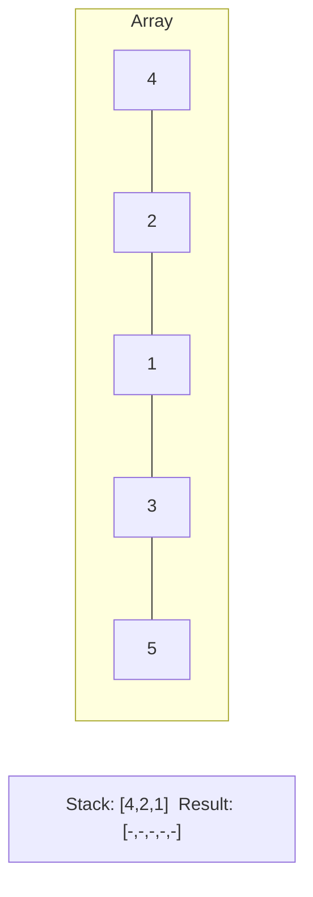
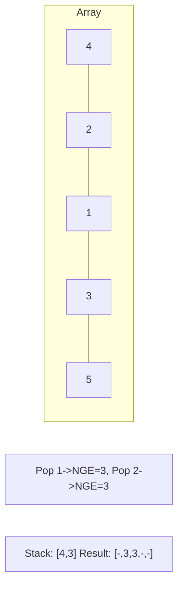
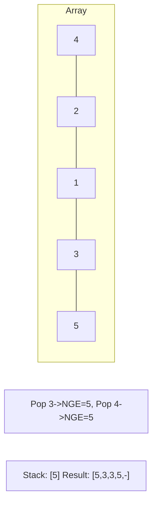

# Problem 1019: Next Greater Node In Linked List

**Difficulty:** Medium  
**Tags:** Array, Linked List, Stack, Monotonic Stack  
**Pattern:** Monotonic Stack  
**Link:** [leetcode.com/problems/next-greater-node-in-linked-list](https://leetcode.com/problems/next-greater-node-in-linked-list/)

## Description

You are given the `head` of a linked list with `n` nodes.

For each node in the list, find the value of the **next greater node**. That is, for each node, find the value of the first node that is next to it and has a **strictly larger** value than it.

Return an integer array `answer` where `answer[i]` is the value of the next greater node of the `i^th` node (**1-indexed**). If the `i^th` node does not have a next greater node, set `answer[i] = 0`.

 

Example 1:

```

**Input:** head = [2,1,5]
**Output:** [5,5,0]

```

Example 2:

```

**Input:** head = [2,7,4,3,5]
**Output:** [7,0,5,5,0]

```

 

**Constraints:**

	- The number of nodes in the list is `n`.
	- `1 <= n <= 10^4`
	- `1 <= Node.val <= 10^9`

## Approach: Monotonic Stack

Maintain a stack where elements are always in monotonic order (increasing or decreasing). When a new element violates the monotonic property, pop elements and compute results (e.g., next greater/smaller element, spans, areas).

## Pseudocode

```
1. Initialize empty stack, result array
2. For each element (index i):
   a. While stack not empty and arr[i] breaks monotonic order:
      - Pop index j from stack
      - result[j] = compute(i, j)
   b. Push i onto stack
3. Handle remaining elements in stack
4. Return result
```

## Algorithm Flow



## Visual State Transitions

**Monotonic Stack (Next Greater Element):**

**Frame 1: Process first elements**


**Frame 2: Push smaller elements**


**Frame 3: Element 3 pops 1 and 2**


**Frame 4: Element 5 pops all**



## Complexity Analysis

- **Time:** O(n)
- **Space:** O(n)

## Solution (Python3)

```python
class Solution:
    def nextLargerNodes(self, head: Optional[ListNode]) -> List[int]:
        # Monotonic stack - O(n) time, O(n) space
        n = len(head)
        result = [0] * n
        stack = []  # indices
        for i in range(n):
            while stack and head[i] > head[stack[-1]]:
                idx = stack.pop()
                result[idx] = i - idx
            stack.append(i)
        return result
```

## Solution (C++)

```cpp
#include <stack>
#include <string>
#include <vector>
using namespace std;

class Solution {
public:
    vector<int> nextLargerNodes(ListNode* head) {
        // Monotonic stack - O(n) time, O(n) space
        int n = head.size();
        vector<int> result(n, 0);
        stack<int> st;
        for (int i = 0; i < n; i++) {
            while (!st.empty() && head[i] > head[st.top()]) {
                int idx = st.top(); st.pop();
                result[idx] = i - idx;
            }
            st.push(i);
        }
        return result;
    }
};
```
