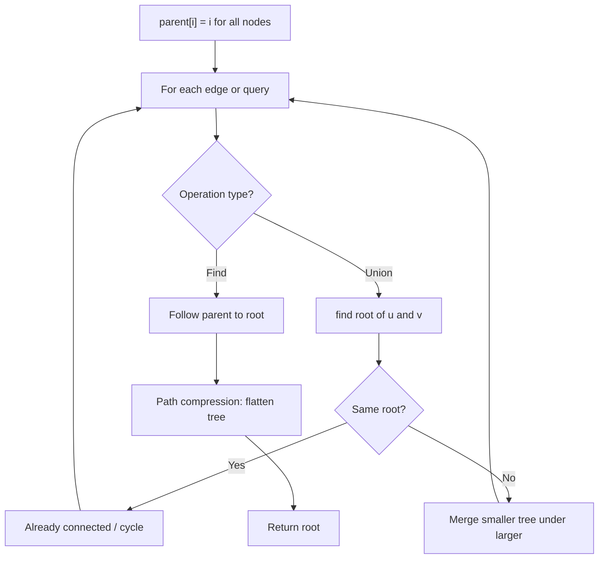
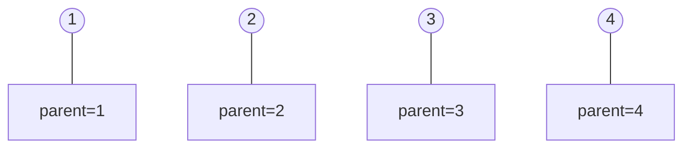
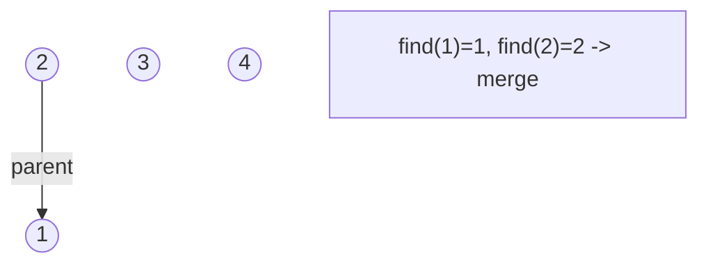
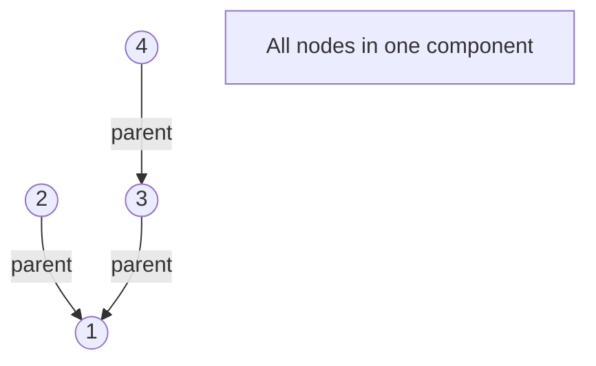
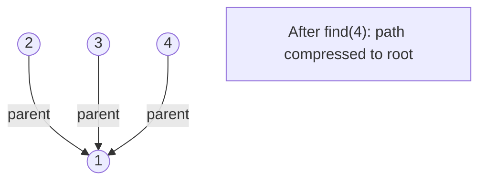

# Problem 1020: Number of Enclaves

**Difficulty:** Medium  
**Tags:** Array, Depth-First Search, Breadth-First Search, Union-Find, Matrix  
**Pattern:** DFS / Graph  
**Link:** [leetcode.com/problems/number-of-enclaves](https://leetcode.com/problems/number-of-enclaves/)

## Description

You are given an `m x n` binary matrix `grid`, where `0` represents a sea cell and `1` represents a land cell.

A **move** consists of walking from one land cell to another adjacent (**4-directionally**) land cell or walking off the boundary of the `grid`.

Return *the number of land cells in* `grid` *for which we cannot walk off the boundary of the grid in any number of **moves***.

 

Example 1:

```

**Input:** grid = [[0,0,0,0],[1,0,1,0],[0,1,1,0],[0,0,0,0]]
**Output:** 3
**Explanation:** There are three 1s that are enclosed by 0s, and one 1 that is not enclosed because its on the boundary.

```

Example 2:

```

**Input:** grid = [[0,1,1,0],[0,0,1,0],[0,0,1,0],[0,0,0,0]]
**Output:** 0
**Explanation:** All 1s are either on the boundary or can reach the boundary.

```

 

**Constraints:**

	- `m == grid.length`
	- `n == grid[i].length`
	- `1 <= m, n <= 500`
	- `grid[i][j]` is either `0` or `1`.

## Approach: DFS / Graph

DFS from border land cells to mark reachable. Count remaining land cells.

## Pseudocode

```
1. parent[i] = i for all nodes (each is its own set)
2. find(x): follow parent pointers to root (with path compression)
3. union(x, y): merge sets of x and y by rank
4. Process edges/operations:
   a. For each edge (u, v): union(u, v)
5. Answer queries using find()
```

## Algorithm Flow



## Visual State Transitions

**Union-Find Step-by-Step:**

**Frame 1: Initial - each node is own parent**


**Frame 2: Union(1,2) - merge components**


**Frame 3: Union(3,4) then Union(2,3)**


**Frame 4: Path compression on find(4)**



## Complexity Analysis

- **Time:** O(m*n)
- **Space:** O(m*n)

## Solution (Python3)

```python
class Solution:
    def numEnclaves(self, grid: list[list[int]]) -> int:
        m, n = len(grid), len(grid[0])
        def dfs(r, c):
            if r < 0 or r >= m or c < 0 or c >= n or grid[r][c] == 0:
                return
            grid[r][c] = 0
            dfs(r+1,c); dfs(r-1,c); dfs(r,c+1); dfs(r,c-1)
        for r in range(m):
            for c in range(n):
                if (r == 0 or r == m-1 or c == 0 or c == n-1) and grid[r][c] == 1:
                    dfs(r, c)
        return sum(sum(row) for row in grid)
```

## Solution (C++)

```cpp
#include <functional>
#include <numeric>
#include <string>
#include <vector>
using namespace std;

class Solution {
public:
    int numEnclaves(vector<vector<int>>& grid) {
        // Union Find (DSU) - O(n * alpha(n))
        int n = grid.size();
        vector<int> parent(n + 1), rnk(n + 1, 0);
        iota(parent.begin(), parent.end(), 0);
        function<int(int)> find = [&](int x) -> int {
            return parent[x] == x ? x : parent[x] = find(parent[x]);
        };
        auto unite = [&](int x, int y) -> bool {
            int px = find(x), py = find(y);
            if (px == py) return false;
            if (rnk[px] < rnk[py]) swap(px, py);
            parent[py] = px;
            if (rnk[px] == rnk[py]) rnk[px]++;
            return true;
        };
        int components = n;
        return components;
    }
};
```
