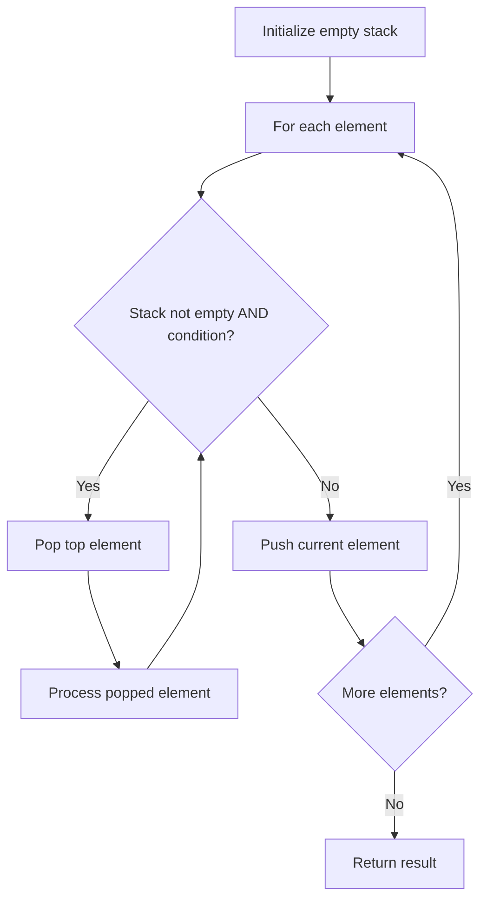

# Problem 1021: Remove Outermost Parentheses

**Difficulty:** Easy  
**Tags:** String, Stack  
**Pattern:** Stack  
**Link:** [leetcode.com/problems/remove-outermost-parentheses](https://leetcode.com/problems/remove-outermost-parentheses/)

## Description

A valid parentheses string is either empty `""`, `"(" + A + ")"`, or `A + B`, where `A` and `B` are valid parentheses strings, and `+` represents string concatenation.

	- For example, `""`, `"()"`, `"(())()"`, and `"(()(()))"` are all valid parentheses strings.

A valid parentheses string `s` is primitive if it is nonempty, and there does not exist a way to split it into `s = A + B`, with `A` and `B` nonempty valid parentheses strings.

Given a valid parentheses string `s`, consider its primitive decomposition: `s = P1 + P2 + ... + Pk`, where `Pi` are primitive valid parentheses strings.

Return `s` *after removing the outermost parentheses of every primitive string in the primitive decomposition of *`s`.

 

Example 1:

```

**Input:** s = "(()())(())"
**Output:** "()()()"
**Explanation:** 
The input string is "(()())(())", with primitive decomposition "(()())" + "(())".
After removing outer parentheses of each part, this is "()()" + "()" = "()()()".

```

Example 2:

```

**Input:** s = "(()())(())(()(()))"
**Output:** "()()()()(())"
**Explanation:** 
The input string is "(()())(())(()(()))", with primitive decomposition "(()())" + "(())" + "(()(()))".
After removing outer parentheses of each part, this is "()()" + "()" + "()(())" = "()()()()(())".

```

Example 3:

```

**Input:** s = "()()"
**Output:** ""
**Explanation:** 
The input string is "()()", with primitive decomposition "()" + "()".
After removing outer parentheses of each part, this is "" + "" = "".

```

 

**Constraints:**

	- `1 <= s.length <= 10^5`
	- `s[i]` is either `'('` or `')'`.
	- `s` is a valid parentheses string.

## Approach: Stack

Use a stack (LIFO) to process elements. Push elements when they might be needed later; pop when a matching or resolving condition is found. Common uses: parentheses matching, expression evaluation, next greater element.

## Pseudocode

```
1. Initialize empty stack
2. For each element:
   a. While stack is not empty and condition met:
      - Pop and process top element
   b. Push current element onto stack
3. Process remaining elements in stack if needed
4. Return result
```

## Algorithm Flow



## Complexity Analysis

- **Time:** O(n)
- **Space:** O(n)

## Solution (Python3)

```python
class Solution:
    def removeOuterParentheses(self, s: str) -> str:
        # Stack-based approach - O(n) time
        stack = []
        for ch in s:
            if stack and self._matches(stack[-1], ch):
                stack.pop()
            else:
                stack.append(ch)
        return len(stack) == 0 if isinstance("", bool) else stack

    def _matches(self, a, b):
        pairs = {'(': ')', '[': ']', '{': '}'}
        return pairs.get(a) == b
```

## Solution (C++)

```cpp
#include <stack>
#include <string>
#include <unordered_map>
#include <vector>
using namespace std;

class Solution {
public:
    string removeOuterParentheses(string& s) {
        // Stack-based approach - O(n) time
        stack<char> st;
        unordered_map<char, char> pairs = {{'(', ')'}, {'[', ']'}, {'{', '}'}};
        for (char ch : s) {
            if (!st.empty() && pairs.count(st.top()) && pairs[st.top()] == ch) {
                st.pop();
            } else {
                st.push(ch);
            }
        }
        return st.empty();
    }
};
```
