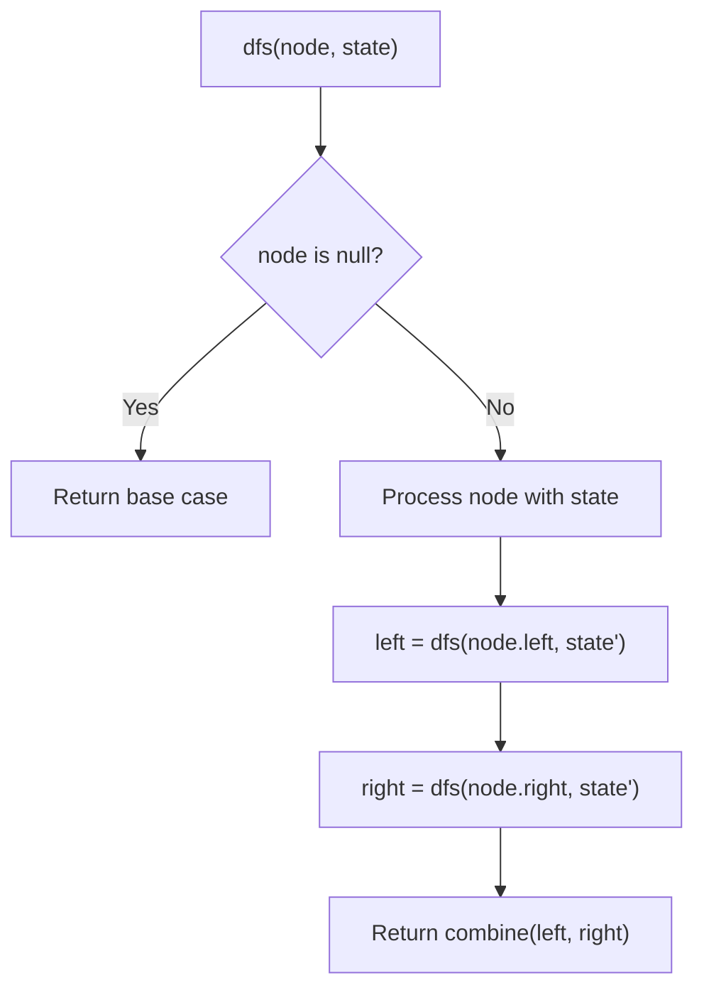
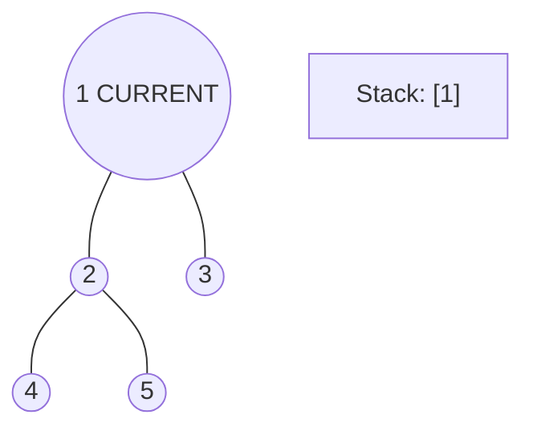
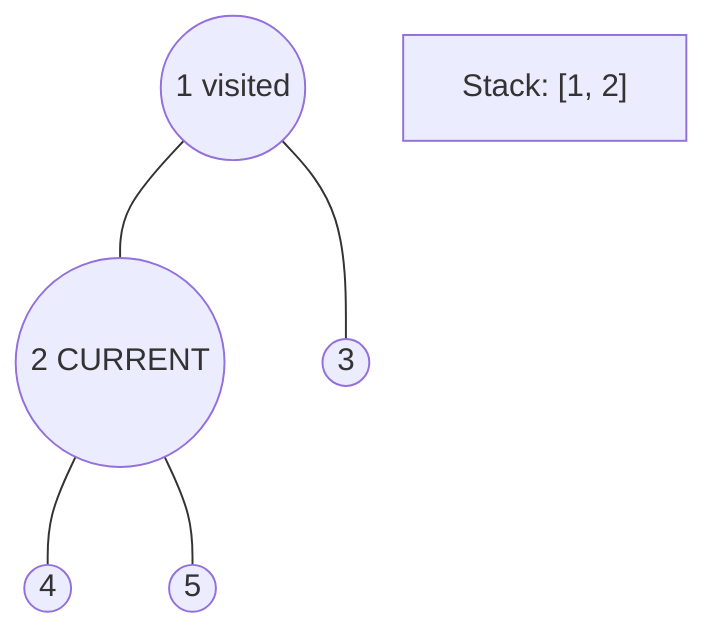
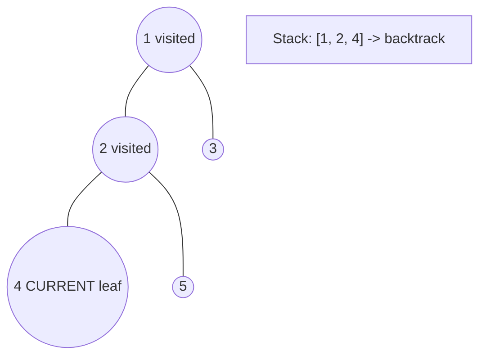
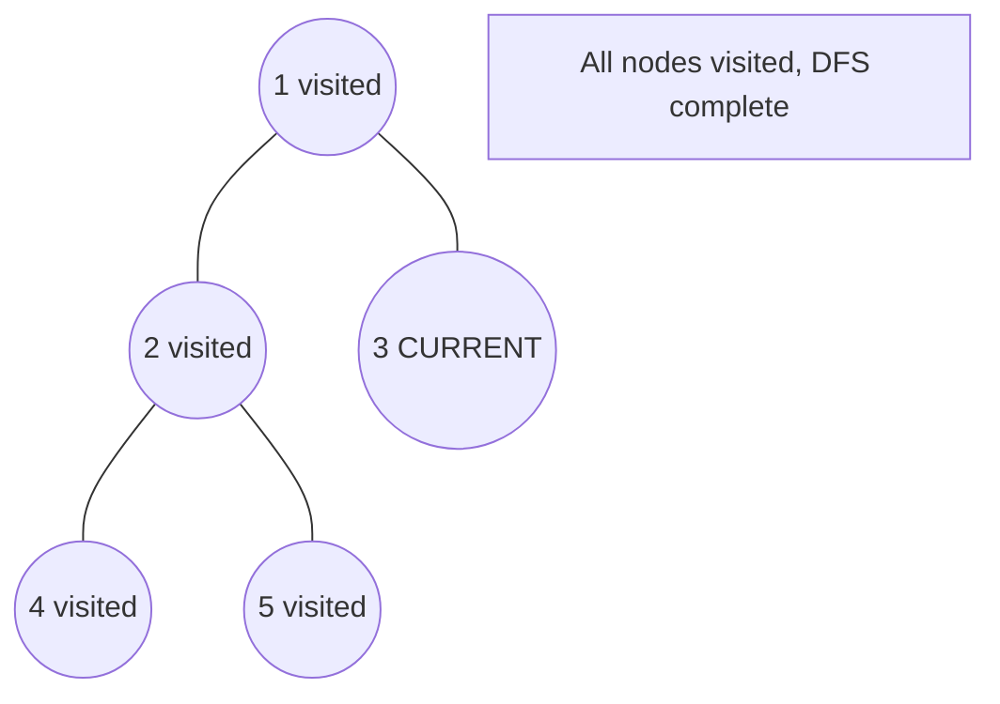

# Problem 1022: Sum of Root To Leaf Binary Numbers

**Difficulty:** Easy  
**Tags:** Tree, Depth-First Search, Binary Tree  
**Pattern:** DFS Tree Traversal  
**Link:** [leetcode.com/problems/sum-of-root-to-leaf-binary-numbers](https://leetcode.com/problems/sum-of-root-to-leaf-binary-numbers/)

## Description

You are given the `root` of a binary tree where each node has a value `0` or `1`. Each root-to-leaf path represents a binary number starting with the most significant bit.

	- For example, if the path is `0 -> 1 -> 1 -> 0 -> 1`, then this could represent `01101` in binary, which is `13`.

For all leaves in the tree, consider the numbers represented by the path from the root to that leaf. Return *the sum of these numbers*.

The test cases are generated so that the answer fits in a **32-bits** integer.

 

Example 1:

```

**Input:** root = [1,0,1,0,1,0,1]
**Output:** 22
**Explanation: **(100) + (101) + (110) + (111) = 4 + 5 + 6 + 7 = 22

```

Example 2:

```

**Input:** root = [0]
**Output:** 0

```

 

**Constraints:**

	- The number of nodes in the tree is in the range `[1, 1000]`.
	- `Node.val` is `0` or `1`.

## Approach: DFS Tree Traversal

Perform depth-first search on the tree. Recurse on left and right subtrees, combining results bottom-up. Track state (path, depth, sum) during traversal.

## Pseudocode

```
1. Define dfs(node, state):
   a. Base case: if null, return default
   b. Process node with current state
   c. left_result = dfs(node.left, updated_state)
   d. right_result = dfs(node.right, updated_state)
   e. Return combine(left_result, right_result)
2. Return dfs(root, initial_state)
```

## Algorithm Flow



## Visual State Transitions

**DFS Tree Traversal Step-by-Step:**

**Frame 1: Start at root**


**Frame 2: Go left - visit node 2**


**Frame 3: Go left - visit node 4 (leaf)**


**Frame 4: Backtrack, visit node 5, then node 3**



## Complexity Analysis

- **Time:** O(n)
- **Space:** O(h)

## Solution (Python3)

```python
class Solution:
    def sumRootToLeaf(self, root: Optional[TreeNode]) -> int:
        # DFS on binary tree - O(n) time, O(h) space
        def dfs(node):
            if not node:
                return 0
            left = dfs(node.left)
            right = dfs(node.right)
            return 1 + max(left, right)
        
        result = dfs(root)
        return result
```

## Solution (C++)

```cpp
#include <algorithm>
#include <functional>
#include <string>
#include <vector>
using namespace std;

class Solution {
public:
    int sumRootToLeaf(TreeNode* root) {
        // DFS on binary tree - O(n) time, O(h) space
        function<int(TreeNode*)> dfs = [&](TreeNode* node) -> int {
            if (!node) return 0;
            int left = dfs(node->left);
            int right = dfs(node->right);
            return 1 + max(left, right);
        };
        return dfs(root);
    }
};
```
