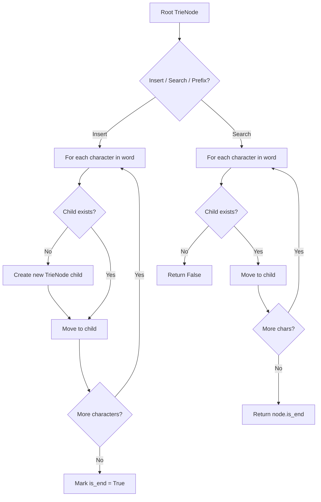
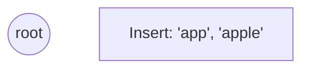
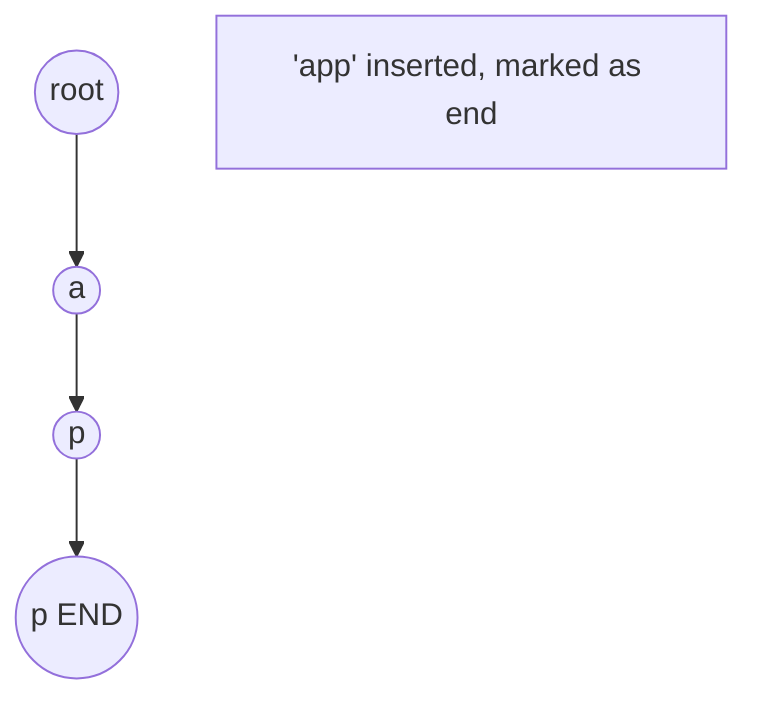
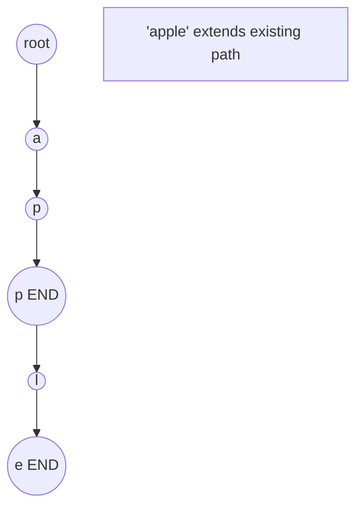
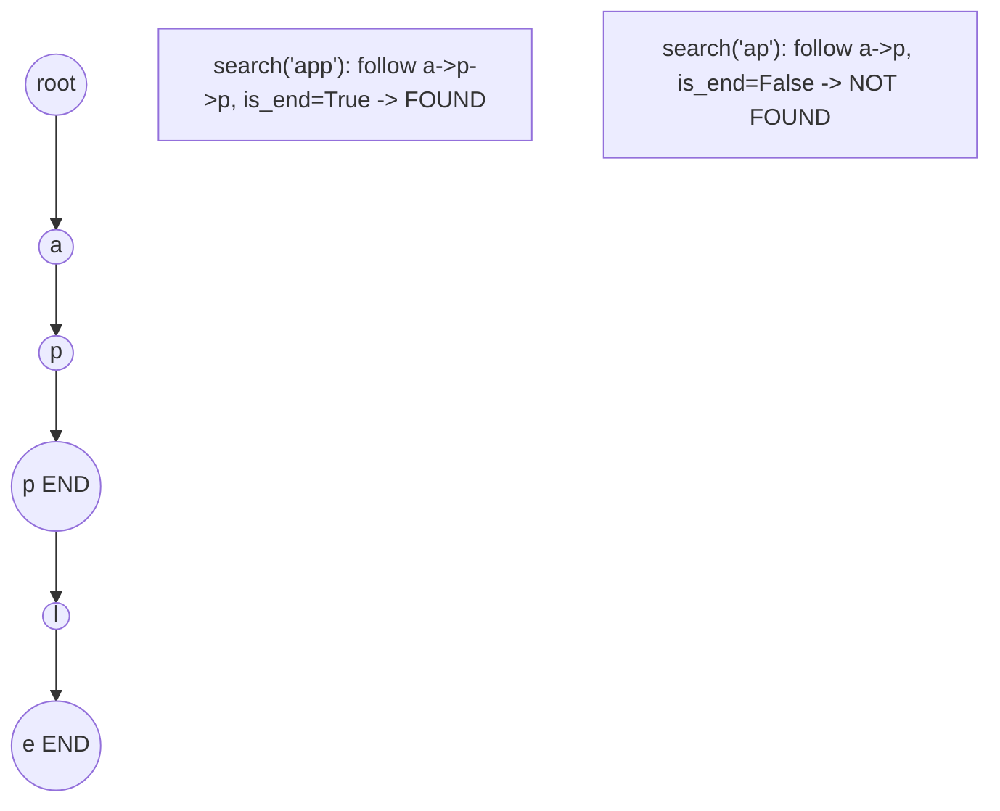

# Problem 1023: Camelcase Matching

**Difficulty:** Medium  
**Tags:** Array, Two Pointers, String, Trie, String Matching  
**Pattern:** Trie / Prefix Tree  
**Link:** [leetcode.com/problems/camelcase-matching](https://leetcode.com/problems/camelcase-matching/)

## Description

Given an array of strings `queries` and a string `pattern`, return a boolean array `answer` where `answer[i]` is `true` if `queries[i]` matches `pattern`, and `false` otherwise.

A query word `queries[i]` matches `pattern` if you can insert lowercase English letters into the pattern so that it equals the query. You may insert a character at any position in pattern or you may choose not to insert any characters **at all**.

 

Example 1:

```

**Input:** queries = ["FooBar","FooBarTest","FootBall","FrameBuffer","ForceFeedBack"], pattern = "FB"
**Output:** [true,false,true,true,false]
**Explanation:** "FooBar" can be generated like this "F" + "oo" + "B" + "ar".
"FootBall" can be generated like this "F" + "oot" + "B" + "all".
"FrameBuffer" can be generated like this "F" + "rame" + "B" + "uffer".

```

Example 2:

```

**Input:** queries = ["FooBar","FooBarTest","FootBall","FrameBuffer","ForceFeedBack"], pattern = "FoBa"
**Output:** [true,false,true,false,false]
**Explanation:** "FooBar" can be generated like this "Fo" + "o" + "Ba" + "r".
"FootBall" can be generated like this "Fo" + "ot" + "Ba" + "ll".

```

Example 3:

```

**Input:** queries = ["FooBar","FooBarTest","FootBall","FrameBuffer","ForceFeedBack"], pattern = "FoBaT"
**Output:** [false,true,false,false,false]
**Explanation:** "FooBarTest" can be generated like this "Fo" + "o" + "Ba" + "r" + "T" + "est".

```

 

**Constraints:**

	- `1 <= pattern.length, queries.length <= 100`
	- `1 <= queries[i].length <= 100`
	- `queries[i]` and `pattern` consist of English letters.

## Approach: Trie / Prefix Tree

Build a trie (prefix tree) where each node represents a character. Insert words character by character, and search by following child pointers. Supports efficient prefix matching.

## Pseudocode

```
1. TrieNode: children = {}, is_end = False
2. Insert(word):
   - For each char: create child if absent, move to child
   - Mark last node as end
3. Search(word):
   - For each char: if child absent return False, move to child
   - Return node.is_end
4. StartsWith(prefix): same as search but return True at end
```

## Algorithm Flow



## Visual State Transitions

**Trie Insert and Search:**

**Frame 1: Empty trie**


**Frame 2: Insert 'app'**


**Frame 3: Insert 'apple'**


**Frame 4: Search 'app' = True, 'ap' = False**



## Complexity Analysis

- **Time:** O(L) per operation
- **Space:** O(N * L)

## Solution (Python3)

```python
class Solution:
    def camelMatch(self, queries: List[str], pattern: str) -> List[bool]:
        # Trie-based approach
        trie = {}
        # Build trie from word list
        words = queries if isinstance(queries, list) else [queries]
        for word in words:
            node = trie
            for ch in word:
                if ch not in node:
                    node[ch] = {}
                node = node[ch]
            node['#'] = True
        
        # Search in trie
        def search(word):
            node = trie
            for ch in word:
                if ch not in node:
                    return False
                node = node[ch]
            return '#' in node
        
        return []
```

## Solution (C++)

```cpp
#include <string>
#include <vector>
using namespace std;

class Solution {
public:
    vector<bool> camelMatch(vector<string>& queries, string& pattern) {
        // Trie-based approach
        struct TrieNode {
            TrieNode* children[26] = {};
            bool isEnd = false;
        };
        TrieNode* root = new TrieNode();
        // Build trie
        for (auto& word : queries) {
            TrieNode* node = root;
            for (char ch : word) {
                int idx = ch - 'a';
                if (!node->children[idx])
                    node->children[idx] = new TrieNode();
                node = node->children[idx];
            }
            node->isEnd = true;
        }
        return {};
    }
};
```
