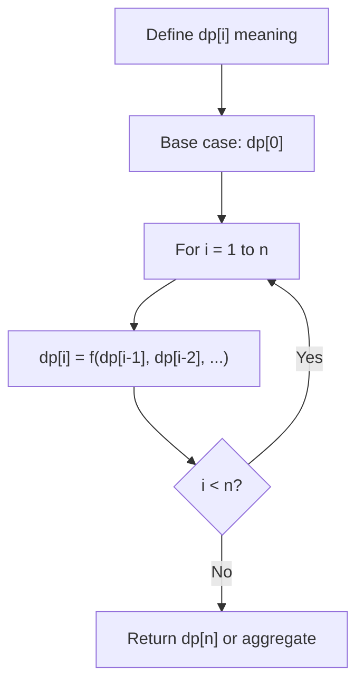
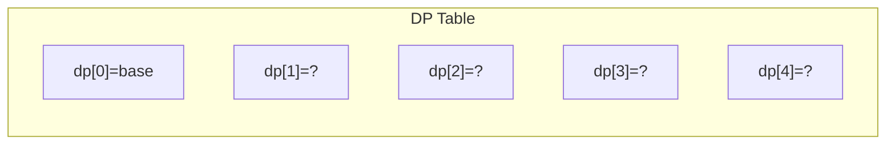
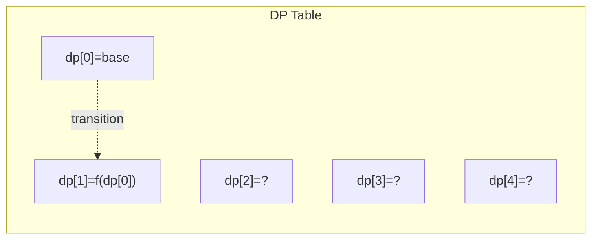
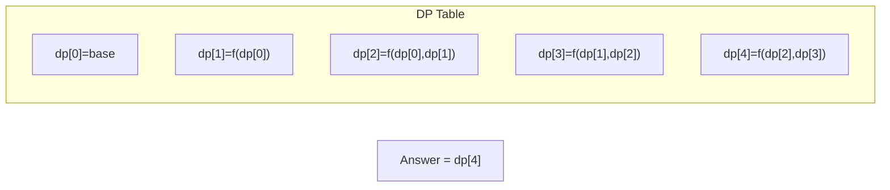

# Problem 1024: Video Stitching

**Difficulty:** Medium  
**Tags:** Array, Dynamic Programming, Greedy  
**Pattern:** Dynamic Programming (1D)  
**Link:** [leetcode.com/problems/video-stitching](https://leetcode.com/problems/video-stitching/)

## Description

You are given a series of video clips from a sporting event that lasted `time` seconds. These video clips can be overlapping with each other and have varying lengths.

Each video clip is described by an array `clips` where `clips[i] = [starti, endi]` indicates that the ith clip started at `starti` and ended at `endi`.

We can cut these clips into segments freely.

	- For example, a clip `[0, 7]` can be cut into segments `[0, 1] + [1, 3] + [3, 7]`.

Return *the minimum number of clips needed so that we can cut the clips into segments that cover the entire sporting event* `[0, time]`. If the task is impossible, return `-1`.

 

Example 1:

```

**Input:** clips = [[0,2],[4,6],[8,10],[1,9],[1,5],[5,9]], time = 10
**Output:** 3
**Explanation:** We take the clips [0,2], [8,10], [1,9]; a total of 3 clips.
Then, we can reconstruct the sporting event as follows:
We cut [1,9] into segments [1,2] + [2,8] + [8,9].
Now we have segments [0,2] + [2,8] + [8,10] which cover the sporting event [0, 10].

```

Example 2:

```

**Input:** clips = [[0,1],[1,2]], time = 5
**Output:** -1
**Explanation:** We cannot cover [0,5] with only [0,1] and [1,2].

```

Example 3:

```

**Input:** clips = [[0,1],[6,8],[0,2],[5,6],[0,4],[0,3],[6,7],[1,3],[4,7],[1,4],[2,5],[2,6],[3,4],[4,5],[5,7],[6,9]], time = 9
**Output:** 3
**Explanation:** We can take clips [0,4], [4,7], and [6,9].

```

 

**Constraints:**

	- `1 <= clips.length <= 100`
	- `0 <= starti <= endi <= 100`
	- `1 <= time <= 100`

## Approach: Dynamic Programming (1D)

Break the problem into overlapping subproblems. Define dp[i] as the optimal value for the subproblem ending at or considering index i. Build the solution bottom-up, using previously computed dp values.

## Pseudocode

```
1. Define dp[i] = optimal value for subproblem i
2. Base case: dp[0] = initial value
3. For i from 1 to n:
   a. dp[i] = recurrence(dp[i-1], dp[i-2], ...)
4. Return dp[n] or max/min of dp
```

## Algorithm Flow



## Visual State Transitions

**1D Dynamic Programming Table Build:**

**Frame 1: Initialize base cases**


**Frame 2: Fill dp[1] from dp[0]**


**Frame 3: Fill remaining cells**



## Complexity Analysis

- **Time:** O(n)
- **Space:** O(n)

## Solution (Python3)

```python
class Solution:
    def videoStitching(self, clips: List[List[int]], time: int) -> int:
        # Dynamic programming (1D) - O(n) time, O(n) space
        if not clips:
            return 0
        n = len(clips) if isinstance(clips, list) else clips
        dp = [0] * (n + 1)
        dp[0] = 1  # base case
        for i in range(1, n + 1):
            dp[i] = dp[i-1]  # transition (customize per problem)
            if i >= 2:
                dp[i] += dp[i-2]
        return dp[n]
```

## Solution (C++)

```cpp
#include <string>
#include <vector>
using namespace std;

class Solution {
public:
    int videoStitching(vector<vector<int>>& clips, int time) {
        // Dynamic programming (1D) - O(n) time, O(n) space
        int n = clips;
        if (n <= 0) return 0;
        vector<int> dp(n + 1, 0);
        dp[0] = 1;
        for (int i = 1; i <= n; i++) {
            dp[i] = dp[i-1];
            if (i >= 2) dp[i] += dp[i-2];
        }
        return dp[n];
    }
};
```
