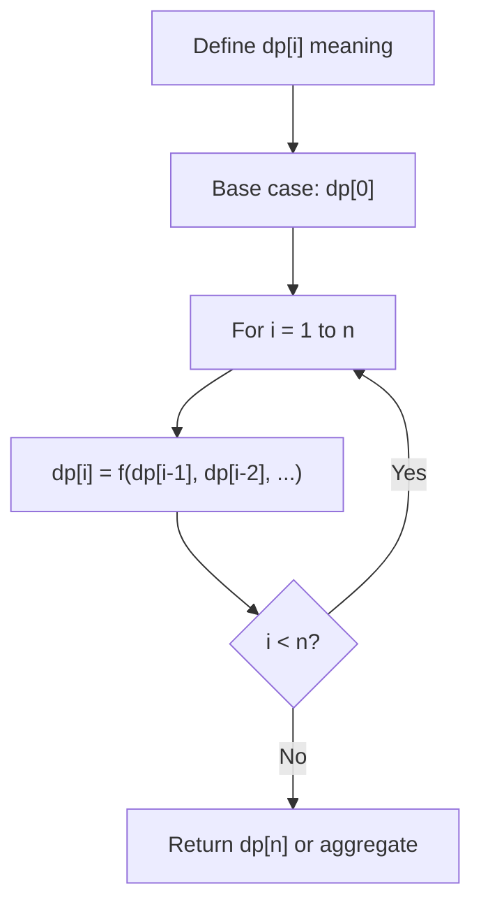
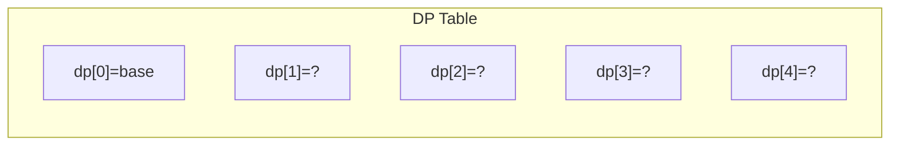
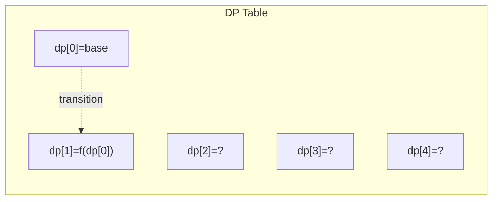
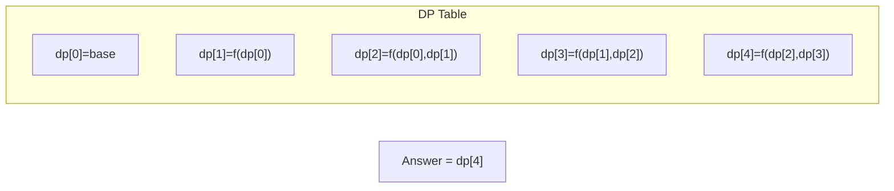

# Problem 1025: Divisor Game

**Difficulty:** Easy  
**Tags:** Math, Dynamic Programming, Brainteaser, Game Theory  
**Pattern:** Dynamic Programming (1D)  
**Link:** [leetcode.com/problems/divisor-game](https://leetcode.com/problems/divisor-game/)

## Description

Alice and Bob take turns playing a game, with Alice starting first.

Initially, there is a number `n` on the chalkboard. On each player's turn, that player makes a move consisting of:

	- Choosing any integer `x` with `0 < x < n` and `n % x == 0`.
	- Replacing the number `n` on the chalkboard with `n - x`.

Also, if a player cannot make a move, they lose the game.

Return `true` *if and only if Alice wins the game, assuming both players play optimally*.

 

Example 1:

```

**Input:** n = 2
**Output:** true
**Explanation:** Alice chooses 1, and Bob has no more moves.

```

Example 2:

```

**Input:** n = 3
**Output:** false
**Explanation:** Alice chooses 1, Bob chooses 1, and Alice has no more moves.

```

 

**Constraints:**

	- `1 <= n <= 1000`

## Approach: Dynamic Programming (1D)

Break the problem into overlapping subproblems. Define dp[i] as the optimal value for the subproblem ending at or considering index i. Build the solution bottom-up, using previously computed dp values.

## Pseudocode

```
1. Define dp[i] = optimal value for subproblem i
2. Base case: dp[0] = initial value
3. For i from 1 to n:
   a. dp[i] = recurrence(dp[i-1], dp[i-2], ...)
4. Return dp[n] or max/min of dp
```

## Algorithm Flow



## Visual State Transitions

**1D Dynamic Programming Table Build:**

**Frame 1: Initialize base cases**


**Frame 2: Fill dp[1] from dp[0]**


**Frame 3: Fill remaining cells**



## Complexity Analysis

- **Time:** O(n)
- **Space:** O(n)

## Solution (Python3)

```python
class Solution:
    def divisorGame(self, n: int) -> bool:
        # Dynamic programming (1D) - O(n) time, O(n) space
        if not n:
            return 0
        n = len(n) if isinstance(n, list) else n
        dp = [0] * (n + 1)
        dp[0] = 1  # base case
        for i in range(1, n + 1):
            dp[i] = dp[i-1]  # transition (customize per problem)
            if i >= 2:
                dp[i] += dp[i-2]
        return dp[n]
```

## Solution (C++)

```cpp
#include <string>
#include <vector>
using namespace std;

class Solution {
public:
    bool divisorGame(int n) {
        // Dynamic programming (1D) - O(n) time, O(n) space
        int n = n;
        if (n <= 0) return 0;
        vector<int> dp(n + 1, 0);
        dp[0] = 1;
        for (int i = 1; i <= n; i++) {
            dp[i] = dp[i-1];
            if (i >= 2) dp[i] += dp[i-2];
        }
        return dp[n];
    }
};
```
