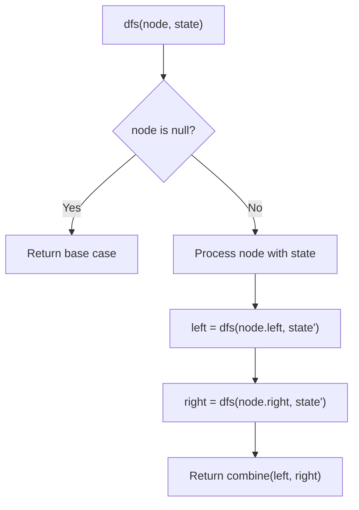
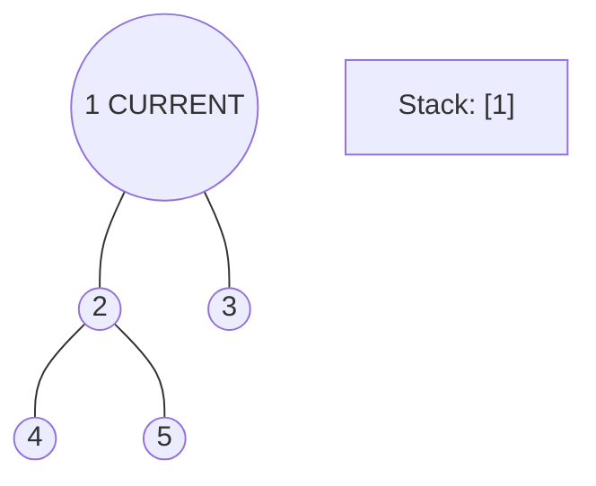
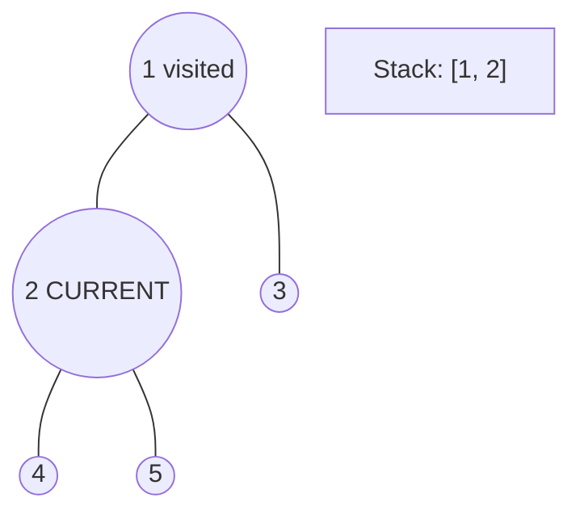
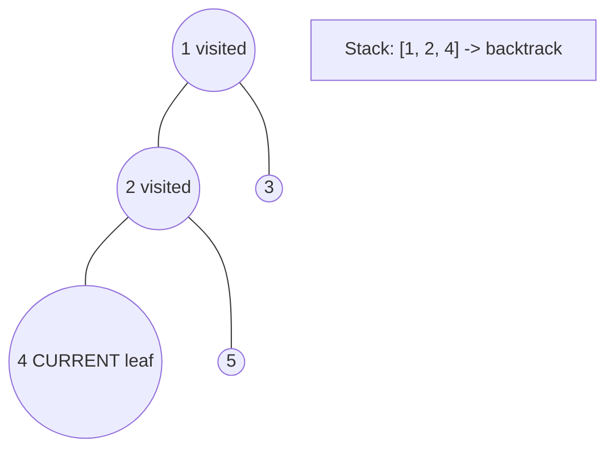
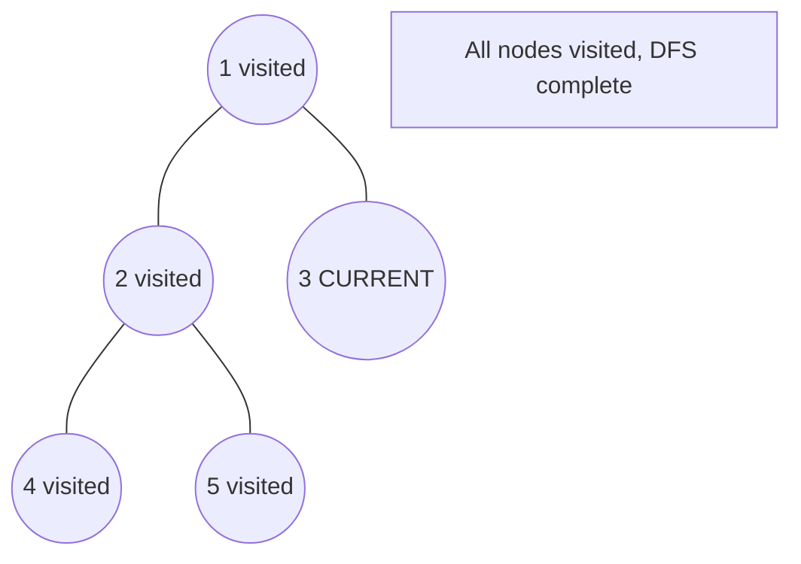

# Problem 1026: Maximum Difference Between Node and Ancestor

**Difficulty:** Medium  
**Tags:** Tree, Depth-First Search, Binary Tree  
**Pattern:** DFS Tree Traversal  
**Link:** [leetcode.com/problems/maximum-difference-between-node-and-ancestor](https://leetcode.com/problems/maximum-difference-between-node-and-ancestor/)

## Description

Given the `root` of a binary tree, find the maximum value `v` for which there exist **different** nodes `a` and `b` where `v = |a.val - b.val|` and `a` is an ancestor of `b`.

A node `a` is an ancestor of `b` if either: any child of `a` is equal to `b` or any child of `a` is an ancestor of `b`.

 

Example 1:

```

**Input:** root = [8,3,10,1,6,null,14,null,null,4,7,13]
**Output:** 7
**Explanation: **We have various ancestor-node differences, some of which are given below :
|8 - 3| = 5
|3 - 7| = 4
|8 - 1| = 7
|10 - 13| = 3
Among all possible differences, the maximum value of 7 is obtained by |8 - 1| = 7.
```

Example 2:

```

**Input:** root = [1,null,2,null,0,3]
**Output:** 3

```

 

**Constraints:**

	- The number of nodes in the tree is in the range `[2, 5000]`.
	- `0 <= Node.val <= 10^5`

## Approach: DFS Tree Traversal

Perform depth-first search on the tree. Recurse on left and right subtrees, combining results bottom-up. Track state (path, depth, sum) during traversal.

## Pseudocode

```
1. Define dfs(node, state):
   a. Base case: if null, return default
   b. Process node with current state
   c. left_result = dfs(node.left, updated_state)
   d. right_result = dfs(node.right, updated_state)
   e. Return combine(left_result, right_result)
2. Return dfs(root, initial_state)
```

## Algorithm Flow



## Visual State Transitions

**DFS Tree Traversal Step-by-Step:**

**Frame 1: Start at root**


**Frame 2: Go left - visit node 2**


**Frame 3: Go left - visit node 4 (leaf)**


**Frame 4: Backtrack, visit node 5, then node 3**



## Complexity Analysis

- **Time:** O(n)
- **Space:** O(h)

## Solution (Python3)

```python
class Solution:
    def maxAncestorDiff(self, root: Optional[TreeNode]) -> int:
        # DFS on binary tree - O(n) time, O(h) space
        def dfs(node):
            if not node:
                return 0
            left = dfs(node.left)
            right = dfs(node.right)
            return 1 + max(left, right)
        
        result = dfs(root)
        return result
```

## Solution (C++)

```cpp
#include <algorithm>
#include <functional>
#include <string>
#include <vector>
using namespace std;

class Solution {
public:
    int maxAncestorDiff(TreeNode* root) {
        // DFS on binary tree - O(n) time, O(h) space
        function<int(TreeNode*)> dfs = [&](TreeNode* node) -> int {
            if (!node) return 0;
            int left = dfs(node->left);
            int right = dfs(node->right);
            return 1 + max(left, right);
        };
        return dfs(root);
    }
};
```
