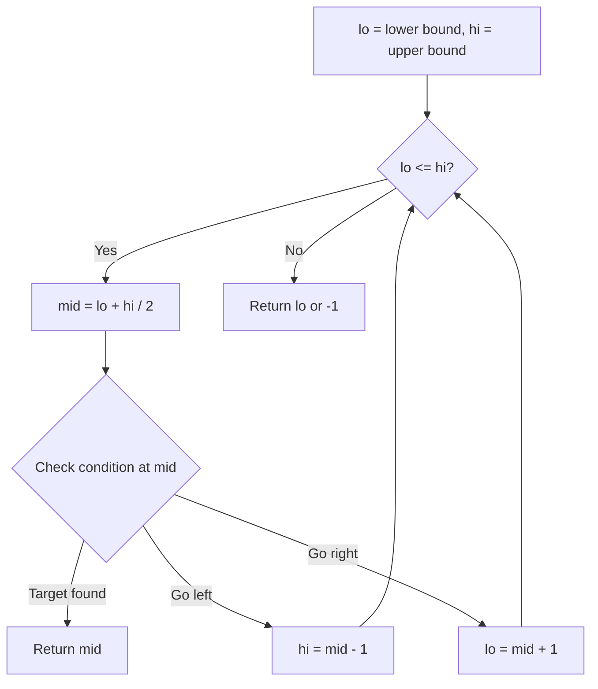
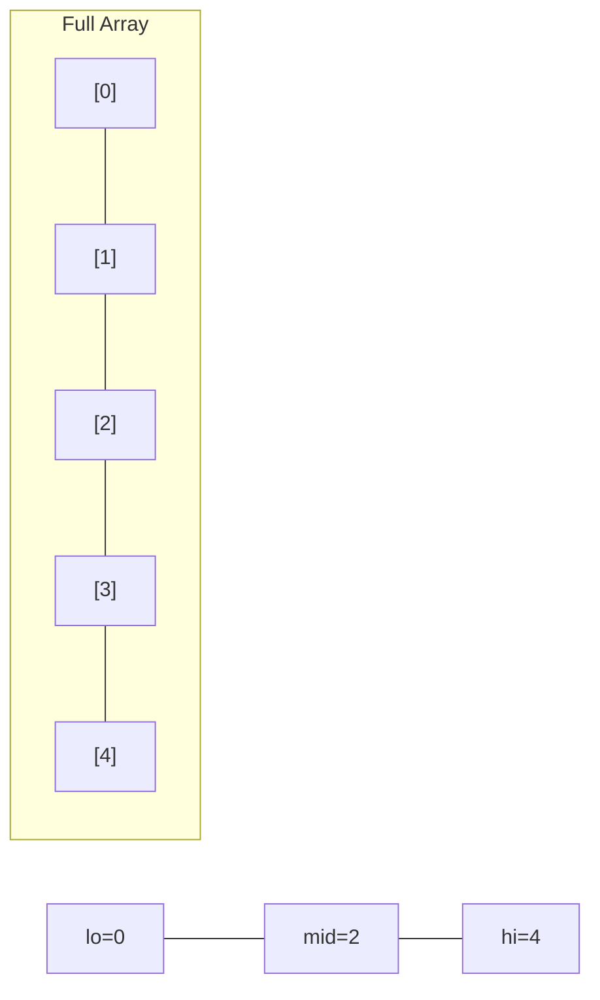
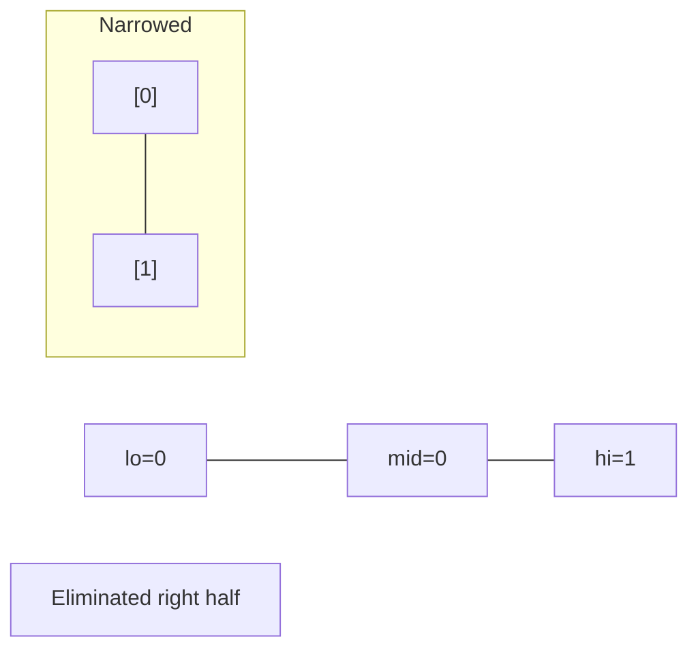
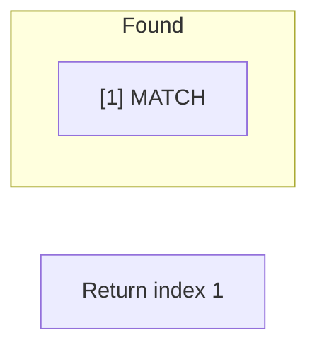

# Problem 1027: Longest Arithmetic Subsequence

**Difficulty:** Medium  
**Tags:** Array, Hash Table, Binary Search, Dynamic Programming  
**Pattern:** Binary Search  
**Link:** [leetcode.com/problems/longest-arithmetic-subsequence](https://leetcode.com/problems/longest-arithmetic-subsequence/)

## Description

Given an array `nums` of integers, return *the length of the longest arithmetic subsequence in* `nums`.

**Note** that:

	- A **subsequence** is an array that can be derived from another array by deleting some or no elements without changing the order of the remaining elements.
	- A sequence `seq` is arithmetic if `seq[i + 1] - seq[i]` are all the same value (for `0 <= i < seq.length - 1`).

 

Example 1:

```

**Input:** nums = [3,6,9,12]
**Output:** 4
**Explanation: ** The whole array is an arithmetic sequence with steps of length = 3.

```

Example 2:

```

**Input:** nums = [9,4,7,2,10]
**Output:** 3
**Explanation: ** The longest arithmetic subsequence is [4,7,10].

```

Example 3:

```

**Input:** nums = [20,1,15,3,10,5,8]
**Output:** 4
**Explanation: ** The longest arithmetic subsequence is [20,15,10,5].

```

 

**Constraints:**

	- `2 <= nums.length <= 1000`
	- `0 <= nums[i] <= 500`

## Approach: Binary Search

Use binary search to halve the search space each iteration. Define the search range [lo, hi], compute mid, and decide which half to keep based on the problem's monotonic condition.

## Pseudocode

```
1. lo = lower_bound, hi = upper_bound
2. While lo <= hi (or lo < hi):
   a. mid = (lo + hi) // 2
   b. If condition(mid) is satisfied: record answer, search left half
   c. Else: search right half
3. Return answer
```

## Algorithm Flow



## Visual State Transitions

**Binary Search Step-by-Step:**

**Frame 1: Initial search space**


**Frame 2: Compare mid, narrow search**


**Frame 3: Found target**



## Complexity Analysis

- **Time:** O(log n)
- **Space:** O(1)

## Solution (Python3)

```python
class Solution:
    def longestArithSeqLength(self, nums: List[int]) -> int:
        # Binary search - O(log n) time, O(1) space
        lo, hi = 0, len(nums) - 1
        while lo <= hi:
            mid = lo + (hi - lo) // 2
            if nums[mid] == nums:
                return mid
            elif nums[mid] < nums:
                lo = mid + 1
            else:
                hi = mid - 1
        return 0
```

## Solution (C++)

```cpp
#include <string>
#include <vector>
using namespace std;

class Solution {
public:
    int longestArithSeqLength(vector<int>& nums) {
        // Binary search - O(log n) time, O(1) space
        int lo = 0, hi = nums.size() - 1;
        while (lo <= hi) {
            int mid = lo + (hi - lo) / 2;
            if (nums[mid] == nums) {
                return mid;
            } else if (nums[mid] < nums) {
                lo = mid + 1;
            } else {
                hi = mid - 1;
            }
        }
        return 0;
    }
};
```
