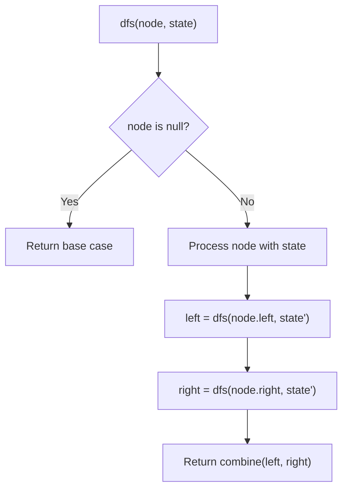
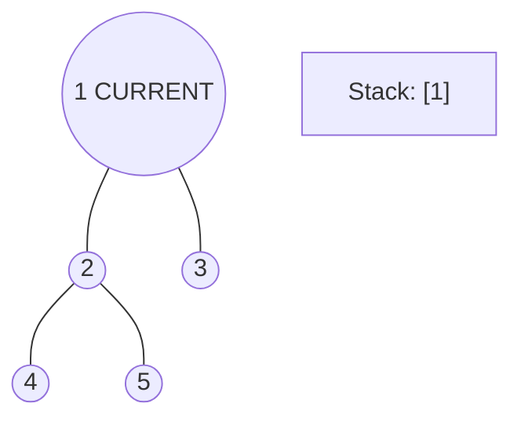
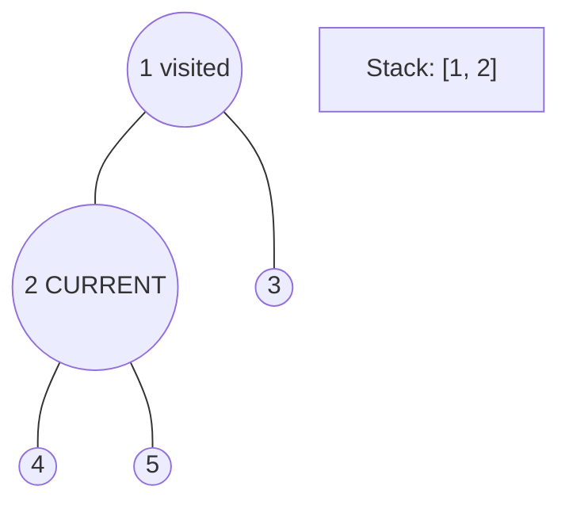
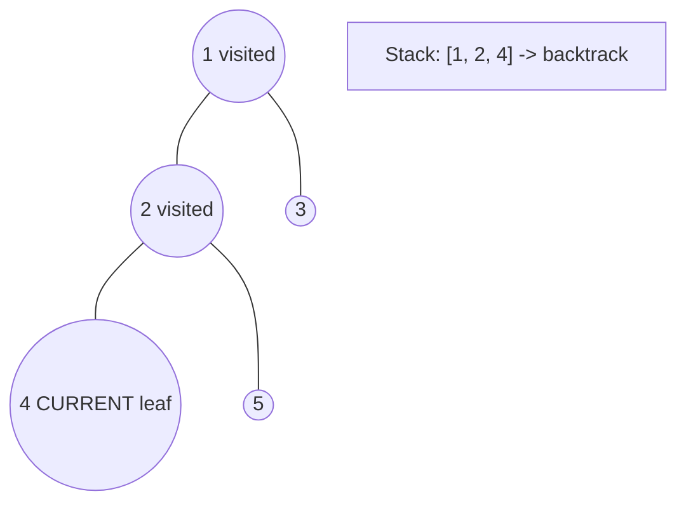
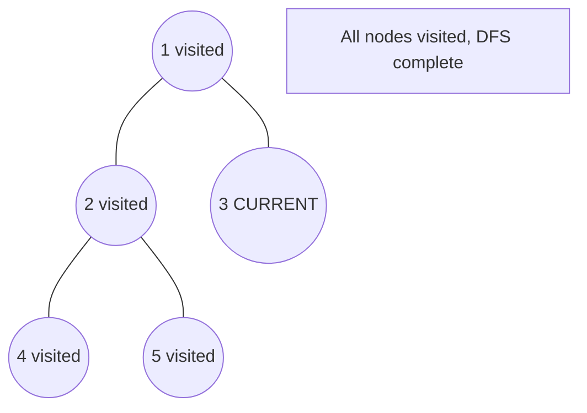

# Problem 1028: Recover a Tree From Preorder Traversal

**Difficulty:** Hard  
**Tags:** String, Tree, Depth-First Search, Binary Tree  
**Pattern:** DFS Tree Traversal  
**Link:** [leetcode.com/problems/recover-a-tree-from-preorder-traversal](https://leetcode.com/problems/recover-a-tree-from-preorder-traversal/)

## Description

We run a preorder depth-first search (DFS) on the `root` of a binary tree.

At each node in this traversal, we output `D` dashes (where `D` is the depth of this node), then we output the value of this node.  If the depth of a node is `D`, the depth of its immediate child is `D + 1`.  The depth of the `root` node is `0`.

If a node has only one child, that child is guaranteed to be **the left child**.

Given the output `traversal` of this traversal, recover the tree and return *its* `root`.

 

Example 1:

```

**Input:** traversal = "1-2--3--4-5--6--7"
**Output:** [1,2,5,3,4,6,7]

```

Example 2:

```

**Input:** traversal = "1-2--3---4-5--6---7"
**Output:** [1,2,5,3,null,6,null,4,null,7]

```

Example 3:

```

**Input:** traversal = "1-401--349---90--88"
**Output:** [1,401,null,349,88,90]

```

 

**Constraints:**

	- The number of nodes in the original tree is in the range `[1, 1000]`.
	- `1 <= Node.val <= 10^9`

## Approach: DFS Tree Traversal

Perform depth-first search on the tree. Recurse on left and right subtrees, combining results bottom-up. Track state (path, depth, sum) during traversal.

## Pseudocode

```
1. Define dfs(node, state):
   a. Base case: if null, return default
   b. Process node with current state
   c. left_result = dfs(node.left, updated_state)
   d. right_result = dfs(node.right, updated_state)
   e. Return combine(left_result, right_result)
2. Return dfs(root, initial_state)
```

## Algorithm Flow



## Visual State Transitions

**DFS Tree Traversal Step-by-Step:**

**Frame 1: Start at root**


**Frame 2: Go left - visit node 2**


**Frame 3: Go left - visit node 4 (leaf)**


**Frame 4: Backtrack, visit node 5, then node 3**



## Complexity Analysis

- **Time:** O(n)
- **Space:** O(h)

## Solution (Python3)

```python
class Solution:
    def recoverFromPreorder(self, traversal: str) -> Optional[TreeNode]:
        # DFS on binary tree - O(n) time, O(h) space
        def dfs(node):
            if not node:
                return 0
            left = dfs(node.left)
            right = dfs(node.right)
            return 1 + max(left, right)
        
        result = dfs(traversal)
        return result
```

## Solution (C++)

```cpp
#include <algorithm>
#include <functional>
#include <string>
#include <vector>
using namespace std;

class Solution {
public:
    TreeNode* recoverFromPreorder(string& traversal) {
        // DFS on binary tree - O(n) time, O(h) space
        function<int(TreeNode*)> dfs = [&](TreeNode* node) -> int {
            if (!node) return 0;
            int left = dfs(node->left);
            int right = dfs(node->right);
            return 1 + max(left, right);
        };
        return dfs(traversal);
    }
};
```
