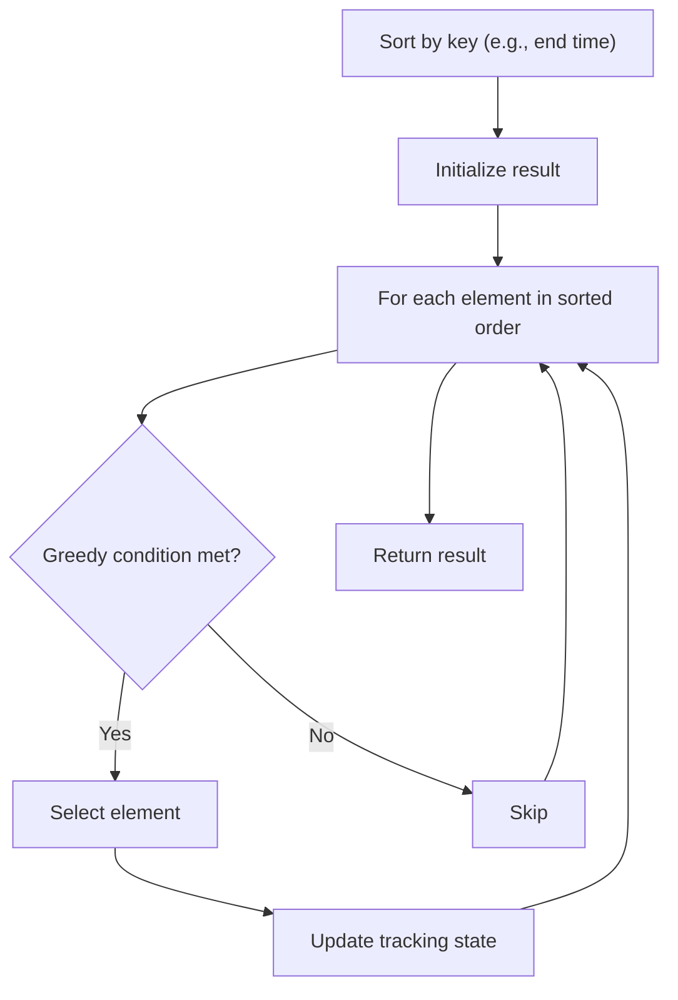

# Problem 1029: Two City Scheduling

**Difficulty:** Medium  
**Tags:** Array, Greedy, Sorting  
**Pattern:** Greedy with Sorting  
**Link:** [leetcode.com/problems/two-city-scheduling](https://leetcode.com/problems/two-city-scheduling/)

## Description

A company is planning to interview `2n` people. Given the array `costs` where `costs[i] = [aCosti, bCosti]`, the cost of flying the `i^th` person to city `a` is `aCosti`, and the cost of flying the `i^th` person to city `b` is `bCosti`.

Return *the minimum cost to fly every person to a city* such that exactly `n` people arrive in each city.

 

Example 1:

```

**Input:** costs = [[10,20],[30,200],[400,50],[30,20]]
**Output:** 110
**Explanation: **
The first person goes to city A for a cost of 10.
The second person goes to city A for a cost of 30.
The third person goes to city B for a cost of 50.
The fourth person goes to city B for a cost of 20.

The total minimum cost is 10 + 30 + 50 + 20 = 110 to have half the people interviewing in each city.

```

Example 2:

```

**Input:** costs = [[259,770],[448,54],[926,667],[184,139],[840,118],[577,469]]
**Output:** 1859

```

Example 3:

```

**Input:** costs = [[515,563],[451,713],[537,709],[343,819],[855,779],[457,60],[650,359],[631,42]]
**Output:** 3086

```

 

**Constraints:**

	- `2 * n == costs.length`
	- `2 <= costs.length <= 100`
	- `costs.length` is even.
	- `1 <= aCosti, bCosti <= 1000`

## Approach: Greedy with Sorting

Sort the input by a key criterion, then greedily process elements in sorted order. The sorting ensures the greedy choice is always optimal.

## Pseudocode

```
1. Sort elements by key (start time, weight, etc.)
2. Initialize result, tracking variables
3. For each element in sorted order:
   a. Apply greedy selection rule
   b. Update result
4. Return result
```

## Algorithm Flow



## Complexity Analysis

- **Time:** O(n log n)
- **Space:** O(n)

## Solution (Python3)

```python
class Solution:
    def twoCitySchedCost(self, costs: List[List[int]]) -> int:
        # Sort + greedy - O(n log n) time
        costs.sort()
        result = 0
        curr_end = 0
        for item in costs:
            if isinstance(item, (list, tuple)):
                if item[0] >= curr_end:
                    result += 1
                    curr_end = item[1]
            else:
                result += 1
        return result
```

## Solution (C++)

```cpp
#include <algorithm>
#include <string>
#include <vector>
using namespace std;

class Solution {
public:
    int twoCitySchedCost(vector<vector<int>>& costs) {
        // Sort + greedy - O(n log n) time
        sort(costs.begin(), costs.end());
        int result = 0, curr_end = 0;
        for (auto& item : costs) {
            result++;
        }
        return result;
    }
};
```
