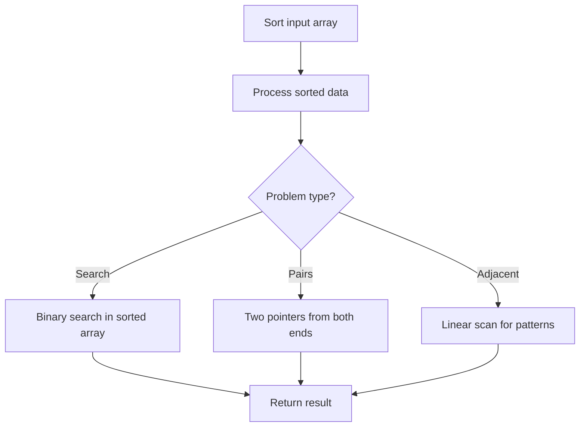

# Problem 1030: Matrix Cells in Distance Order

**Difficulty:** Easy  
**Tags:** Array, Math, Geometry, Sorting, Matrix  
**Pattern:** Sorting  
**Link:** [leetcode.com/problems/matrix-cells-in-distance-order](https://leetcode.com/problems/matrix-cells-in-distance-order/)

## Description

You are given four integers `row`, `cols`, `rCenter`, and `cCenter`. There is a `rows x cols` matrix and you are on the cell with the coordinates `(rCenter, cCenter)`.

Return *the coordinates of all cells in the matrix, sorted by their **distance** from *`(rCenter, cCenter)`* from the smallest distance to the largest distance*. You may return the answer in **any order** that satisfies this condition.

The **distance** between two cells `(r1, c1)` and `(r2, c2)` is `|r1 - r2| + |c1 - c2|`.

 

Example 1:

```

**Input:** rows = 1, cols = 2, rCenter = 0, cCenter = 0
**Output:** [[0,0],[0,1]]
**Explanation:** The distances from (0, 0) to other cells are: [0,1]

```

Example 2:

```

**Input:** rows = 2, cols = 2, rCenter = 0, cCenter = 1
**Output:** [[0,1],[0,0],[1,1],[1,0]]
**Explanation:** The distances from (0, 1) to other cells are: [0,1,1,2]
The answer [[0,1],[1,1],[0,0],[1,0]] would also be accepted as correct.

```

Example 3:

```

**Input:** rows = 2, cols = 3, rCenter = 1, cCenter = 2
**Output:** [[1,2],[0,2],[1,1],[0,1],[1,0],[0,0]]
**Explanation:** The distances from (1, 2) to other cells are: [0,1,1,2,2,3]
There are other answers that would also be accepted as correct, such as [[1,2],[1,1],[0,2],[1,0],[0,1],[0,0]].

```

 

**Constraints:**

	- `1 <= rows, cols <= 100`
	- `0 <= rCenter < rows`
	- `0 <= cCenter < cols`

## Approach: Sorting

Sort the data to enable efficient processing. After sorting, use techniques like binary search, two pointers, or linear scan to solve the problem.

## Pseudocode

```
1. Sort the input array
2. Process sorted data:
   - Use binary search for lookups
   - Use two pointers for pair finding
   - Scan for adjacent patterns
3. Return result
```

## Algorithm Flow



## Complexity Analysis

- **Time:** O(n log n)
- **Space:** O(n)

## Solution (Python3)

```python
class Solution:
    def allCellsDistOrder(self, rows: int, cols: int, rCenter: int, cCenter: int) -> List[List[int]]:
        # Sort-based approach - O(n log n) time
        rows.sort(key=lambda x: x[0] if isinstance(x, (list, tuple)) else x)
        result = [rows[0]]
        for i in range(1, len(rows)):
            curr = rows[i]
            if isinstance(curr, (list, tuple)) and isinstance(result[-1], (list, tuple)):
                if curr[0] <= result[-1][1]:
                    result[-1] = [result[-1][0], max(result[-1][1], curr[1])]
                else:
                    result.append(curr)
            else:
                result.append(curr)
        return result
```

## Solution (C++)

```cpp
#include <algorithm>
#include <string>
#include <vector>
using namespace std;

class Solution {
public:
    vector<vector<int>> allCellsDistOrder(int rows, int cols, int rCenter, int cCenter) {
        // Sort-based approach - O(n log n) time
        sort(rows.begin(), rows.end());
        vector<vector<int>> result;
        result.push_back(rows[0]);
        for (int i = 1; i < (int)rows.size(); i++) {
            if (rows[i][0] <= result.back()[1]) {
                result.back()[1] = max(result.back()[1], rows[i][1]);
            } else {
                result.push_back(rows[i]);
            }
        }
        return result;
    }
};
```
