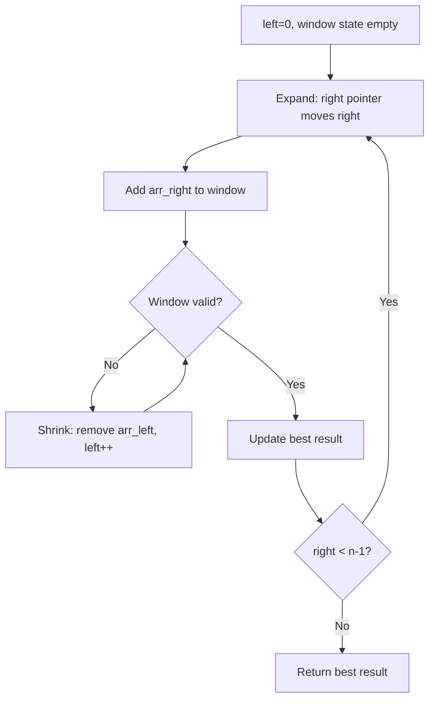
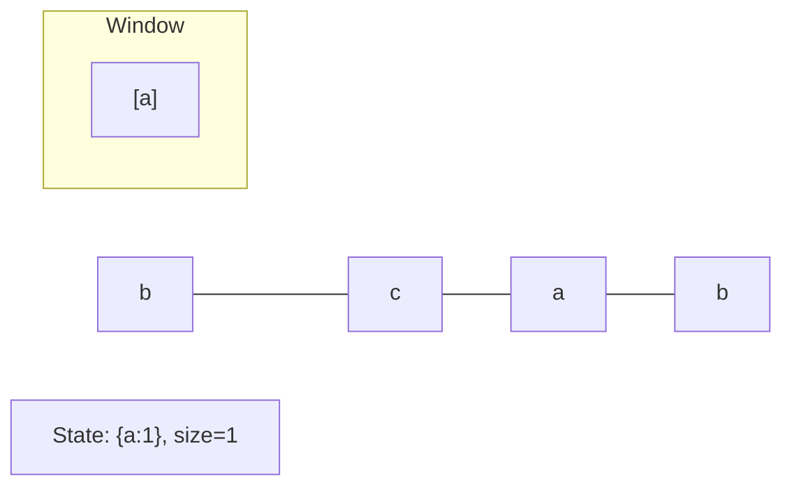
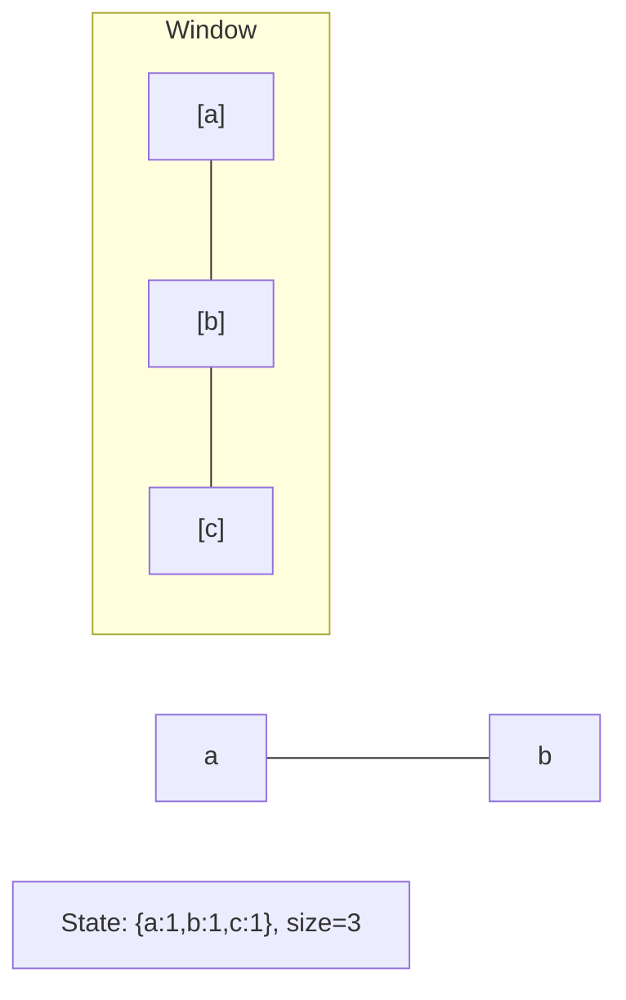
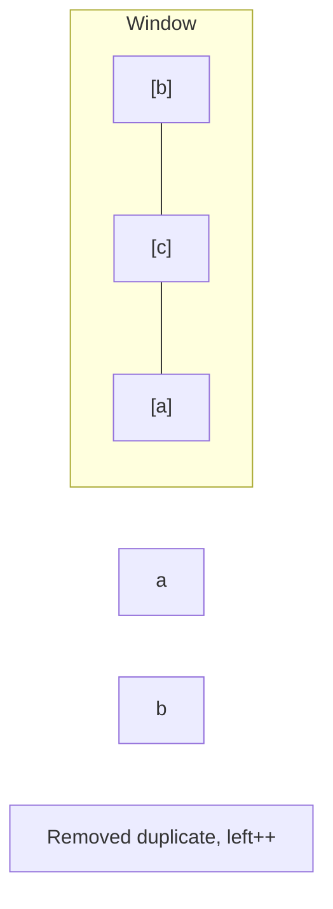
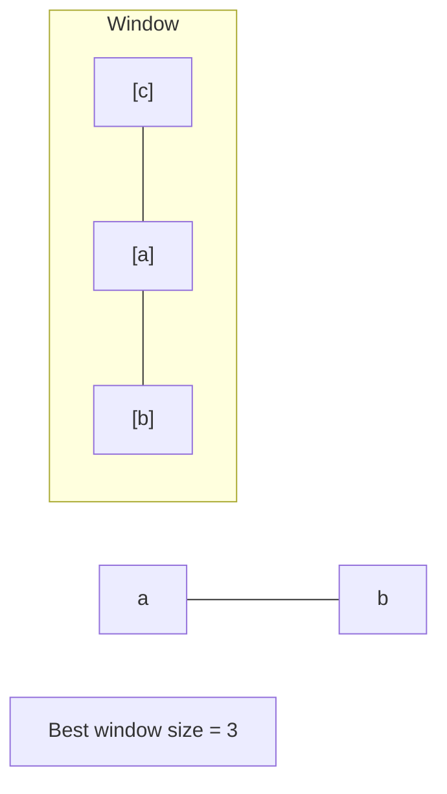

# Problem 1031: Maximum Sum of Two Non-Overlapping Subarrays

**Difficulty:** Medium  
**Tags:** Array, Dynamic Programming, Sliding Window  
**Pattern:** Sliding Window  
**Link:** [leetcode.com/problems/maximum-sum-of-two-non-overlapping-subarrays](https://leetcode.com/problems/maximum-sum-of-two-non-overlapping-subarrays/)

## Description

Given an integer array `nums` and two integers `firstLen` and `secondLen`, return *the maximum sum of elements in two non-overlapping **subarrays** with lengths *`firstLen`* and *`secondLen`.

The array with length `firstLen` could occur before or after the array with length `secondLen`, but they have to be non-overlapping.

A **subarray** is a **contiguous** part of an array.

 

Example 1:

```

**Input:** nums = [0,6,5,2,2,5,1,9,4], firstLen = 1, secondLen = 2
**Output:** 20
**Explanation:** One choice of subarrays is [9] with length 1, and [6,5] with length 2.

```

Example 2:

```

**Input:** nums = [3,8,1,3,2,1,8,9,0], firstLen = 3, secondLen = 2
**Output:** 29
**Explanation:** One choice of subarrays is [3,8,1] with length 3, and [8,9] with length 2.

```

Example 3:

```

**Input:** nums = [2,1,5,6,0,9,5,0,3,8], firstLen = 4, secondLen = 3
**Output:** 31
**Explanation:** One choice of subarrays is [5,6,0,9] with length 4, and [0,3,8] with length 3.

```

 

**Constraints:**

	- `1 <= firstLen, secondLen <= 1000`
	- `2 <= firstLen + secondLen <= 1000`
	- `firstLen + secondLen <= nums.length <= 1000`
	- `0 <= nums[i] <= 1000`

## Approach: Sliding Window

Maintain a window over the data using two pointers. Expand the right boundary to include new elements, and shrink the left boundary when the window constraint is violated. Track the optimal window.

## Pseudocode

```
1. Initialize left = 0, result = initial_value
2. For right in range(n):
   a. Add element at right to window state
   b. While window is invalid:
      - Remove element at left from window state
      - left++
   c. Update result = best of (result, window size/value)
3. Return result
```

## Algorithm Flow



## Visual State Transitions

**Sliding Window Step-by-Step:**

**Frame 1: Initial window (left=0, right=0)**


**Frame 2: Expand right (right=2)**


**Frame 3: Violation - shrink left**


**Frame 4: Continue expanding**



## Complexity Analysis

- **Time:** O(n)
- **Space:** O(k)

## Solution (Python3)

```python
class Solution:
    def maxSumTwoNoOverlap(self, nums: List[int], firstLen: int, secondLen: int) -> int:
        # Sliding window approach - O(n) time, O(k) space
        from collections import defaultdict
        window = defaultdict(int)
        left = 0
        result = 0
        for right in range(len(nums)):
            window[nums[right]] += 1
            while len(window) > (firstLen if isinstance(firstLen, int) else len(nums)):
                window[nums[left]] -= 1
                if window[nums[left]] == 0:
                    del window[nums[left]]
                left += 1
            result = max(result, right - left + 1)
        return result
```

## Solution (C++)

```cpp
#include <algorithm>
#include <string>
#include <unordered_map>
#include <vector>
using namespace std;

class Solution {
public:
    int maxSumTwoNoOverlap(vector<int>& nums, int firstLen, int secondLen) {
        // Sliding window approach - O(n) time, O(k) space
        unordered_map<char, int> window;
        int left = 0, result = 0;
        for (int right = 0; right < nums.size(); right++) {
            window[nums[right]]++;
            while ((int)window.size() > firstLen) {
                window[nums[left]]--;
                if (window[nums[left]] == 0)
                    window.erase(nums[left]);
                left++;
            }
            result = max(result, right - left + 1);
        }
        return result;
    }
};
```
