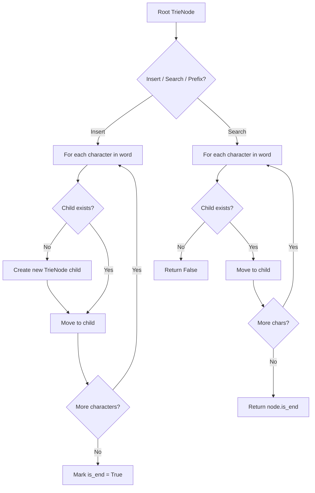
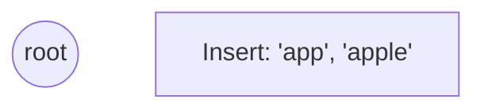
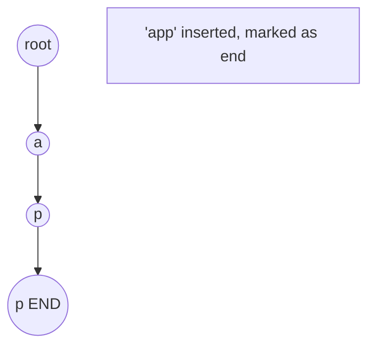
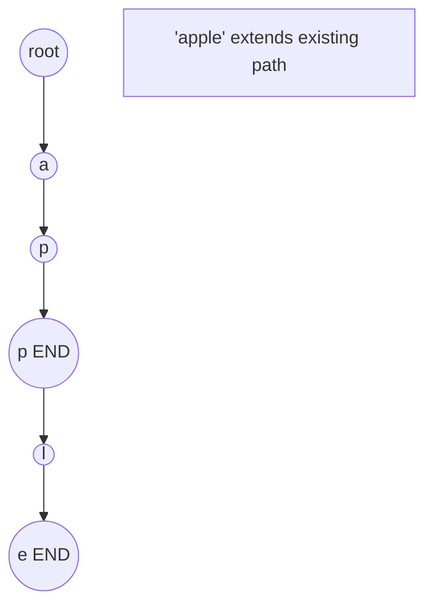
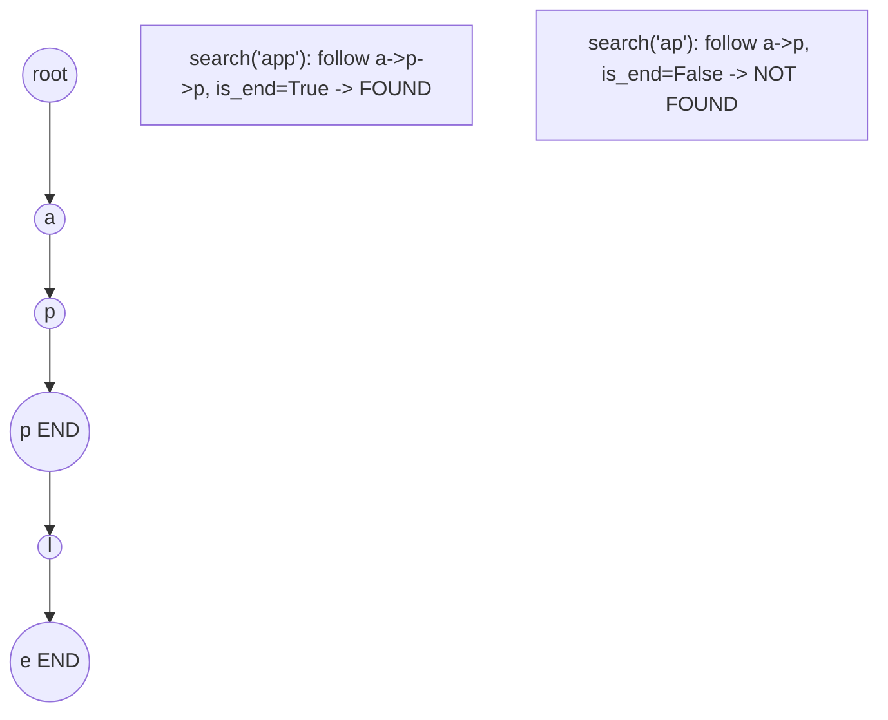

# Problem 1032: Stream of Characters

**Difficulty:** Hard  
**Tags:** Array, String, Design, Trie, Data Stream  
**Pattern:** Trie / Prefix Tree  
**Link:** [leetcode.com/problems/stream-of-characters](https://leetcode.com/problems/stream-of-characters/)

## Description

Design an algorithm that accepts a stream of characters and checks if a suffix of these characters is a string of a given array of strings `words`.

For example, if `words = ["abc", "xyz"]` and the stream added the four characters (one by one) `'a'`, `'x'`, `'y'`, and `'z'`, your algorithm should detect that the suffix `"xyz"` of the characters `"axyz"` matches `"xyz"` from `words`.

Implement the `StreamChecker` class:

	- `StreamChecker(String[] words)` Initializes the object with the strings array `words`.
	- `boolean query(char letter)` Accepts a new character from the stream and returns `true` if any non-empty suffix from the stream forms a word that is in `words`.

 

Example 1:

```

**Input**
["StreamChecker", "query", "query", "query", "query", "query", "query", "query", "query", "query", "query", "query", "query"]
[[["cd", "f", "kl"]], ["a"], ["b"], ["c"], ["d"], ["e"], ["f"], ["g"], ["h"], ["i"], ["j"], ["k"], ["l"]]
**Output**
[null, false, false, false, true, false, true, false, false, false, false, false, true]

**Explanation**
StreamChecker streamChecker = new StreamChecker(["cd", "f", "kl"]);
streamChecker.query("a"); // return False
streamChecker.query("b"); // return False
streamChecker.query("c"); // return False
streamChecker.query("d"); // return True, because 'cd' is in the wordlist
streamChecker.query("e"); // return False
streamChecker.query("f"); // return True, because 'f' is in the wordlist
streamChecker.query("g"); // return False
streamChecker.query("h"); // return False
streamChecker.query("i"); // return False
streamChecker.query("j"); // return False
streamChecker.query("k"); // return False
streamChecker.query("l"); // return True, because 'kl' is in the wordlist

```

 

**Constraints:**

	- `1 <= words.length <= 2000`
	- `1 <= words[i].length <= 200`
	- `words[i]` consists of lowercase English letters.
	- `letter` is a lowercase English letter.
	- At most `4 * 10^4` calls will be made to query.

## Approach: Trie / Prefix Tree

Build a trie (prefix tree) where each node represents a character. Insert words character by character, and search by following child pointers. Supports efficient prefix matching.

## Pseudocode

```
1. TrieNode: children = {}, is_end = False
2. Insert(word):
   - For each char: create child if absent, move to child
   - Mark last node as end
3. Search(word):
   - For each char: if child absent return False, move to child
   - Return node.is_end
4. StartsWith(prefix): same as search but return True at end
```

## Algorithm Flow



## Visual State Transitions

**Trie Insert and Search:**

**Frame 1: Empty trie**


**Frame 2: Insert 'app'**


**Frame 3: Insert 'apple'**


**Frame 4: Search 'app' = True, 'ap' = False**



## Complexity Analysis

- **Time:** O(L) per operation
- **Space:** O(N * L)

## Solution (Python3)

```python
class StreamChecker:
    def __init__(self, words: List[str]):
        # Initialize data structure
        self.words = words

    def query(self, letter: str) -> bool:
        return False

```

## Solution (C++)

```cpp
#include <string>
#include <vector>
using namespace std;

class StreamChecker {
public:
    StreamChecker(vector<string>& words) {
        // Initialize
    }

    bool query(string& letter) {
        return false;
    }

};
```
