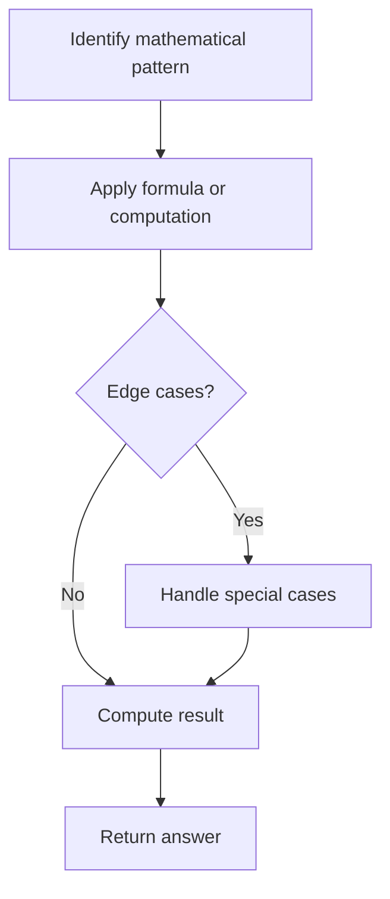

# Problem 1033: Moving Stones Until Consecutive

**Difficulty:** Medium  
**Tags:** Math, Brainteaser  
**Pattern:** Math  
**Link:** [leetcode.com/problems/moving-stones-until-consecutive](https://leetcode.com/problems/moving-stones-until-consecutive/)

## Description

There are three stones in different positions on the X-axis. You are given three integers `a`, `b`, and `c`, the positions of the stones.

In one move, you pick up a stone at an endpoint (i.e., either the lowest or highest position stone), and move it to an unoccupied position between those endpoints. Formally, let's say the stones are currently at positions `x`, `y`, and `z` with `x < y < z`. You pick up the stone at either position `x` or position `z`, and move that stone to an integer position `k`, with `x < k < z` and `k != y`.

The game ends when you cannot make any more moves (i.e., the stones are in three consecutive positions).

Return *an integer array *`answer`* of length *`2`* where*:

	- `answer[0]` *is the minimum number of moves you can play, and*
	- `answer[1]` *is the maximum number of moves you can play*.

 

Example 1:

```

**Input:** a = 1, b = 2, c = 5
**Output:** [1,2]
**Explanation:** Move the stone from 5 to 3, or move the stone from 5 to 4 to 3.

```

Example 2:

```

**Input:** a = 4, b = 3, c = 2
**Output:** [0,0]
**Explanation:** We cannot make any moves.

```

Example 3:

```

**Input:** a = 3, b = 5, c = 1
**Output:** [1,2]
**Explanation:** Move the stone from 1 to 4; or move the stone from 1 to 2 to 4.

```

 

**Constraints:**

	- `1 <= a, b, c <= 100`
	- `a`, `b`, and `c` have different values.

## Approach: Math

Apply mathematical properties, formulas, or number-theoretic concepts. Look for patterns, modular arithmetic, or closed-form solutions.

## Pseudocode

```
1. Identify the mathematical pattern or formula
2. Apply computation:
   - Modular arithmetic for large numbers
   - GCD/LCM for divisibility
   - Sieve for primes
3. Handle edge cases
4. Return result
```

## Algorithm Flow



## Complexity Analysis

- **Time:** O(n) or O(sqrt(n))
- **Space:** O(1)

## Solution (Python3)

```python
class Solution:
    def numMovesStones(self, a: int, b: int, c: int) -> List[int]:
        # Mathematical approach
        result = 0
        x = a
        while x != 0:
            result = result * 10 + x % 10
            x //= 10 if isinstance(x, int) else 1
        return result
```

## Solution (C++)

```cpp
#include <string>
#include <vector>
using namespace std;

class Solution {
public:
    vector<int> numMovesStones(int a, int b, int c) {
        // Mathematical approach
        long long result = 0;
        int x = a;
        while (x != 0) {
            result = result * 10 + x % 10;
            x /= 10;
        }
        return (int)result;
    }
};
```
