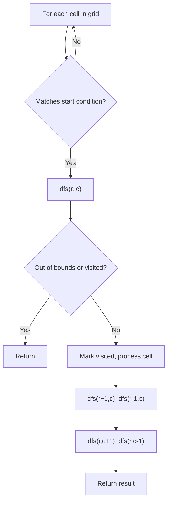
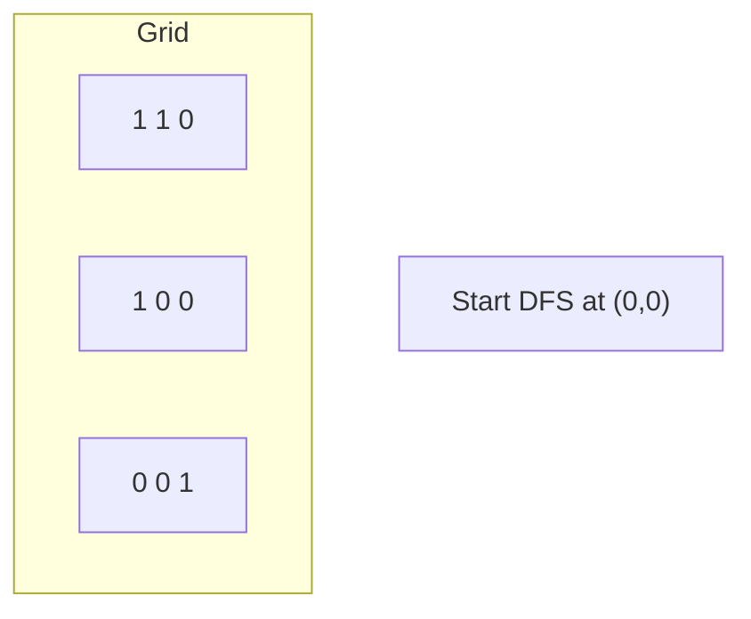
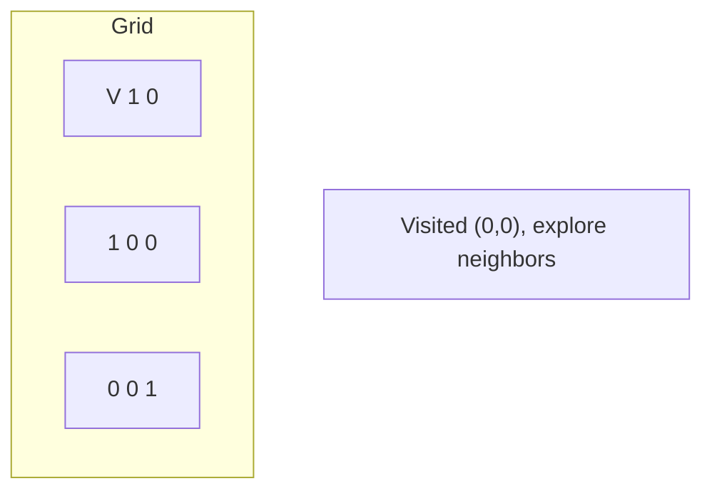
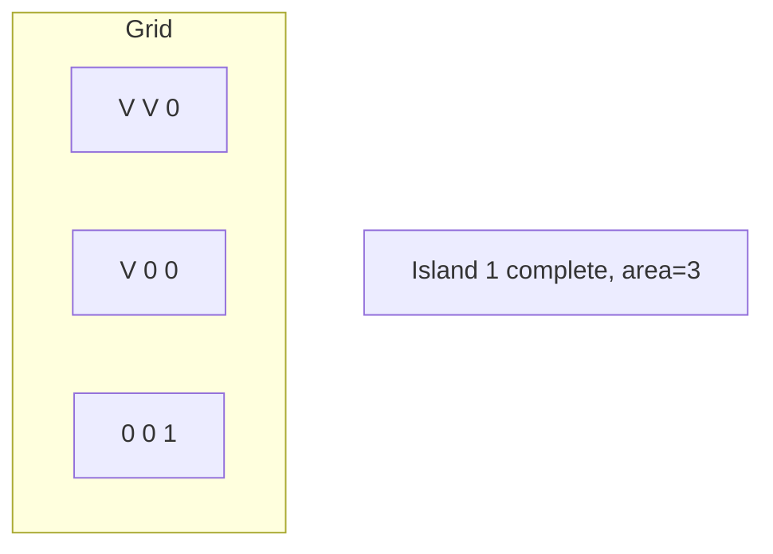
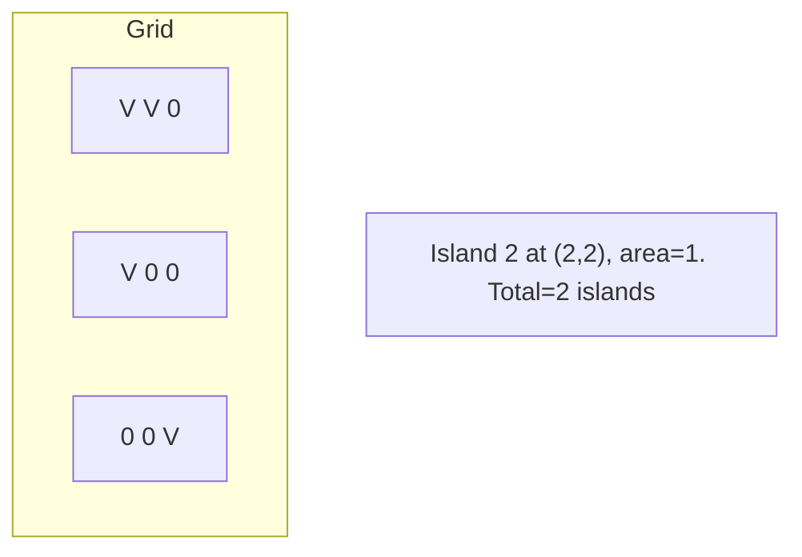

# Problem 1034: Coloring A Border

**Difficulty:** Medium  
**Tags:** Array, Depth-First Search, Breadth-First Search, Matrix  
**Pattern:** DFS on Matrix / Grid  
**Link:** [leetcode.com/problems/coloring-a-border](https://leetcode.com/problems/coloring-a-border/)

## Description

You are given an `m x n` integer matrix `grid`, and three integers `row`, `col`, and `color`. Each value in the grid represents the color of the grid square at that location.

Two squares are called **adjacent** if they are next to each other in any of the 4 directions.

Two squares belong to the same **connected component** if they have the same color and they are adjacent.

The **border of a connected component** is all the squares in the connected component that are either adjacent to (at least) a square not in the component, or on the boundary of the grid (the first or last row or column).

You should color the **border** of the **connected component** that contains the square `grid[row][col]` with `color`.

Return *the final grid*.

 

Example 1:

```
**Input:** grid = [[1,1],[1,2]], row = 0, col = 0, color = 3
**Output:** [[3,3],[3,2]]

```
Example 2:

```
**Input:** grid = [[1,2,2],[2,3,2]], row = 0, col = 1, color = 3
**Output:** [[1,3,3],[2,3,3]]

```
Example 3:

```
**Input:** grid = [[1,1,1],[1,1,1],[1,1,1]], row = 1, col = 1, color = 2
**Output:** [[2,2,2],[2,1,2],[2,2,2]]

```

 

**Constraints:**

	- `m == grid.length`
	- `n == grid[i].length`
	- `1 <= m, n <= 50`
	- `1 <= grid[i][j], color <= 1000`
	- `0 <= row < m`
	- `0 <= col < n`

## Approach: DFS on Matrix / Grid

Treat the grid as a graph where each cell connects to its 4 (or 8) neighbors. DFS from target cells, marking visited to avoid revisiting.

## Pseudocode

```
1. For each cell (r, c) in grid:
   a. If cell meets start condition:
      - Call dfs(r, c)
2. dfs(r, c):
   a. If out of bounds or visited or invalid: return
   b. Mark cell visited
   c. Recurse on 4 neighbors: up, down, left, right
3. Return result
```

## Algorithm Flow



## Visual State Transitions

**DFS on Grid (Island/Flood Fill):**

**Frame 1: Find first land cell**


**Frame 2: DFS explores connected cells**


**Frame 3: Mark entire island**


**Frame 4: Find second island**



## Complexity Analysis

- **Time:** O(m * n)
- **Space:** O(m * n)

## Solution (Python3)

```python
class Solution:
    def colorBorder(self, grid: List[List[int]], row: int, col: int, color: int) -> List[List[int]]:
        # DFS on grid - O(m*n) time
        if not grid:
            return 0
        rows, cols = len(grid), len(grid[0])
        count = 0
        
        def dfs(r, c):
            if r < 0 or r >= rows or c < 0 or c >= cols:
                return
            if grid[r][c] == '0' or grid[r][c] == 0:
                return
            grid[r][c] = '0'
            dfs(r+1, c); dfs(r-1, c)
            dfs(r, c+1); dfs(r, c-1)
        
        for r in range(rows):
            for c in range(cols):
                if grid[r][c] == '1' or grid[r][c] == 1:
                    dfs(r, c)
                    count += 1
        return count
```

## Solution (C++)

```cpp
#include <functional>
#include <string>
#include <vector>
using namespace std;

class Solution {
public:
    vector<vector<int>> colorBorder(vector<vector<int>>& grid, int row, int col, int color) {
        // DFS on grid - O(m*n) time
        if (grid.empty()) return 0;
        int rows = grid.size(), cols = grid[0].size();
        int count = 0;
        function<void(int, int)> dfs = [&](int r, int c) {
            if (r < 0 || r >= rows || c < 0 || c >= cols) return;
            if (grid[r][c] == '0') return;
            grid[r][c] = '0';
            dfs(r+1, c); dfs(r-1, c);
            dfs(r, c+1); dfs(r, c-1);
        };
        for (int r = 0; r < rows; r++) {
            for (int c = 0; c < cols; c++) {
                if (grid[r][c] == '1') {
                    dfs(r, c);
                    count++;
                }
            }
        }
        return count;
    }
};
```
