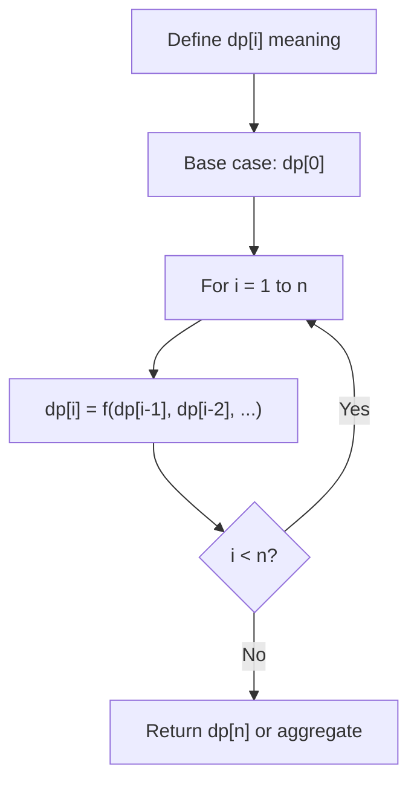
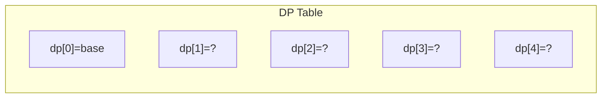
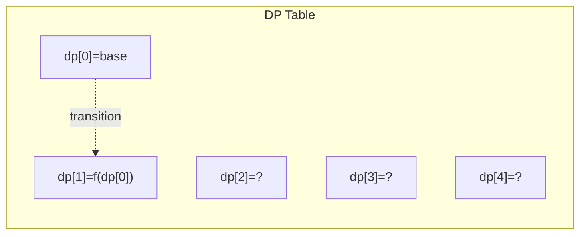
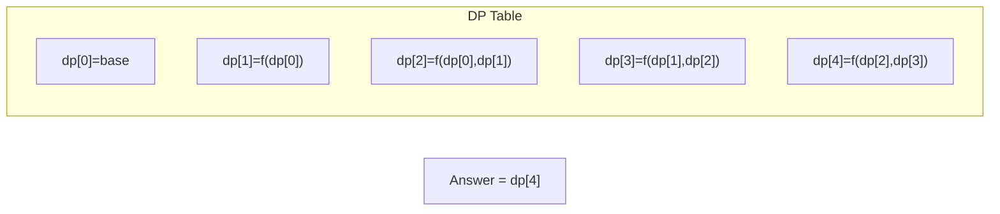

# Problem 1035: Uncrossed Lines

**Difficulty:** Medium  
**Tags:** Array, Dynamic Programming  
**Pattern:** Dynamic Programming (1D)  
**Link:** [leetcode.com/problems/uncrossed-lines](https://leetcode.com/problems/uncrossed-lines/)

## Description

You are given two integer arrays `nums1` and `nums2`. We write the integers of `nums1` and `nums2` (in the order they are given) on two separate horizontal lines.

We may draw connecting lines: a straight line connecting two numbers `nums1[i]` and `nums2[j]` such that:

	- `nums1[i] == nums2[j]`, and
	- the line we draw does not intersect any other connecting (non-horizontal) line.

Note that a connecting line cannot intersect even at the endpoints (i.e., each number can only belong to one connecting line).

Return *the maximum number of connecting lines we can draw in this way*.

 

Example 1:

```

**Input:** nums1 = [1,4,2], nums2 = [1,2,4]
**Output:** 2
**Explanation:** We can draw 2 uncrossed lines as in the diagram.
We cannot draw 3 uncrossed lines, because the line from nums1[1] = 4 to nums2[2] = 4 will intersect the line from nums1[2]=2 to nums2[1]=2.

```

Example 2:

```

**Input:** nums1 = [2,5,1,2,5], nums2 = [10,5,2,1,5,2]
**Output:** 3

```

Example 3:

```

**Input:** nums1 = [1,3,7,1,7,5], nums2 = [1,9,2,5,1]
**Output:** 2

```

 

**Constraints:**

	- `1 <= nums1.length, nums2.length <= 500`
	- `1 <= nums1[i], nums2[j] <= 2000`

## Approach: Dynamic Programming (1D)

Break the problem into overlapping subproblems. Define dp[i] as the optimal value for the subproblem ending at or considering index i. Build the solution bottom-up, using previously computed dp values.

## Pseudocode

```
1. Define dp[i] = optimal value for subproblem i
2. Base case: dp[0] = initial value
3. For i from 1 to n:
   a. dp[i] = recurrence(dp[i-1], dp[i-2], ...)
4. Return dp[n] or max/min of dp
```

## Algorithm Flow



## Visual State Transitions

**1D Dynamic Programming Table Build:**

**Frame 1: Initialize base cases**


**Frame 2: Fill dp[1] from dp[0]**


**Frame 3: Fill remaining cells**



## Complexity Analysis

- **Time:** O(n)
- **Space:** O(n)

## Solution (Python3)

```python
class Solution:
    def maxUncrossedLines(self, nums1: List[int], nums2: List[int]) -> int:
        # Dynamic programming (1D) - O(n) time, O(n) space
        if not nums1:
            return 0
        n = len(nums1) if isinstance(nums1, list) else nums1
        dp = [0] * (n + 1)
        dp[0] = 1  # base case
        for i in range(1, n + 1):
            dp[i] = dp[i-1]  # transition (customize per problem)
            if i >= 2:
                dp[i] += dp[i-2]
        return dp[n]
```

## Solution (C++)

```cpp
#include <string>
#include <vector>
using namespace std;

class Solution {
public:
    int maxUncrossedLines(vector<int>& nums1, vector<int>& nums2) {
        // Dynamic programming (1D) - O(n) time, O(n) space
        int n = nums1;
        if (n <= 0) return 0;
        vector<int> dp(n + 1, 0);
        dp[0] = 1;
        for (int i = 1; i <= n; i++) {
            dp[i] = dp[i-1];
            if (i >= 2) dp[i] += dp[i-2];
        }
        return dp[n];
    }
};
```
