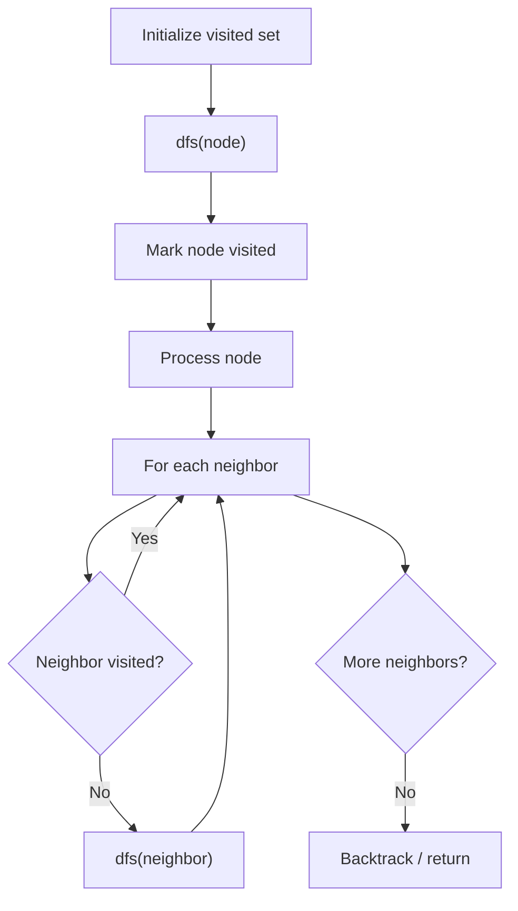

# Problem 1036: Escape a Large Maze

**Difficulty:** Hard  
**Tags:** Array, Hash Table, Depth-First Search, Breadth-First Search  
**Pattern:** DFS Graph Traversal  
**Link:** [leetcode.com/problems/escape-a-large-maze](https://leetcode.com/problems/escape-a-large-maze/)

## Description

There is a 1 million by 1 million grid on an XY-plane, and the coordinates of each grid square are `(x, y)`.

We start at the `source = [sx, sy]` square and want to reach the `target = [tx, ty]` square. There is also an array of `blocked` squares, where each `blocked[i] = [xi, yi]` represents a blocked square with coordinates `(xi, yi)`.

Each move, we can walk one square north, east, south, or west if the square is **not** in the array of `blocked` squares. We are also not allowed to walk outside of the grid.

Return `true`* if and only if it is possible to reach the *`target`* square from the *`source`* square through a sequence of valid moves*.

 

Example 1:

```

**Input:** blocked = [[0,1],[1,0]], source = [0,0], target = [0,2]
**Output:** false
**Explanation:** The target square is inaccessible starting from the source square because we cannot move.
We cannot move north or east because those squares are blocked.
We cannot move south or west because we cannot go outside of the grid.

```

Example 2:

```

**Input:** blocked = [], source = [0,0], target = [999999,999999]
**Output:** true
**Explanation:** Because there are no blocked cells, it is possible to reach the target square.

```

 

**Constraints:**

	- `0 <= blocked.length <= 200`
	- `blocked[i].length == 2`
	- `0 <= xi, yi < 10^6`
	- `source.length == target.length == 2`
	- `0 <= sx, sy, tx, ty < 10^6`
	- `source != target`
	- It is guaranteed that `source` and `target` are not blocked.

## Approach: DFS Graph Traversal

Explore the graph depth-first using recursion or a stack. Mark nodes as visited to avoid cycles. Process each node and explore all unvisited neighbors.

## Pseudocode

```
1. Initialize visited set
2. Define dfs(node):
   a. Mark node as visited
   b. Process node
   c. For each neighbor of node:
      - If not visited: dfs(neighbor)
3. Call dfs(start) for each unvisited node
```

## Algorithm Flow



## Complexity Analysis

- **Time:** O(V + E)
- **Space:** O(V)

## Solution (Python3)

```python
class Solution:
    def isEscapePossible(self, blocked: List[List[int]], source: List[int], target: List[int]) -> bool:
        # DFS on graph - O(V+E) time
        visited = set()
        result = []
        
        def dfs(node):
            if node in visited:
                return
            visited.add(node)
            result.append(node)
            # Traverse neighbors (adjust based on adjacency representation)
        
        dfs(0)
        return result if isinstance(False, list) else len(result)
```

## Solution (C++)

```cpp
#include <functional>
#include <string>
#include <vector>
using namespace std;

class Solution {
public:
    bool isEscapePossible(vector<vector<int>>& blocked, vector<int>& source, vector<int>& target) {
        // DFS on graph - O(V+E) time
        vector<bool> visited(blocked.size(), false);
        vector<int> result;
        function<void(int)> dfs = [&](int node) {
            if (visited[node]) return;
            visited[node] = true;
            result.push_back(node);
            // Traverse neighbors
        };
        dfs(0);
        return result;
    }
};
```
