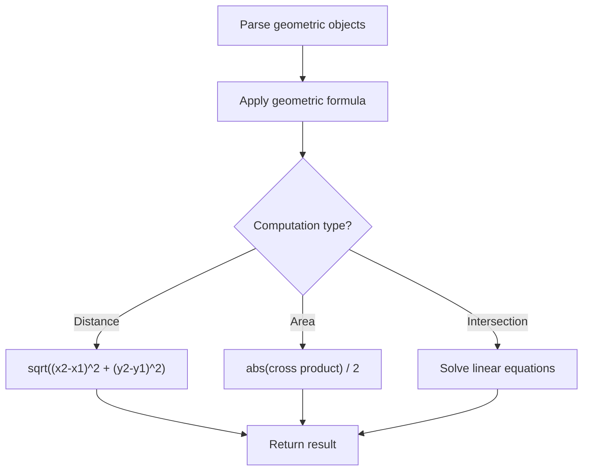

# Problem 1037: Valid Boomerang

**Difficulty:** Easy  
**Tags:** Array, Math, Geometry  
**Pattern:** Geometry  
**Link:** [leetcode.com/problems/valid-boomerang](https://leetcode.com/problems/valid-boomerang/)

## Description

Given an array `points` where `points[i] = [xi, yi]` represents a point on the **X-Y** plane, return `true` *if these points are a **boomerang***.

A **boomerang** is a set of three points that are **all distinct** and **not in a straight line**.

 

Example 1:

```
**Input:** points = [[1,1],[2,3],[3,2]]
**Output:** true

```
Example 2:

```
**Input:** points = [[1,1],[2,2],[3,3]]
**Output:** false

```

 

**Constraints:**

	- `points.length == 3`
	- `points[i].length == 2`
	- `0 <= xi, yi <= 100`

## Approach: Geometry

Apply geometric formulas: distance, area, cross product, convex hull, line intersection. Handle floating-point precision carefully.

## Pseudocode

```
1. Parse geometric objects (points, lines, shapes)
2. Apply geometric operations:
   - Distance formula
   - Cross/dot product
   - Area computation
3. Handle precision and edge cases
4. Return result
```

## Algorithm Flow



## Complexity Analysis

- **Time:** O(n^2) or O(n log n)
- **Space:** O(n)

## Solution (Python3)

```python
class Solution:
    def isBoomerang(self, points: List[List[int]]) -> bool:
        # Geometry approach
        import math
        result = 0
        for i in range(len(points)):
            for j in range(i + 1, len(points)):
                dx = points[i][0] - points[j][0]
                dy = points[i][1] - points[j][1]
                dist = math.sqrt(dx*dx + dy*dy)
                result = max(result, dist)
        return result
```

## Solution (C++)

```cpp
#include <algorithm>
#include <cmath>
#include <string>
#include <vector>
using namespace std;

class Solution {
public:
    bool isBoomerang(vector<vector<int>>& points) {
        // Geometry approach
        double result = 0;
        for (int i = 0; i < (int)points.size(); i++) {
            for (int j = i + 1; j < (int)points.size(); j++) {
                double dx = points[i][0] - points[j][0];
                double dy = points[i][1] - points[j][1];
                result = max(result, sqrt(dx*dx + dy*dy));
            }
        }
        return result;
    }
};
```
