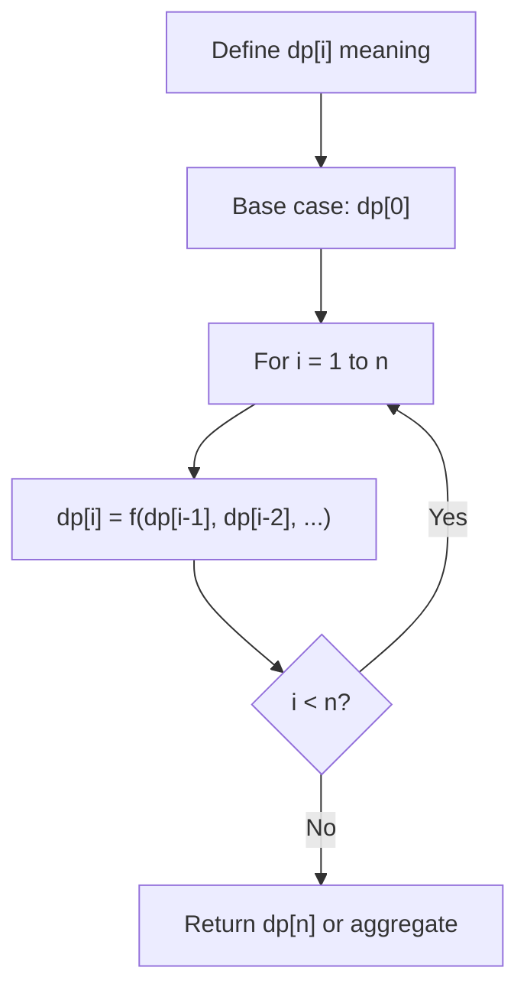
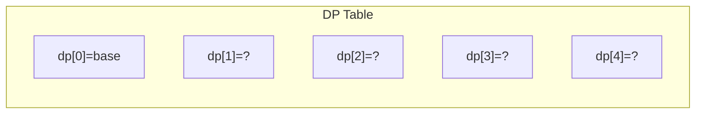
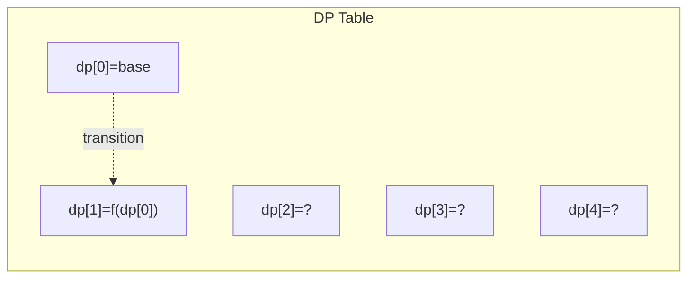
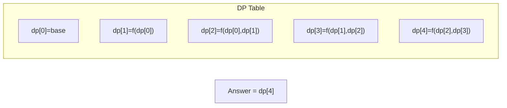

# Problem 1039: Minimum Score Triangulation of Polygon

**Difficulty:** Medium  
**Tags:** Array, Dynamic Programming  
**Pattern:** Dynamic Programming (1D)  
**Link:** [leetcode.com/problems/minimum-score-triangulation-of-polygon](https://leetcode.com/problems/minimum-score-triangulation-of-polygon/)

## Description

You have a convex `n`-sided polygon where each vertex has an integer value. You are given an integer array `values` where `values[i]` is the value of the `i^th` vertex in **clockwise order**.

**Polygon** **triangulation** is a process where you divide a polygon into a set of triangles and the vertices of each triangle must also be vertices of the original polygon. Note that no other shapes other than triangles are allowed in the division. This process will result in `n - 2` triangles.

You will **triangulate** the polygon. For each triangle, the *weight* of that triangle is the product of the values at its vertices. The total score of the triangulation is the sum of these *weights* over all `n - 2` triangles.

Return the* minimum possible score *that you can achieve with some* ***triangulation*** *of the polygon.

 

Example 1:

**Input:** values = [1,2,3]

**Output:** 6

**Explanation:** The polygon is already triangulated, and the score of the only triangle is 6.

Example 2:

**Input:** values = [3,7,4,5]

**Output:** 144

**Explanation:** There are two triangulations, with possible scores: 3*7*5 + 4*5*7 = 245, or 3*4*5 + 3*4*7 = 144.

The minimum score is 144.

Example 3:

​​​​​​​

**Input:** values = [1,3,1,4,1,5]

**Output:** 13

**Explanation:** The minimum score triangulation is 1*1*3 + 1*1*4 + 1*1*5 + 1*1*1 = 13.

 

**Constraints:**

	- `n == values.length`
	- `3 <= n <= 50`
	- `1 <= values[i] <= 100`

## Approach: Dynamic Programming (1D)

Break the problem into overlapping subproblems. Define dp[i] as the optimal value for the subproblem ending at or considering index i. Build the solution bottom-up, using previously computed dp values.

## Pseudocode

```
1. Define dp[i] = optimal value for subproblem i
2. Base case: dp[0] = initial value
3. For i from 1 to n:
   a. dp[i] = recurrence(dp[i-1], dp[i-2], ...)
4. Return dp[n] or max/min of dp
```

## Algorithm Flow



## Visual State Transitions

**1D Dynamic Programming Table Build:**

**Frame 1: Initialize base cases**


**Frame 2: Fill dp[1] from dp[0]**


**Frame 3: Fill remaining cells**



## Complexity Analysis

- **Time:** O(n)
- **Space:** O(n)

## Solution (Python3)

```python
class Solution:
    def minScoreTriangulation(self, values: List[int]) -> int:
        # Dynamic programming (1D) - O(n) time, O(n) space
        if not values:
            return 0
        n = len(values) if isinstance(values, list) else values
        dp = [0] * (n + 1)
        dp[0] = 1  # base case
        for i in range(1, n + 1):
            dp[i] = dp[i-1]  # transition (customize per problem)
            if i >= 2:
                dp[i] += dp[i-2]
        return dp[n]
```

## Solution (C++)

```cpp
#include <string>
#include <vector>
using namespace std;

class Solution {
public:
    int minScoreTriangulation(vector<int>& values) {
        // Dynamic programming (1D) - O(n) time, O(n) space
        int n = values;
        if (n <= 0) return 0;
        vector<int> dp(n + 1, 0);
        dp[0] = 1;
        for (int i = 1; i <= n; i++) {
            dp[i] = dp[i-1];
            if (i >= 2) dp[i] += dp[i-2];
        }
        return dp[n];
    }
};
```
