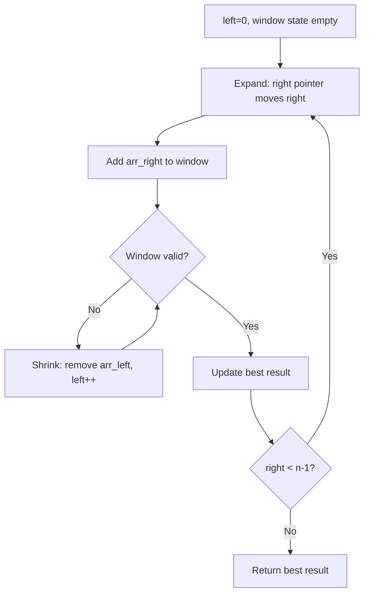
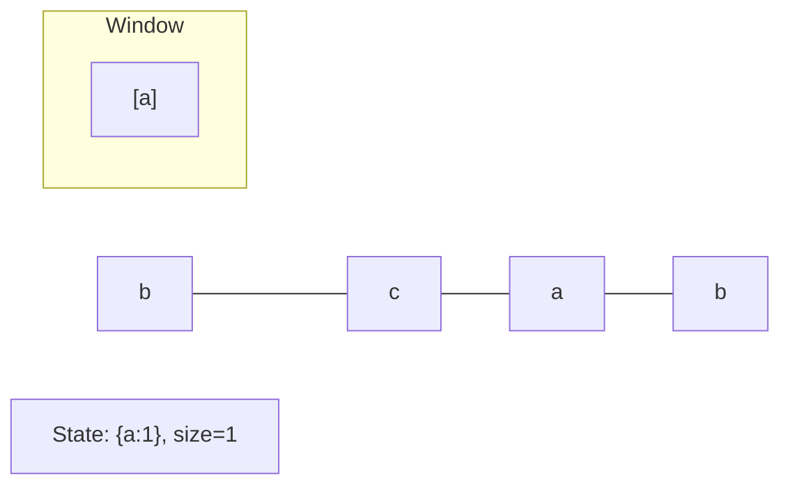
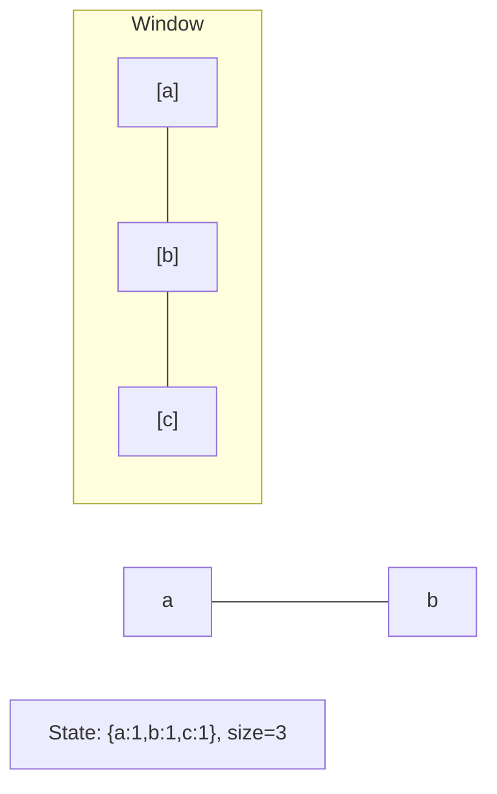
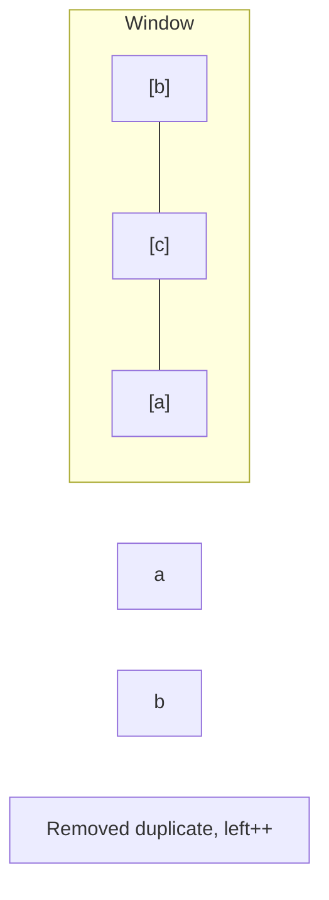
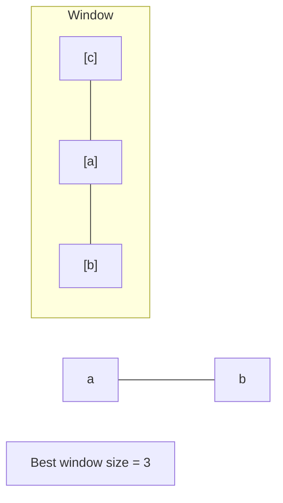

# Problem 1040: Moving Stones Until Consecutive II

**Difficulty:** Medium  
**Tags:** Array, Math, Sliding Window, Sorting  
**Pattern:** Sliding Window  
**Link:** [leetcode.com/problems/moving-stones-until-consecutive-ii](https://leetcode.com/problems/moving-stones-until-consecutive-ii/)

## Description

There are some stones in different positions on the X-axis. You are given an integer array `stones`, the positions of the stones.

Call a stone an **endpoint stone** if it has the smallest or largest position. In one move, you pick up an **endpoint stone** and move it to an unoccupied position so that it is no longer an **endpoint stone**.

	- In particular, if the stones are at say, `stones = [1,2,5]`, you cannot move the endpoint stone at position `5`, since moving it to any position (such as `0`, or `3`) will still keep that stone as an endpoint stone.

The game ends when you cannot make any more moves (i.e., the stones are in three consecutive positions).

Return *an integer array *`answer`* of length *`2`* where*:

	- `answer[0]` *is the minimum number of moves you can play, and*
	- `answer[1]` *is the maximum number of moves you can play*.

 

Example 1:

```

**Input:** stones = [7,4,9]
**Output:** [1,2]
**Explanation:** We can move 4 -> 8 for one move to finish the game.
Or, we can move 9 -> 5, 4 -> 6 for two moves to finish the game.

```

Example 2:

```

**Input:** stones = [6,5,4,3,10]
**Output:** [2,3]
**Explanation:** We can move 3 -> 8 then 10 -> 7 to finish the game.
Or, we can move 3 -> 7, 4 -> 8, 5 -> 9 to finish the game.
Notice we cannot move 10 -> 2 to finish the game, because that would be an illegal move.

```

 

**Constraints:**

	- `3 <= stones.length <= 10^4`
	- `1 <= stones[i] <= 10^9`
	- All the values of `stones` are **unique**.

## Approach: Sliding Window

Maintain a window over the data using two pointers. Expand the right boundary to include new elements, and shrink the left boundary when the window constraint is violated. Track the optimal window.

## Pseudocode

```
1. Initialize left = 0, result = initial_value
2. For right in range(n):
   a. Add element at right to window state
   b. While window is invalid:
      - Remove element at left from window state
      - left++
   c. Update result = best of (result, window size/value)
3. Return result
```

## Algorithm Flow



## Visual State Transitions

**Sliding Window Step-by-Step:**

**Frame 1: Initial window (left=0, right=0)**


**Frame 2: Expand right (right=2)**


**Frame 3: Violation - shrink left**


**Frame 4: Continue expanding**



## Complexity Analysis

- **Time:** O(n)
- **Space:** O(k)

## Solution (Python3)

```python
class Solution:
    def numMovesStonesII(self, stones: List[int]) -> List[int]:
        # Sliding window approach - O(n) time, O(k) space
        from collections import defaultdict
        window = defaultdict(int)
        left = 0
        result = 0
        for right in range(len(stones)):
            window[stones[right]] += 1
            while len(window) > (stones if isinstance(stones, int) else len(stones)):
                window[stones[left]] -= 1
                if window[stones[left]] == 0:
                    del window[stones[left]]
                left += 1
            result = max(result, right - left + 1)
        return result
```

## Solution (C++)

```cpp
#include <algorithm>
#include <string>
#include <unordered_map>
#include <vector>
using namespace std;

class Solution {
public:
    vector<int> numMovesStonesII(vector<int>& stones) {
        // Sliding window approach - O(n) time, O(k) space
        unordered_map<char, int> window;
        int left = 0, result = 0;
        for (int right = 0; right < stones.size(); right++) {
            window[stones[right]]++;
            while ((int)window.size() > stones) {
                window[stones[left]]--;
                if (window[stones[left]] == 0)
                    window.erase(stones[left]);
                left++;
            }
            result = max(result, right - left + 1);
        }
        return result;
    }
};
```
