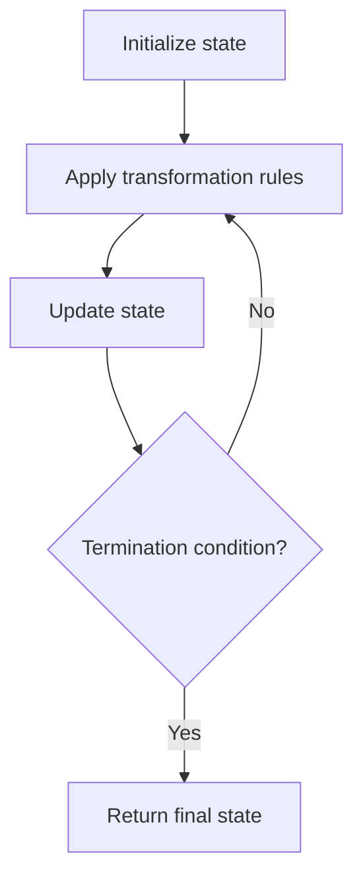

# Problem 1041: Robot Bounded In Circle

**Difficulty:** Medium  
**Tags:** Math, String, Simulation  
**Pattern:** Simulation  
**Link:** [leetcode.com/problems/robot-bounded-in-circle](https://leetcode.com/problems/robot-bounded-in-circle/)

## Description

On an infinite plane, a robot initially stands at `(0, 0)` and faces north. Note that:

	- The **north direction** is the positive direction of the y-axis.
	- The **south direction** is the negative direction of the y-axis.
	- The **east direction** is the positive direction of the x-axis.
	- The **west direction** is the negative direction of the x-axis.

The robot can receive one of three instructions:

	- `"G"`: go straight 1 unit.
	- `"L"`: turn 90 degrees to the left (i.e., anti-clockwise direction).
	- `"R"`: turn 90 degrees to the right (i.e., clockwise direction).

The robot performs the `instructions` given in order, and repeats them forever.

Return `true` if and only if there exists a circle in the plane such that the robot never leaves the circle.

 

Example 1:

```

**Input:** instructions = "GGLLGG"
**Output:** true
**Explanation:** The robot is initially at (0, 0) facing the north direction.
"G": move one step. Position: (0, 1). Direction: North.
"G": move one step. Position: (0, 2). Direction: North.
"L": turn 90 degrees anti-clockwise. Position: (0, 2). Direction: West.
"L": turn 90 degrees anti-clockwise. Position: (0, 2). Direction: South.
"G": move one step. Position: (0, 1). Direction: South.
"G": move one step. Position: (0, 0). Direction: South.
Repeating the instructions, the robot goes into the cycle: (0, 0) --> (0, 1) --> (0, 2) --> (0, 1) --> (0, 0).
Based on that, we return true.

```

Example 2:

```

**Input:** instructions = "GG"
**Output:** false
**Explanation:** The robot is initially at (0, 0) facing the north direction.
"G": move one step. Position: (0, 1). Direction: North.
"G": move one step. Position: (0, 2). Direction: North.
Repeating the instructions, keeps advancing in the north direction and does not go into cycles.
Based on that, we return false.

```

Example 3:

```

**Input:** instructions = "GL"
**Output:** true
**Explanation:** The robot is initially at (0, 0) facing the north direction.
"G": move one step. Position: (0, 1). Direction: North.
"L": turn 90 degrees anti-clockwise. Position: (0, 1). Direction: West.
"G": move one step. Position: (-1, 1). Direction: West.
"L": turn 90 degrees anti-clockwise. Position: (-1, 1). Direction: South.
"G": move one step. Position: (-1, 0). Direction: South.
"L": turn 90 degrees anti-clockwise. Position: (-1, 0). Direction: East.
"G": move one step. Position: (0, 0). Direction: East.
"L": turn 90 degrees anti-clockwise. Position: (0, 0). Direction: North.
Repeating the instructions, the robot goes into the cycle: (0, 0) --> (0, 1) --> (-1, 1) --> (-1, 0) --> (0, 0).
Based on that, we return true.

```

 

**Constraints:**

	- `1 <= instructions.length <= 100`
	- `instructions[i]` is `'G'`, `'L'` or, `'R'`.

## Approach: Simulation

Simulate the process described in the problem step by step. Follow the rules exactly, tracking state at each step.

## Pseudocode

```
1. Initialize state (grid, pointers, counters)
2. For each step / iteration:
   a. Apply the transformation rules
   b. Update state
   c. Check termination condition
3. Return final state or result
```

## Algorithm Flow



## Complexity Analysis

- **Time:** O(n) or O(n * k)
- **Space:** O(n)

## Solution (Python3)

```python
class Solution:
    def isRobotBounded(self, instructions: str) -> bool:
        # Simulation approach - follow the rules step by step
        result = False
        for i in range(len(instructions) if isinstance(instructions, list) else instructions):
            # Simulate each step
            pass
        return result
```

## Solution (C++)

```cpp
#include <string>
#include <vector>
using namespace std;

class Solution {
public:
    bool isRobotBounded(string& instructions) {
        // Simulation approach
        int n = instructions.size();
        for (int i = 0; i < n; i++) {
            // Simulate each step
        }
        return false;
    }
};
```
