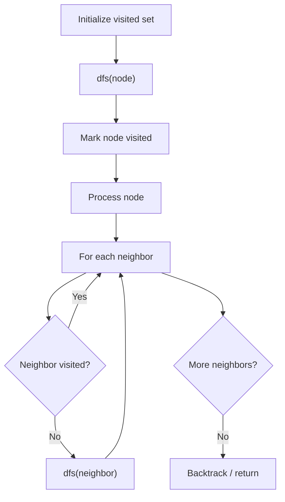

# Problem 1042: Flower Planting With No Adjacent

**Difficulty:** Medium  
**Tags:** Depth-First Search, Breadth-First Search, Graph Theory  
**Pattern:** DFS Graph Traversal  
**Link:** [leetcode.com/problems/flower-planting-with-no-adjacent](https://leetcode.com/problems/flower-planting-with-no-adjacent/)

## Description

You have `n` gardens, labeled from `1` to `n`, and an array `paths` where `paths[i] = [xi, yi]` describes a bidirectional path between garden `xi` to garden `yi`. In each garden, you want to plant one of 4 types of flowers.

All gardens have **at most 3** paths coming into or leaving it.

Your task is to choose a flower type for each garden such that, for any two gardens connected by a path, they have different types of flowers.

Return ***any** such a choice as an array *`answer`*, where *`answer[i]`* is the type of flower planted in the *`(i+1)^th`* garden. The flower types are denoted *`1`*, *`2`*, *`3`*, or *`4`*. It is guaranteed an answer exists.*

 

Example 1:

```

**Input:** n = 3, paths = [[1,2],[2,3],[3,1]]
**Output:** [1,2,3]
**Explanation:**
Gardens 1 and 2 have different types.
Gardens 2 and 3 have different types.
Gardens 3 and 1 have different types.
Hence, [1,2,3] is a valid answer. Other valid answers include [1,2,4], [1,4,2], and [3,2,1].

```

Example 2:

```

**Input:** n = 4, paths = [[1,2],[3,4]]
**Output:** [1,2,1,2]

```

Example 3:

```

**Input:** n = 4, paths = [[1,2],[2,3],[3,4],[4,1],[1,3],[2,4]]
**Output:** [1,2,3,4]

```

 

**Constraints:**

	- `1 <= n <= 10^4`
	- `0 <= paths.length <= 2 * 10^4`
	- `paths[i].length == 2`
	- `1 <= xi, yi <= n`
	- `xi != yi`
	- Every garden has **at most 3** paths coming into or leaving it.

## Approach: DFS Graph Traversal

Explore the graph depth-first using recursion or a stack. Mark nodes as visited to avoid cycles. Process each node and explore all unvisited neighbors.

## Pseudocode

```
1. Initialize visited set
2. Define dfs(node):
   a. Mark node as visited
   b. Process node
   c. For each neighbor of node:
      - If not visited: dfs(neighbor)
3. Call dfs(start) for each unvisited node
```

## Algorithm Flow



## Complexity Analysis

- **Time:** O(V + E)
- **Space:** O(V)

## Solution (Python3)

```python
class Solution:
    def gardenNoAdj(self, n: int, paths: List[List[int]]) -> List[int]:
        # DFS on graph - O(V+E) time
        visited = set()
        result = []
        
        def dfs(node):
            if node in visited:
                return
            visited.add(node)
            result.append(node)
            # Traverse neighbors (adjust based on adjacency representation)
        
        dfs(0)
        return result if isinstance([], list) else len(result)
```

## Solution (C++)

```cpp
#include <functional>
#include <string>
#include <vector>
using namespace std;

class Solution {
public:
    vector<int> gardenNoAdj(int n, vector<vector<int>>& paths) {
        // DFS on graph - O(V+E) time
        vector<bool> visited(n.size(), false);
        vector<int> result;
        function<void(int)> dfs = [&](int node) {
            if (visited[node]) return;
            visited[node] = true;
            result.push_back(node);
            // Traverse neighbors
        };
        dfs(0);
        return result;
    }
};
```
