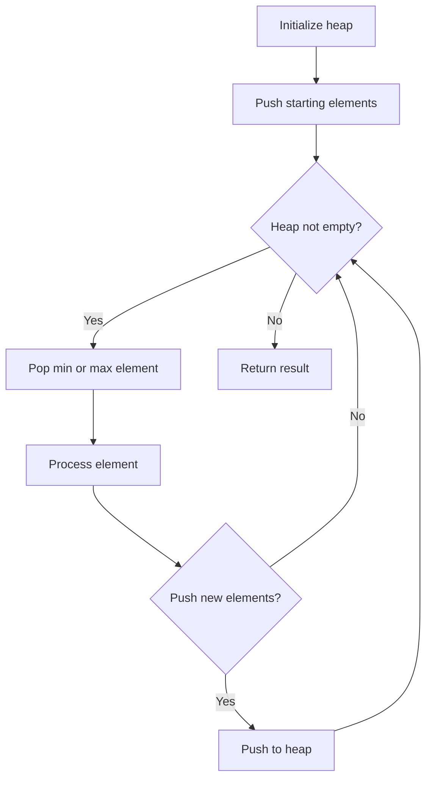
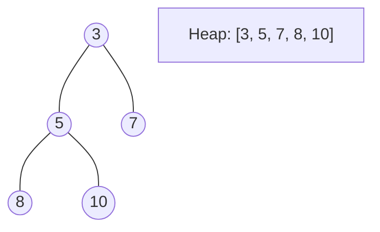
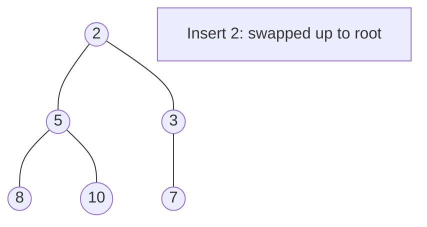
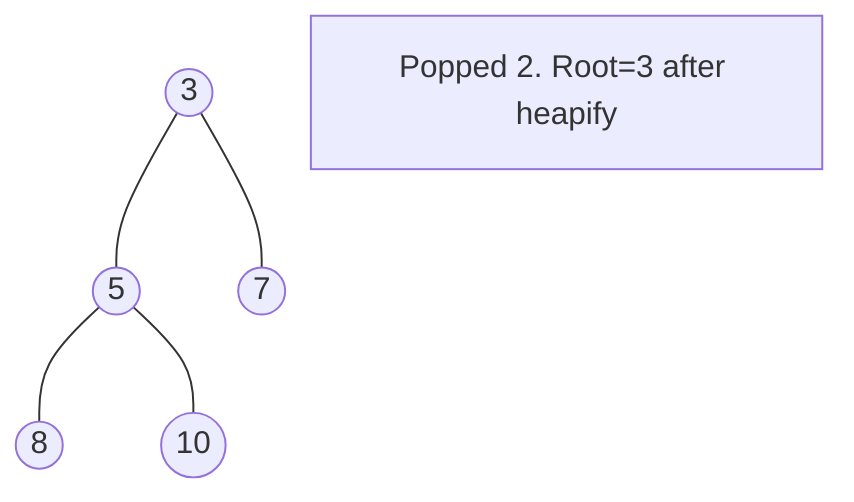

# Problem 1046: Last Stone Weight

**Difficulty:** Easy  
**Tags:** Array, Heap (Priority Queue)  
**Pattern:** Heap  
**Link:** [leetcode.com/problems/last-stone-weight](https://leetcode.com/problems/last-stone-weight/)

## Description

You are given an array of integers `stones` where `stones[i]` is the weight of the `i^th` stone.

We are playing a game with the stones. On each turn, we choose the **heaviest two stones** and smash them together. Suppose the heaviest two stones have weights `x` and `y` with `x <= y`. The result of this smash is:

	- If `x == y`, both stones are destroyed, and
	- If `x != y`, the stone of weight `x` is destroyed, and the stone of weight `y` has new weight `y - x`.

At the end of the game, there is **at most one** stone left.

Return *the weight of the last remaining stone*. If there are no stones left, return `0`.

 

Example 1:

```

**Input:** stones = [2,7,4,1,8,1]
**Output:** 1
**Explanation:** 
We combine 7 and 8 to get 1 so the array converts to [2,4,1,1,1] then,
we combine 2 and 4 to get 2 so the array converts to [2,1,1,1] then,
we combine 2 and 1 to get 1 so the array converts to [1,1,1] then,
we combine 1 and 1 to get 0 so the array converts to [1] then that's the value of the last stone.

```

Example 2:

```

**Input:** stones = [1]
**Output:** 1

```

 

**Constraints:**

	- `1 <= stones.length <= 30`
	- `1 <= stones[i] <= 1000`

## Approach: Heap

Max-heap (via negation). Smash two heaviest, push difference back.

## Pseudocode

```
1. Initialize heap (min or max)
2. Push initial elements onto heap
3. While heap not empty and condition:
   a. Pop top element (min or max)
   b. Process element
   c. Push new elements if needed
4. Return result
```

## Algorithm Flow



## Visual State Transitions

**Heap Operations (Min-Heap):**

**Frame 1: Initial heap**


**Frame 2: Insert 2 - bubble up**


**Frame 3: Pop minimum (2) - heapify down**



## Complexity Analysis

- **Time:** O(n log n)
- **Space:** O(n)

## Solution (Python3)

```python
import heapq

class Solution:
    def lastStoneWeight(self, stones: list[int]) -> int:
        stones = [-s for s in stones]
        heapq.heapify(stones)
        while len(stones) > 1:
            a = -heapq.heappop(stones)
            b = -heapq.heappop(stones)
            if a != b:
                heapq.heappush(stones, -(a - b))
        return -stones[0] if stones else 0
```

## Solution (C++)

```cpp
#include <queue>
#include <string>
#include <vector>
using namespace std;

class Solution {
public:
    int lastStoneWeight(vector<int>& stones) {
        // Heap/Priority Queue - O(n log k) time
        priority_queue<int, vector<int>, greater<int>> pq;
        for (int val : stones) {
            pq.push(val);
            if ((int)pq.size() > stones)
                pq.pop();
        }
        return pq.empty() ? 0 : pq.top();
    }
};
```
