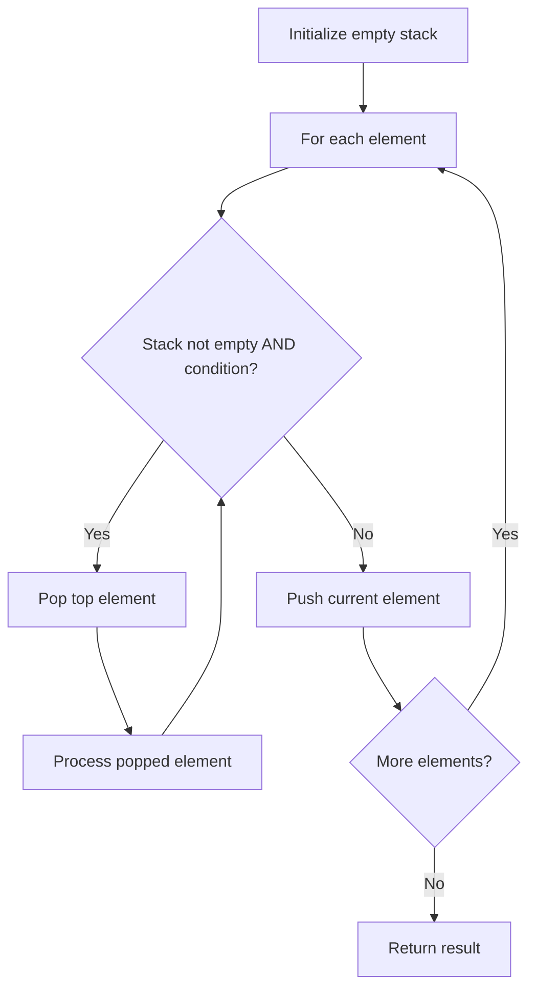

# Problem 1047: Remove All Adjacent Duplicates In String

**Difficulty:** Easy  
**Tags:** String, Stack  
**Pattern:** Stack  
**Link:** [leetcode.com/problems/remove-all-adjacent-duplicates-in-string](https://leetcode.com/problems/remove-all-adjacent-duplicates-in-string/)

## Description

You are given a string `s` consisting of lowercase English letters. A **duplicate removal** consists of choosing two **adjacent** and **equal** letters and removing them.

We repeatedly make **duplicate removals** on `s` until we no longer can.

Return *the final string after all such duplicate removals have been made*. It can be proven that the answer is **unique**.

 

Example 1:

```

**Input:** s = "abbaca"
**Output:** "ca"
**Explanation:** 
For example, in "abbaca" we could remove "bb" since the letters are adjacent and equal, and this is the only possible move.  The result of this move is that the string is "aaca", of which only "aa" is possible, so the final string is "ca".

```

Example 2:

```

**Input:** s = "azxxzy"
**Output:** "ay"

```

 

**Constraints:**

	- `1 <= s.length <= 10^5`
	- `s` consists of lowercase English letters.

## Approach: Stack

Use a stack (LIFO) to process elements. Push elements when they might be needed later; pop when a matching or resolving condition is found. Common uses: parentheses matching, expression evaluation, next greater element.

## Pseudocode

```
1. Initialize empty stack
2. For each element:
   a. While stack is not empty and condition met:
      - Pop and process top element
   b. Push current element onto stack
3. Process remaining elements in stack if needed
4. Return result
```

## Algorithm Flow



## Complexity Analysis

- **Time:** O(n)
- **Space:** O(n)

## Solution (Python3)

```python
class Solution:
    def removeDuplicates(self, s: str) -> str:
        # Stack-based approach - O(n) time
        stack = []
        for ch in s:
            if stack and self._matches(stack[-1], ch):
                stack.pop()
            else:
                stack.append(ch)
        return len(stack) == 0 if isinstance("", bool) else stack

    def _matches(self, a, b):
        pairs = {'(': ')', '[': ']', '{': '}'}
        return pairs.get(a) == b
```

## Solution (C++)

```cpp
#include <stack>
#include <string>
#include <unordered_map>
#include <vector>
using namespace std;

class Solution {
public:
    string removeDuplicates(string& s) {
        // Stack-based approach - O(n) time
        stack<char> st;
        unordered_map<char, char> pairs = {{'(', ')'}, {'[', ']'}, {'{', '}'}};
        for (char ch : s) {
            if (!st.empty() && pairs.count(st.top()) && pairs[st.top()] == ch) {
                st.pop();
            } else {
                st.push(ch);
            }
        }
        return st.empty();
    }
};
```
