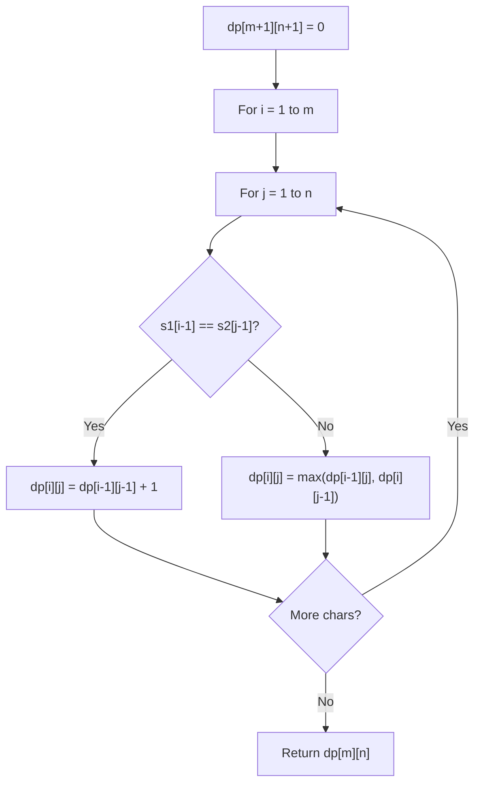

# Problem 1048: Longest String Chain

**Difficulty:** Medium  
**Tags:** Array, Hash Table, Two Pointers, String, Dynamic Programming, Sorting  
**Pattern:** Dynamic Programming (String)  
**Link:** [leetcode.com/problems/longest-string-chain](https://leetcode.com/problems/longest-string-chain/)

## Description

You are given an array of `words` where each word consists of lowercase English letters.

`wordA` is a **predecessor** of `wordB` if and only if we can insert **exactly one** letter anywhere in `wordA` **without changing the order of the other characters** to make it equal to `wordB`.

	- For example, `"abc"` is a **predecessor** of `"abac"`, while `"cba"` is not a **predecessor** of `"bcad"`.

A **word chain*** *is a sequence of words `[word1, word2, ..., wordk]` with `k >= 1`, where `word1` is a **predecessor** of `word2`, `word2` is a **predecessor** of `word3`, and so on. A single word is trivially a **word chain** with `k == 1`.

Return *the **length** of the **longest possible word chain** with words chosen from the given list of *`words`.

 

Example 1:

```

**Input:** words = ["a","b","ba","bca","bda","bdca"]
**Output:** 4
**Explanation**: One of the longest word chains is ["a","ba","bda","bdca"].

```

Example 2:

```

**Input:** words = ["xbc","pcxbcf","xb","cxbc","pcxbc"]
**Output:** 5
**Explanation:** All the words can be put in a word chain ["xb", "xbc", "cxbc", "pcxbc", "pcxbcf"].

```

Example 3:

```

**Input:** words = ["abcd","dbqca"]
**Output:** 1
**Explanation:** The trivial word chain ["abcd"] is one of the longest word chains.
["abcd","dbqca"] is not a valid word chain because the ordering of the letters is changed.

```

 

**Constraints:**

	- `1 <= words.length <= 1000`
	- `1 <= words[i].length <= 16`
	- `words[i]` only consists of lowercase English letters.

## Approach: Dynamic Programming (String)

Compare or match two strings using a 2D DP table. dp[i][j] represents the answer for substrings s1[0..i-1] and s2[0..j-1]. Common patterns: LCS, edit distance, regex matching.

## Pseudocode

```
1. Create dp[m+1][n+1]
2. Initialize base cases
3. For i from 1 to m:
   For j from 1 to n:
     If s1[i-1] == s2[j-1]: dp[i][j] = dp[i-1][j-1] + 1
     Else: dp[i][j] = best of (dp[i-1][j], dp[i][j-1], dp[i-1][j-1])
4. Return dp[m][n]
```

## Algorithm Flow



## Complexity Analysis

- **Time:** O(m * n)
- **Space:** O(m * n)

## Solution (Python3)

```python
class Solution:
    def longestStrChain(self, words: List[str]) -> int:
        # String DP - O(m*n) time and space
        m, n = len(words), len(words)
        dp = [[0] * (n + 1) for _ in range(m + 1)]
        for i in range(1, m + 1):
            for j in range(1, n + 1):
                if words[i-1] == words[j-1]:
                    dp[i][j] = dp[i-1][j-1] + 1
                else:
                    dp[i][j] = max(dp[i-1][j], dp[i][j-1])
        return dp[m][n]
```

## Solution (C++)

```cpp
#include <algorithm>
#include <string>
#include <vector>
using namespace std;

class Solution {
public:
    int longestStrChain(vector<string>& words) {
        // String DP - O(m*n) time and space
        int m = words.size(), n = words.size();
        vector<vector<int>> dp(m + 1, vector<int>(n + 1, 0));
        for (int i = 1; i <= m; i++) {
            for (int j = 1; j <= n; j++) {
                if (words[i-1] == words[j-1])
                    dp[i][j] = dp[i-1][j-1] + 1;
                else
                    dp[i][j] = max(dp[i-1][j], dp[i][j-1]);
            }
        }
        return dp[m][n];
    }
};
```
