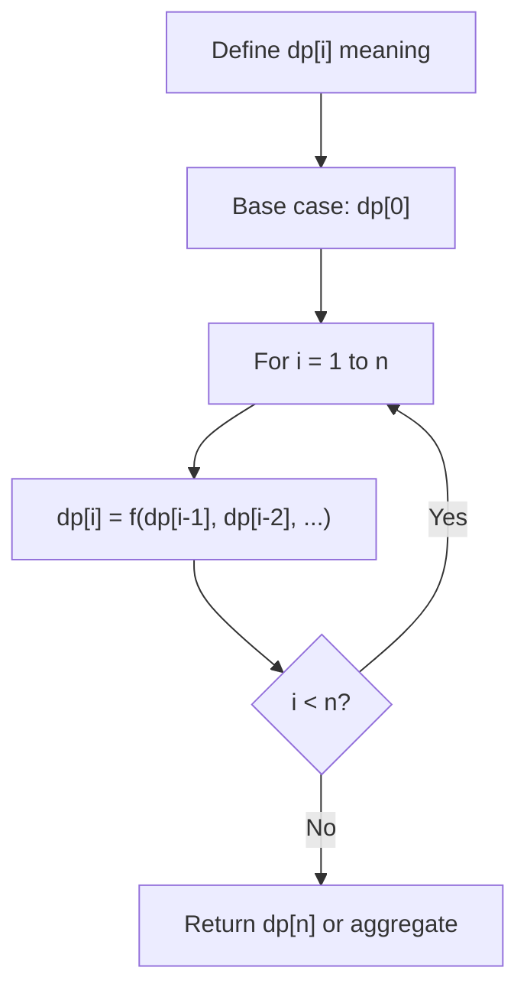
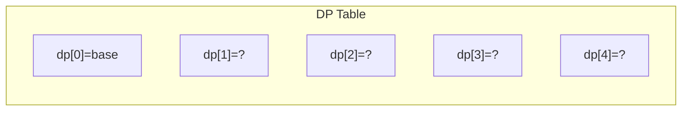
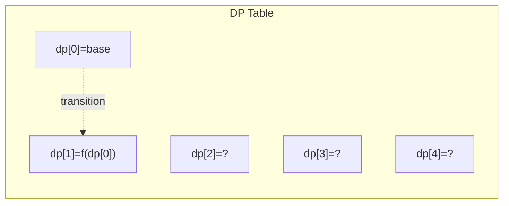
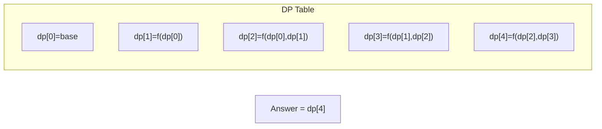

# Problem 1049: Last Stone Weight II

**Difficulty:** Medium  
**Tags:** Array, Dynamic Programming  
**Pattern:** Dynamic Programming (1D)  
**Link:** [leetcode.com/problems/last-stone-weight-ii](https://leetcode.com/problems/last-stone-weight-ii/)

## Description

You are given an array of integers `stones` where `stones[i]` is the weight of the `i^th` stone.

We are playing a game with the stones. On each turn, we choose any two stones and smash them together. Suppose the stones have weights `x` and `y` with `x <= y`. The result of this smash is:

	- If `x == y`, both stones are destroyed, and
	- If `x != y`, the stone of weight `x` is destroyed, and the stone of weight `y` has new weight `y - x`.

At the end of the game, there is **at most one** stone left.

Return *the smallest possible weight of the left stone*. If there are no stones left, return `0`.

 

Example 1:

```

**Input:** stones = [2,7,4,1,8,1]
**Output:** 1
**Explanation:**
We can combine 2 and 4 to get 2, so the array converts to [2,7,1,8,1] then,
we can combine 7 and 8 to get 1, so the array converts to [2,1,1,1] then,
we can combine 2 and 1 to get 1, so the array converts to [1,1,1] then,
we can combine 1 and 1 to get 0, so the array converts to [1], then that's the optimal value.

```

Example 2:

```

**Input:** stones = [31,26,33,21,40]
**Output:** 5

```

 

**Constraints:**

	- `1 <= stones.length <= 30`
	- `1 <= stones[i] <= 100`

## Approach: Dynamic Programming (1D)

Break the problem into overlapping subproblems. Define dp[i] as the optimal value for the subproblem ending at or considering index i. Build the solution bottom-up, using previously computed dp values.

## Pseudocode

```
1. Define dp[i] = optimal value for subproblem i
2. Base case: dp[0] = initial value
3. For i from 1 to n:
   a. dp[i] = recurrence(dp[i-1], dp[i-2], ...)
4. Return dp[n] or max/min of dp
```

## Algorithm Flow



## Visual State Transitions

**1D Dynamic Programming Table Build:**

**Frame 1: Initialize base cases**


**Frame 2: Fill dp[1] from dp[0]**


**Frame 3: Fill remaining cells**



## Complexity Analysis

- **Time:** O(n)
- **Space:** O(n)

## Solution (Python3)

```python
class Solution:
    def lastStoneWeightII(self, stones: List[int]) -> int:
        # Dynamic programming (1D) - O(n) time, O(n) space
        if not stones:
            return 0
        n = len(stones) if isinstance(stones, list) else stones
        dp = [0] * (n + 1)
        dp[0] = 1  # base case
        for i in range(1, n + 1):
            dp[i] = dp[i-1]  # transition (customize per problem)
            if i >= 2:
                dp[i] += dp[i-2]
        return dp[n]
```

## Solution (C++)

```cpp
#include <string>
#include <vector>
using namespace std;

class Solution {
public:
    int lastStoneWeightII(vector<int>& stones) {
        // Dynamic programming (1D) - O(n) time, O(n) space
        int n = stones;
        if (n <= 0) return 0;
        vector<int> dp(n + 1, 0);
        dp[0] = 1;
        for (int i = 1; i <= n; i++) {
            dp[i] = dp[i-1];
            if (i >= 2) dp[i] += dp[i-2];
        }
        return dp[n];
    }
};
```
