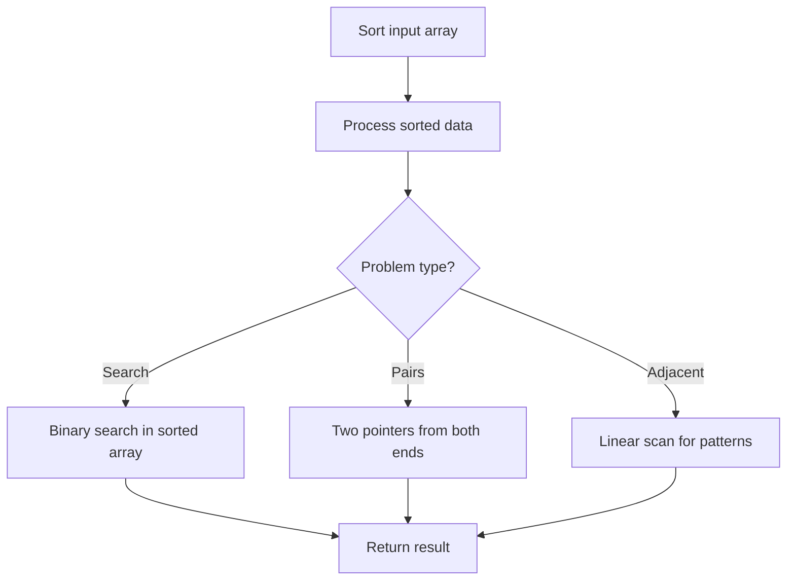

# Problem 1051: Height Checker

**Difficulty:** Easy  
**Tags:** Array, Sorting, Counting Sort  
**Pattern:** Sorting  
**Link:** [leetcode.com/problems/height-checker](https://leetcode.com/problems/height-checker/)

## Description

A school is trying to take an annual photo of all the students. The students are asked to stand in a single file line in **non-decreasing order** by height. Let this ordering be represented by the integer array `expected` where `expected[i]` is the expected height of the `i^th` student in line.

You are given an integer array `heights` representing the **current order** that the students are standing in. Each `heights[i]` is the height of the `i^th` student in line (**0-indexed**).

Return *the **number of indices** where *`heights[i] != expected[i]`.

 

Example 1:

```

**Input:** heights = [1,1,4,2,1,3]
**Output:** 3
**Explanation:** 
heights:  [1,1,4,2,1,3]
expected: [1,1,1,2,3,4]
Indices 2, 4, and 5 do not match.

```

Example 2:

```

**Input:** heights = [5,1,2,3,4]
**Output:** 5
**Explanation:**
heights:  [5,1,2,3,4]
expected: [1,2,3,4,5]
All indices do not match.

```

Example 3:

```

**Input:** heights = [1,2,3,4,5]
**Output:** 0
**Explanation:**
heights:  [1,2,3,4,5]
expected: [1,2,3,4,5]
All indices match.

```

 

**Constraints:**

	- `1 <= heights.length <= 100`
	- `1 <= heights[i] <= 100`

## Approach: Sorting

Sort the data to enable efficient processing. After sorting, use techniques like binary search, two pointers, or linear scan to solve the problem.

## Pseudocode

```
1. Sort the input array
2. Process sorted data:
   - Use binary search for lookups
   - Use two pointers for pair finding
   - Scan for adjacent patterns
3. Return result
```

## Algorithm Flow



## Complexity Analysis

- **Time:** O(n log n)
- **Space:** O(n)

## Solution (Python3)

```python
class Solution:
    def heightChecker(self, heights: List[int]) -> int:
        # Sort-based approach - O(n log n) time
        heights.sort(key=lambda x: x[0] if isinstance(x, (list, tuple)) else x)
        result = [heights[0]]
        for i in range(1, len(heights)):
            curr = heights[i]
            if isinstance(curr, (list, tuple)) and isinstance(result[-1], (list, tuple)):
                if curr[0] <= result[-1][1]:
                    result[-1] = [result[-1][0], max(result[-1][1], curr[1])]
                else:
                    result.append(curr)
            else:
                result.append(curr)
        return result
```

## Solution (C++)

```cpp
#include <algorithm>
#include <string>
#include <vector>
using namespace std;

class Solution {
public:
    int heightChecker(vector<int>& heights) {
        // Sort-based approach - O(n log n) time
        sort(heights.begin(), heights.end());
        vector<vector<int>> result;
        result.push_back(heights[0]);
        for (int i = 1; i < (int)heights.size(); i++) {
            if (heights[i][0] <= result.back()[1]) {
                result.back()[1] = max(result.back()[1], heights[i][1]);
            } else {
                result.push_back(heights[i]);
            }
        }
        return result;
    }
};
```
