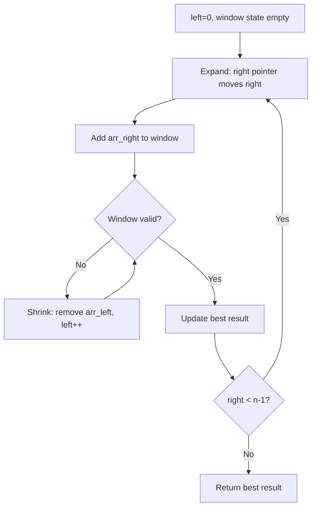
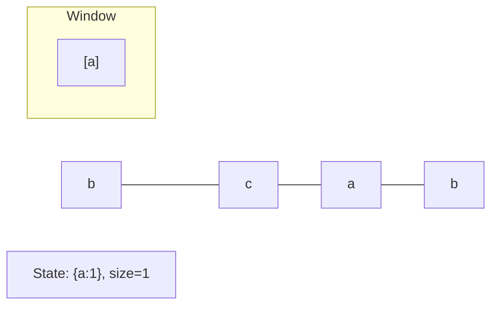
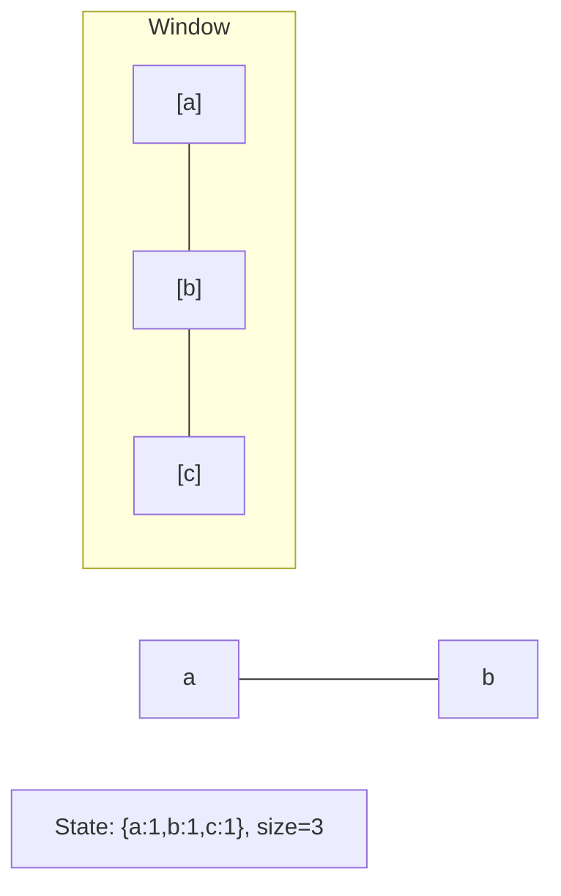
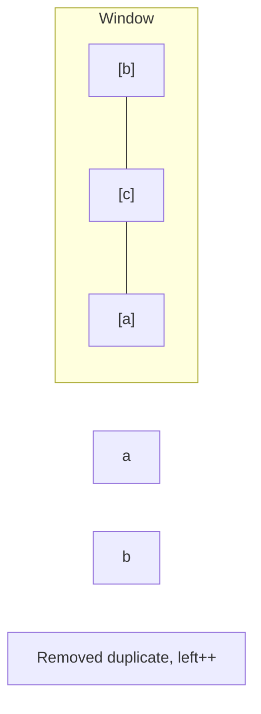
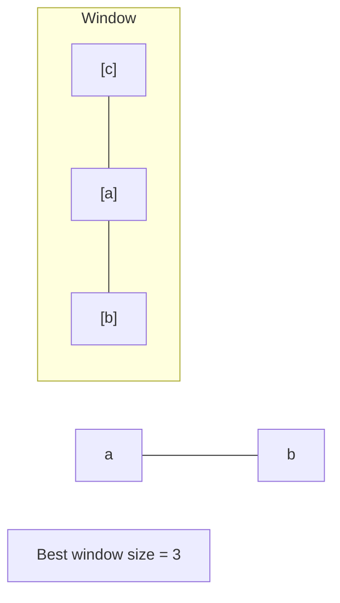

# Problem 1052: Grumpy Bookstore Owner

**Difficulty:** Medium  
**Tags:** Array, Sliding Window  
**Pattern:** Sliding Window  
**Link:** [leetcode.com/problems/grumpy-bookstore-owner](https://leetcode.com/problems/grumpy-bookstore-owner/)

## Description

There is a bookstore owner that has a store open for `n` minutes. You are given an integer array `customers` of length `n` where `customers[i]` is the number of the customers that enter the store at the start of the `i^th` minute and all those customers leave after the end of that minute.

During certain minutes, the bookstore owner is grumpy. You are given a binary array grumpy where `grumpy[i]` is `1` if the bookstore owner is grumpy during the `i^th` minute, and is `0` otherwise.

When the bookstore owner is grumpy, the customers entering during that minute are not **satisfied**. Otherwise, they are satisfied.

The bookstore owner knows a secret technique to remain **not grumpy** for `minutes` consecutive minutes, but this technique can only be used **once**.

Return the **maximum** number of customers that can be *satisfied* throughout the day.

 

Example 1:

**Input:** customers = [1,0,1,2,1,1,7,5], grumpy = [0,1,0,1,0,1,0,1], minutes = 3

**Output:** 16

**Explanation:**

The bookstore owner keeps themselves not grumpy for the last 3 minutes.

The maximum number of customers that can be satisfied = 1 + 1 + 1 + 1 + 7 + 5 = 16.

Example 2:

**Input:** customers = [1], grumpy = [0], minutes = 1

**Output:** 1

 

**Constraints:**

	- `n == customers.length == grumpy.length`
	- `1 <= minutes <= n <= 2 * 10^4`
	- `0 <= customers[i] <= 1000`
	- `grumpy[i]` is either `0` or `1`.

## Approach: Sliding Window

Maintain a window over the data using two pointers. Expand the right boundary to include new elements, and shrink the left boundary when the window constraint is violated. Track the optimal window.

## Pseudocode

```
1. Initialize left = 0, result = initial_value
2. For right in range(n):
   a. Add element at right to window state
   b. While window is invalid:
      - Remove element at left from window state
      - left++
   c. Update result = best of (result, window size/value)
3. Return result
```

## Algorithm Flow



## Visual State Transitions

**Sliding Window Step-by-Step:**

**Frame 1: Initial window (left=0, right=0)**


**Frame 2: Expand right (right=2)**


**Frame 3: Violation - shrink left**


**Frame 4: Continue expanding**



## Complexity Analysis

- **Time:** O(n)
- **Space:** O(k)

## Solution (Python3)

```python
class Solution:
    def maxSatisfied(self, customers: List[int], grumpy: List[int], minutes: int) -> int:
        # Sliding window approach - O(n) time, O(k) space
        from collections import defaultdict
        window = defaultdict(int)
        left = 0
        result = 0
        for right in range(len(customers)):
            window[customers[right]] += 1
            while len(window) > (grumpy if isinstance(grumpy, int) else len(customers)):
                window[customers[left]] -= 1
                if window[customers[left]] == 0:
                    del window[customers[left]]
                left += 1
            result = max(result, right - left + 1)
        return result
```

## Solution (C++)

```cpp
#include <algorithm>
#include <string>
#include <unordered_map>
#include <vector>
using namespace std;

class Solution {
public:
    int maxSatisfied(vector<int>& customers, vector<int>& grumpy, int minutes) {
        // Sliding window approach - O(n) time, O(k) space
        unordered_map<char, int> window;
        int left = 0, result = 0;
        for (int right = 0; right < customers.size(); right++) {
            window[customers[right]]++;
            while ((int)window.size() > grumpy) {
                window[customers[left]]--;
                if (window[customers[left]] == 0)
                    window.erase(customers[left]);
                left++;
            }
            result = max(result, right - left + 1);
        }
        return result;
    }
};
```
