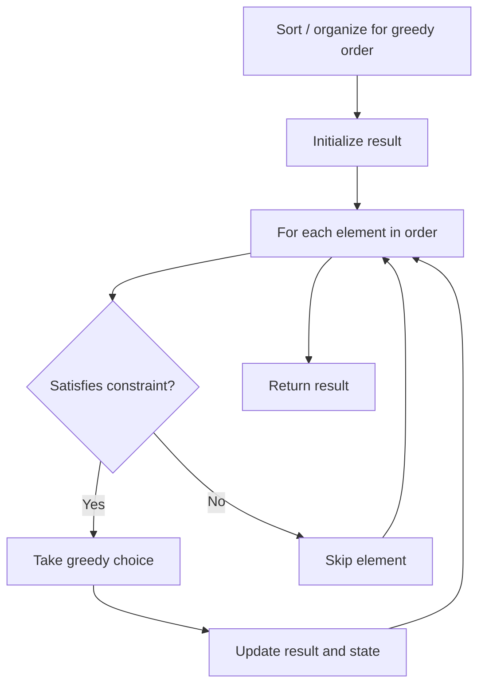

# Problem 1053: Previous Permutation With One Swap

**Difficulty:** Medium  
**Tags:** Array, Greedy  
**Pattern:** Greedy  
**Link:** [leetcode.com/problems/previous-permutation-with-one-swap](https://leetcode.com/problems/previous-permutation-with-one-swap/)

## Description

Given an array of positive integers `arr` (not necessarily distinct), return *the **lexicographically** largest permutation that is smaller than* `arr`, that can be **made with exactly one swap**. If it cannot be done, then return the same array.

**Note** that a *swap* exchanges the positions of two numbers `arr[i]` and `arr[j]`

 

Example 1:

```

**Input:** arr = [3,2,1]
**Output:** [3,1,2]
**Explanation:** Swapping 2 and 1.

```

Example 2:

```

**Input:** arr = [1,1,5]
**Output:** [1,1,5]
**Explanation:** This is already the smallest permutation.

```

Example 3:

```

**Input:** arr = [1,9,4,6,7]
**Output:** [1,7,4,6,9]
**Explanation:** Swapping 9 and 7.

```

 

**Constraints:**

	- `1 <= arr.length <= 10^4`
	- `1 <= arr[i] <= 10^4`

## Approach: Greedy

Make the locally optimal choice at each step, trusting it leads to a global optimum. Greedy works when the problem has the greedy-choice property and optimal substructure.

## Pseudocode

```
1. Sort or organize data for greedy ordering
2. Initialize result
3. For each element in greedy order:
   a. If element satisfies constraint:
      - Take the greedy choice
      - Update result and state
4. Return result
```

## Algorithm Flow



## Complexity Analysis

- **Time:** O(n log n)
- **Space:** O(1)

## Solution (Python3)

```python
class Solution:
    def prevPermOpt1(self, arr: List[int]) -> List[int]:
        # Greedy approach - O(n) time
        result = 0
        curr_max = 0
        for i in range(len(arr)):
            if isinstance(arr[i], int):
                curr_max = max(curr_max, arr[i])
                result = max(result, curr_max)
            else:
                result += 1
        return result
```

## Solution (C++)

```cpp
#include <algorithm>
#include <string>
#include <vector>
using namespace std;

class Solution {
public:
    vector<int> prevPermOpt1(vector<int>& arr) {
        // Greedy approach - O(n) time
        int result = 0, curr_max = 0;
        for (int i = 0; i < (int)arr.size(); i++) {
            curr_max = max(curr_max, arr[i]);
            result = max(result, curr_max);
        }
        return result;
    }
};
```
