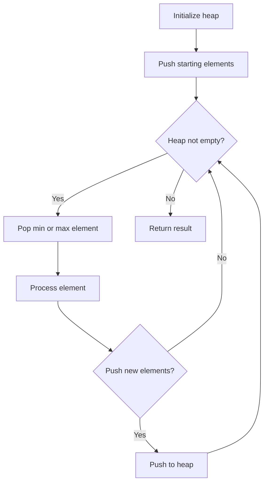
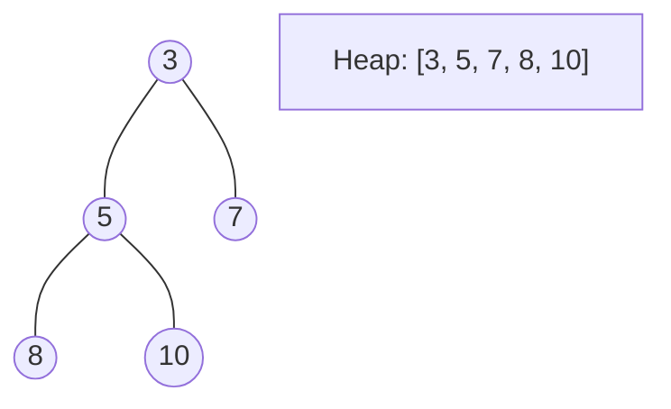
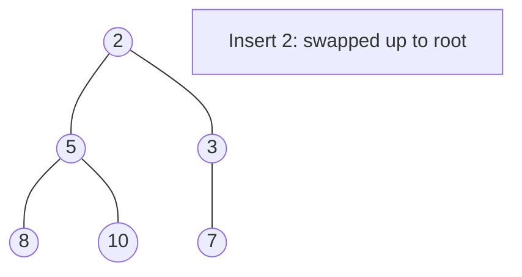
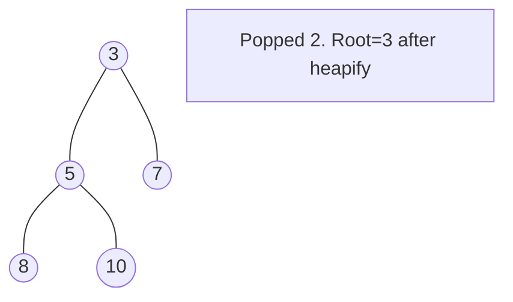

# Problem 1054: Distant Barcodes

**Difficulty:** Medium  
**Tags:** Array, Hash Table, Greedy, Sorting, Heap (Priority Queue), Counting  
**Pattern:** Heap / Priority Queue  
**Link:** [leetcode.com/problems/distant-barcodes](https://leetcode.com/problems/distant-barcodes/)

## Description

In a warehouse, there is a row of barcodes, where the `i^th` barcode is `barcodes[i]`.

Rearrange the barcodes so that no two adjacent barcodes are equal. You may return any answer, and it is guaranteed an answer exists.

 

Example 1:

```
**Input:** barcodes = [1,1,1,2,2,2]
**Output:** [2,1,2,1,2,1]

```
Example 2:

```
**Input:** barcodes = [1,1,1,1,2,2,3,3]
**Output:** [1,3,1,3,1,2,1,2]

```

 

**Constraints:**

	- `1 <= barcodes.length <= 10000`
	- `1 <= barcodes[i] <= 10000`

## Approach: Heap / Priority Queue

Use a min-heap or max-heap to efficiently access the smallest/largest element. Push elements and pop the top to process in priority order.

## Pseudocode

```
1. Initialize heap (min or max)
2. Push initial elements onto heap
3. While heap not empty and condition:
   a. Pop top element (min or max)
   b. Process element
   c. Push new elements if needed
4. Return result
```

## Algorithm Flow



## Visual State Transitions

**Heap Operations (Min-Heap):**

**Frame 1: Initial heap**


**Frame 2: Insert 2 - bubble up**


**Frame 3: Pop minimum (2) - heapify down**



## Complexity Analysis

- **Time:** O(n log n)
- **Space:** O(n)

## Solution (Python3)

```python
class Solution:
    def rearrangeBarcodes(self, barcodes: List[int]) -> List[int]:
        # Heap/Priority Queue - O(n log k) time
        import heapq
        if not barcodes:
            return []
        # Min heap (negate for max heap)
        heap = []
        for val in barcodes:
            heapq.heappush(heap, val)
            if len(heap) > (barcodes if isinstance(barcodes, int) else len(barcodes)):
                heapq.heappop(heap)
        return heap[0] if heap else []
```

## Solution (C++)

```cpp
#include <queue>
#include <string>
#include <vector>
using namespace std;

class Solution {
public:
    vector<int> rearrangeBarcodes(vector<int>& barcodes) {
        // Heap/Priority Queue - O(n log k) time
        priority_queue<int, vector<int>, greater<int>> pq;
        for (int val : barcodes) {
            pq.push(val);
            if ((int)pq.size() > barcodes)
                pq.pop();
        }
        return pq.empty() ? {} : pq.top();
    }
};
```
