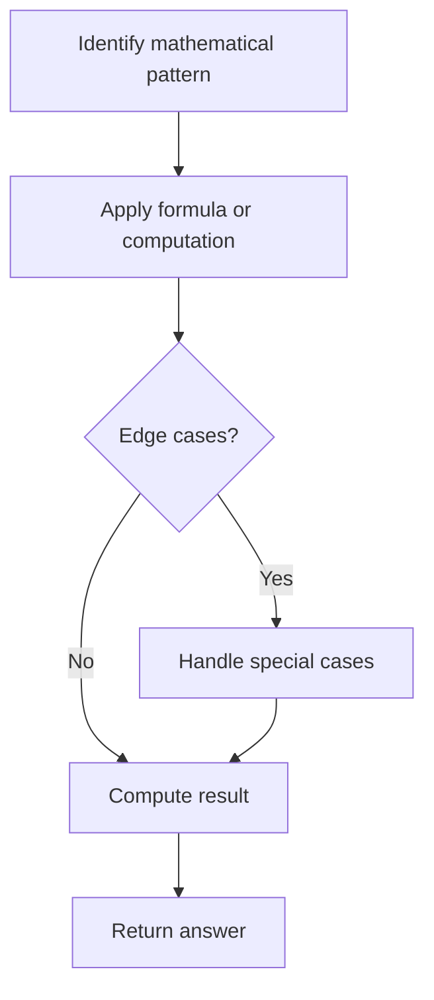

# Problem 1071: Greatest Common Divisor of Strings

**Difficulty:** Easy  
**Tags:** Math, String  
**Pattern:** Math / String  
**Link:** [leetcode.com/problems/greatest-common-divisor-of-strings](https://leetcode.com/problems/greatest-common-divisor-of-strings/)

## Description

For two strings `s` and `t`, we say "`t` divides `s`" if and only if `s = t + t + t + ... + t + t` (i.e., `t` is concatenated with itself one or more times).

Given two strings `str1` and `str2`, return *the largest string *`x`* such that *`x`* divides both *`str1`* and *`str2`.

 

Example 1:

**Input:** str1 = "ABCABC", str2 = "ABC"

**Output:** "ABC"

Example 2:

**Input:** str1 = "ABABAB", str2 = "ABAB"

**Output:** "AB"

Example 3:

**Input:** str1 = "LEET", str2 = "CODE"

**Output:** ""

Example 4:

**Input:** str1 = "AAAAAB", str2 = "AAA"

**Output:** ""​​​​​​​

 

**Constraints:**

	- `1 <= str1.length, str2.length <= 1000`
	- `str1` and `str2` consist of English uppercase letters.

## Approach: Math / String

If str1+str2 != str2+str1, no common divisor. Otherwise, answer length = gcd of lengths.

## Pseudocode

```
1. Identify the mathematical pattern or formula
2. Apply computation:
   - Modular arithmetic for large numbers
   - GCD/LCM for divisibility
   - Sieve for primes
3. Handle edge cases
4. Return result
```

## Algorithm Flow



## Complexity Analysis

- **Time:** O(n+m)
- **Space:** O(n+m)

## Solution (Python3)

```python
from math import gcd

class Solution:
    def gcdOfStrings(self, str1: str, str2: str) -> str:
        if str1 + str2 != str2 + str1:
            return ''
        return str1[:gcd(len(str1), len(str2))]
```

## Solution (C++)

```cpp
#include <string>
#include <vector>
using namespace std;

class Solution {
public:
    string gcdOfStrings(string& str1, string& str2) {
        // Mathematical approach
        long long result = 0;
        int x = str1;
        while (x != 0) {
            result = result * 10 + x % 10;
            x /= 10;
        }
        return (int)result;
    }
};
```
