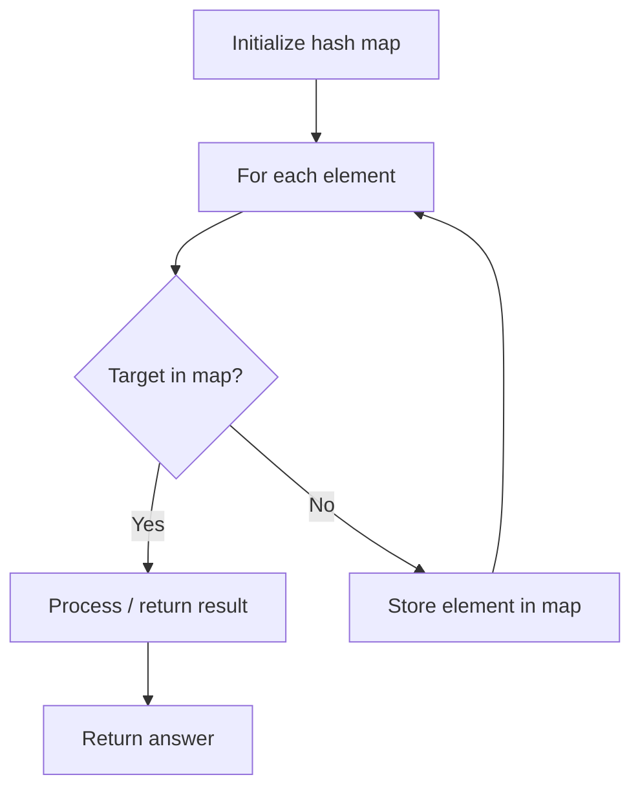

# Problem 1072: Flip Columns For Maximum Number of Equal Rows

**Difficulty:** Medium  
**Tags:** Array, Hash Table, Matrix  
**Pattern:** Hash Map Lookup  
**Link:** [leetcode.com/problems/flip-columns-for-maximum-number-of-equal-rows](https://leetcode.com/problems/flip-columns-for-maximum-number-of-equal-rows/)

## Description

You are given an `m x n` binary matrix `matrix`.

You can choose any number of columns in the matrix and flip every cell in that column (i.e., Change the value of the cell from `0` to `1` or vice versa).

Return *the maximum number of rows that have all values equal after some number of flips*.

 

Example 1:

```

**Input:** matrix = [[0,1],[1,1]]
**Output:** 1
**Explanation:** After flipping no values, 1 row has all values equal.

```

Example 2:

```

**Input:** matrix = [[0,1],[1,0]]
**Output:** 2
**Explanation:** After flipping values in the first column, both rows have equal values.

```

Example 3:

```

**Input:** matrix = [[0,0,0],[0,0,1],[1,1,0]]
**Output:** 2
**Explanation:** After flipping values in the first two columns, the last two rows have equal values.

```

 

**Constraints:**

	- `m == matrix.length`
	- `n == matrix[i].length`
	- `1 <= m, n <= 300`
	- `matrix[i][j]` is either `0` or `1`.

## Approach: Hash Map Lookup

Use a hash map (dictionary) to store elements for O(1) lookup. Iterate through the input, checking membership or counting frequencies in the map.

## Pseudocode

```
1. Initialize hash map
2. Iterate through elements:
   a. Check if target/complement exists in map
   b. If found: process result
   c. Otherwise: store element in map
3. Return result
```

## Algorithm Flow



## Complexity Analysis

- **Time:** O(n)
- **Space:** O(n)

## Solution (Python3)

```python
class Solution:
    def maxEqualRowsAfterFlips(self, matrix: List[List[int]]) -> int:
        # Hash map approach - O(n) time, O(n) space
        seen = {}
        for i, val in enumerate(matrix):
            complement = matrix - val
            if complement in seen:
                return [seen[complement], i]
            seen[val] = i
        return 0
```

## Solution (C++)

```cpp
#include <string>
#include <unordered_map>
#include <vector>
using namespace std;

class Solution {
public:
    int maxEqualRowsAfterFlips(vector<vector<int>>& matrix) {
        // Hash map approach - O(n) time, O(n) space
        unordered_map<int, int> seen;
        for (int i = 0; i < matrix.size(); i++) {
            int complement = matrix - matrix[i];
            if (seen.count(complement)) {
                return {seen[complement], i};
            }
            seen[matrix[i]] = i;
        }
        return 0;
    }
};
```
