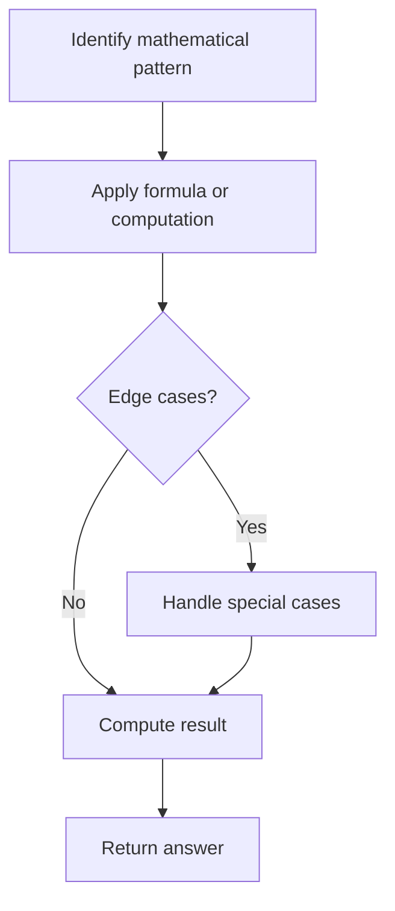

# Problem 1073: Adding Two Negabinary Numbers

**Difficulty:** Medium  
**Tags:** Array, Math  
**Pattern:** Math  
**Link:** [leetcode.com/problems/adding-two-negabinary-numbers](https://leetcode.com/problems/adding-two-negabinary-numbers/)

## Description

Given two numbers `arr1` and `arr2` in base **-2**, return the result of adding them together.

Each number is given in *array format*:  as an array of 0s and 1s, from most significant bit to least significant bit.  For example, `arr = [1,1,0,1]` represents the number `(-2)^3 + (-2)^2 + (-2)^0 = -3`.  A number `arr` in *array, format* is also guaranteed to have no leading zeros: either `arr == [0]` or `arr[0] == 1`.

Return the result of adding `arr1` and `arr2` in the same format: as an array of 0s and 1s with no leading zeros.

 

Example 1:

```

**Input:** arr1 = [1,1,1,1,1], arr2 = [1,0,1]
**Output:** [1,0,0,0,0]
**Explanation: **arr1 represents 11, arr2 represents 5, the output represents 16.

```

Example 2:

```

**Input:** arr1 = [0], arr2 = [0]
**Output:** [0]

```

Example 3:

```

**Input:** arr1 = [0], arr2 = [1]
**Output:** [1]

```

 

**Constraints:**

	- `1 <= arr1.length, arr2.length <= 1000`
	- `arr1[i]` and `arr2[i]` are `0` or `1`
	- `arr1` and `arr2` have no leading zeros

## Approach: Math

Apply mathematical properties, formulas, or number-theoretic concepts. Look for patterns, modular arithmetic, or closed-form solutions.

## Pseudocode

```
1. Identify the mathematical pattern or formula
2. Apply computation:
   - Modular arithmetic for large numbers
   - GCD/LCM for divisibility
   - Sieve for primes
3. Handle edge cases
4. Return result
```

## Algorithm Flow



## Complexity Analysis

- **Time:** O(n) or O(sqrt(n))
- **Space:** O(1)

## Solution (Python3)

```python
class Solution:
    def addNegabinary(self, arr1: List[int], arr2: List[int]) -> List[int]:
        # Mathematical approach
        result = 0
        x = arr1
        while x != 0:
            result = result * 10 + x % 10
            x //= 10 if isinstance(x, int) else 1
        return result
```

## Solution (C++)

```cpp
#include <string>
#include <vector>
using namespace std;

class Solution {
public:
    vector<int> addNegabinary(vector<int>& arr1, vector<int>& arr2) {
        // Mathematical approach
        long long result = 0;
        int x = arr1;
        while (x != 0) {
            result = result * 10 + x % 10;
            x /= 10;
        }
        return (int)result;
    }
};
```
