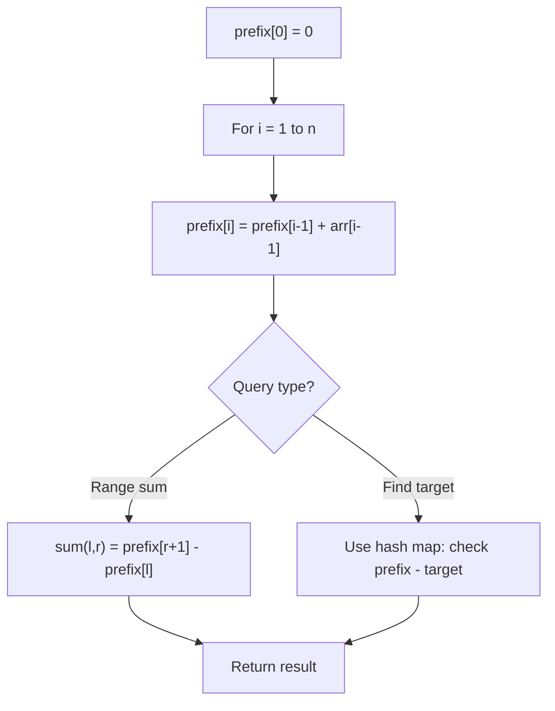

# Problem 1074: Number of Submatrices That Sum to Target

**Difficulty:** Hard  
**Tags:** Array, Hash Table, Matrix, Prefix Sum  
**Pattern:** Prefix Sum  
**Link:** [leetcode.com/problems/number-of-submatrices-that-sum-to-target](https://leetcode.com/problems/number-of-submatrices-that-sum-to-target/)

## Description

Given a `matrix` and a `target`, return the number of non-empty submatrices that sum to target.

A submatrix `x1, y1, x2, y2` is the set of all cells `matrix[x][y]` with `x1 <= x <= x2` and `y1 <= y <= y2`.

Two submatrices `(x1, y1, x2, y2)` and `(x1', y1', x2', y2')` are different if they have some coordinate that is different: for example, if `x1 != x1'`.

 

Example 1:

```

**Input:** matrix = [[0,1,0],[1,1,1],[0,1,0]], target = 0
**Output:** 4
**Explanation:** The four 1x1 submatrices that only contain 0.

```

Example 2:

```

**Input:** matrix = [[1,-1],[-1,1]], target = 0
**Output:** 5
**Explanation:** The two 1x2 submatrices, plus the two 2x1 submatrices, plus the 2x2 submatrix.

```

Example 3:

```

**Input:** matrix = [[904]], target = 0
**Output:** 0

```

 

**Constraints:**

	- `1 <= matrix.length <= 100`
	- `1 <= matrix[0].length <= 100`
	- `-1000 <= matrix[i][j] <= 1000`
	- `-10^8 <= target <= 10^8`

## Approach: Prefix Sum

Build a prefix sum array where prefix[i] = sum of elements 0..i-1. Any subarray sum [l..r] = prefix[r+1] - prefix[l]. Combine with hash map for O(n) subarray sum queries.

## Pseudocode

```
1. Build prefix sum array: prefix[0]=0, prefix[i]=prefix[i-1]+arr[i-1]
2. Use prefix sums to answer queries:
   - Subarray sum [l..r] = prefix[r+1] - prefix[l]
   - Or use hash map to find prefix[j]-prefix[i] == target
3. Return result
```

## Algorithm Flow



## Complexity Analysis

- **Time:** O(n)
- **Space:** O(n)

## Solution (Python3)

```python
class Solution:
    def numSubmatrixSumTarget(self, matrix: List[List[int]], target: int) -> int:
        # Prefix sum approach - O(n) time, O(n) space
        prefix = {0: -1}
        curr_sum = 0
        result = 0
        target = target if isinstance(target, int) else 0
        for i, val in enumerate(matrix):
            curr_sum += val
            if curr_sum - target in prefix:
                result = max(result, i - prefix[curr_sum - target])
            if curr_sum not in prefix:
                prefix[curr_sum] = i
        return result
```

## Solution (C++)

```cpp
#include <algorithm>
#include <string>
#include <unordered_map>
#include <vector>
using namespace std;

class Solution {
public:
    int numSubmatrixSumTarget(vector<vector<int>>& matrix, int target) {
        // Prefix sum approach - O(n) time, O(n) space
        unordered_map<int, int> prefix;
        prefix[0] = -1;
        int curr_sum = 0, result = 0;
        int target = target;
        for (int i = 0; i < (int)matrix.size(); i++) {
            curr_sum += matrix[i];
            if (prefix.count(curr_sum - target)) {
                result = max(result, i - prefix[curr_sum - target]);
            }
            if (!prefix.count(curr_sum)) {
                prefix[curr_sum] = i;
            }
        }
        return result;
    }
};
```
