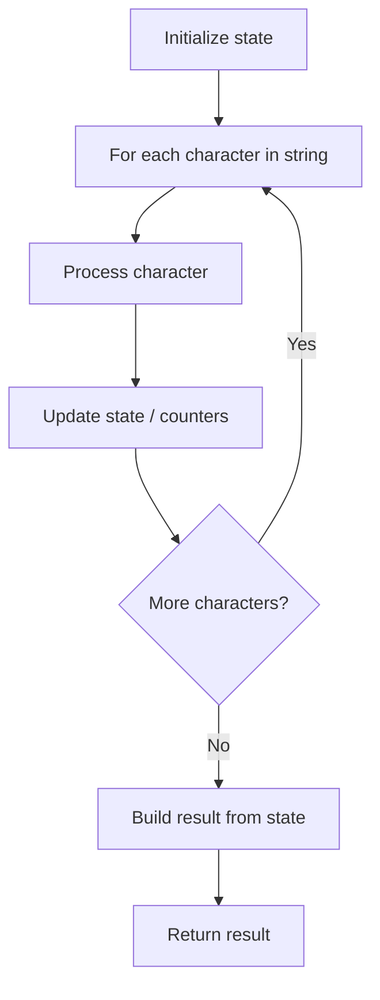

# Problem 1078: Occurrences After Bigram

**Difficulty:** Easy  
**Tags:** String  
**Pattern:** String Processing  
**Link:** [leetcode.com/problems/occurrences-after-bigram](https://leetcode.com/problems/occurrences-after-bigram/)

## Description

Given two strings `first` and `second`, consider occurrences in some text of the form `"first second third"`, where `second` comes immediately after `first`, and `third` comes immediately after `second`.

Return *an array of all the words* `third` *for each occurrence of* `"first second third"`.

 

Example 1:

```
**Input:** text = "alice is a good girl she is a good student", first = "a", second = "good"
**Output:** ["girl","student"]

```
Example 2:

```
**Input:** text = "we will we will rock you", first = "we", second = "will"
**Output:** ["we","rock"]

```

 

**Constraints:**

	- `1 <= text.length <= 1000`
	- `text` consists of lowercase English letters and spaces.
	- All the words in `text` are separated by **a single space**.
	- `1 <= first.length, second.length <= 10`
	- `first` and `second` consist of lowercase English letters.
	- `text` will not have any leading or trailing spaces.

## Approach: String Processing

Process the string character by character. Common techniques: two pointers, sliding window, hash map for frequencies, stack for matching.

## Pseudocode

```
1. Initialize result / tracking state
2. Iterate through string characters:
   a. Process character based on rules
   b. Update state (counters, pointers, stack)
3. Build and return result
```

## Algorithm Flow



## Complexity Analysis

- **Time:** O(n)
- **Space:** O(n)

## Solution (Python3)

```python
class Solution:
    def findOcurrences(self, text: str, first: str, second: str) -> List[str]:
        # String processing approach - O(n) time
        result = []
        for ch in text:
            if ch.isalnum():
                result.append(ch.lower())
        # Check palindrome or process
        processed = ''.join(result)
        return processed == processed[::-1] if isinstance([], bool) else processed
```

## Solution (C++)

```cpp
#include <algorithm>
#include <cctype>
#include <string>
#include <vector>
using namespace std;

class Solution {
public:
    vector<string> findOcurrences(string& text, string& first, string& second) {
        // String processing approach - O(n) time
        string processed;
        for (char ch : text) {
            if (isalnum(ch)) {
                processed += tolower(ch);
            }
        }
        string rev = processed;
        reverse(rev.begin(), rev.end());
        return processed == rev;
    }
};
```
