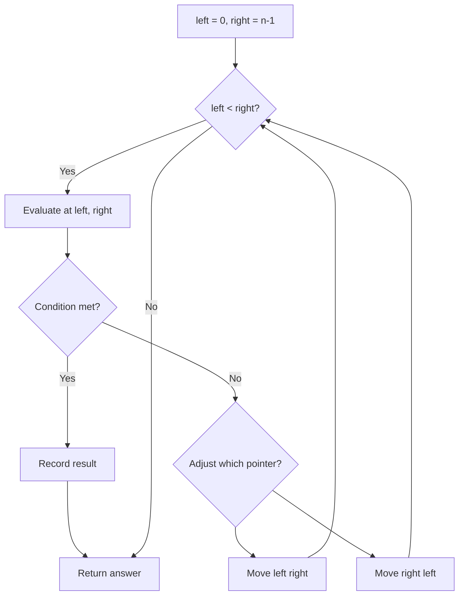
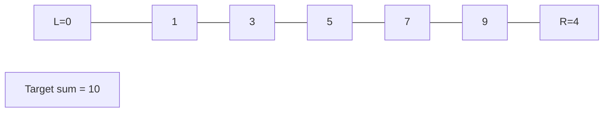
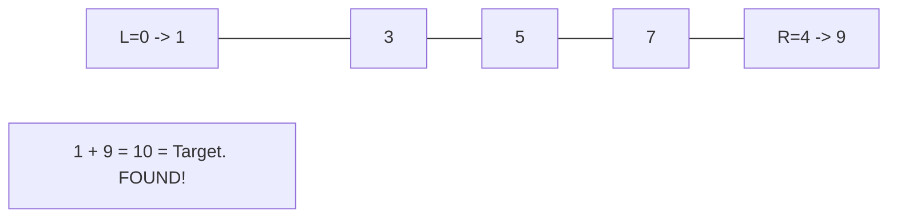

# Problem 1089: Duplicate Zeros

**Difficulty:** Easy  
**Tags:** Array, Two Pointers  
**Pattern:** Two Pointers  
**Link:** [leetcode.com/problems/duplicate-zeros](https://leetcode.com/problems/duplicate-zeros/)

## Description

Given a fixed-length integer array `arr`, duplicate each occurrence of zero, shifting the remaining elements to the right.

**Note** that elements beyond the length of the original array are not written. Do the above modifications to the input array in place and do not return anything.

 

Example 1:

```

**Input:** arr = [1,0,2,3,0,4,5,0]
**Output:** [1,0,0,2,3,0,0,4]
**Explanation:** After calling your function, the input array is modified to: [1,0,0,2,3,0,0,4]

```

Example 2:

```

**Input:** arr = [1,2,3]
**Output:** [1,2,3]
**Explanation:** After calling your function, the input array is modified to: [1,2,3]

```

 

**Constraints:**

	- `1 <= arr.length <= 10^4`
	- `0 <= arr[i] <= 9`

## Approach: Two Pointers

Use two pointers moving through the data structure. Depending on the problem, pointers may move toward each other (converging), in the same direction (fast/slow), or independently.

## Pseudocode

```
1. Initialize left = 0, right = n-1 (or two independent pointers)
2. While pointers haven't crossed:
   a. Evaluate condition at pointer positions
   b. Move left pointer right or right pointer left
3. Return result
```

## Algorithm Flow



## Visual State Transitions

**Two Pointer Convergence:**

**Frame 1: Initialize pointers**


**Frame 2: Sum = 1+9 = 10, found!**



## Complexity Analysis

- **Time:** O(n)
- **Space:** O(1)

## Solution (Python3)

```python
class Solution:
    def duplicateZeros(self, arr: List[int]) -> None:
        # Two pointer approach - O(n) time, O(1) space
        left, right = 0, len(arr) - 1
        while left < right:
            curr = arr[left] + arr[right]
            if curr == arr:
                return [left, right]
            elif curr < arr:
                left += 1
            else:
                right -= 1
        return None
```

## Solution (C++)

```cpp
#include <string>
#include <vector>
using namespace std;

class Solution {
public:
    void duplicateZeros(vector<int>& arr) {
        // Two pointer approach - O(n) time, O(1) space
        int left = 0, right = arr.size() - 1;
        while (left < right) {
            int curr = arr[left] + arr[right];
            if (curr == arr) {
                return {left, right};
            } else if (curr < arr) {
                left++;
            } else {
                right--;
            }
        }
        return ;
    }
};
```
