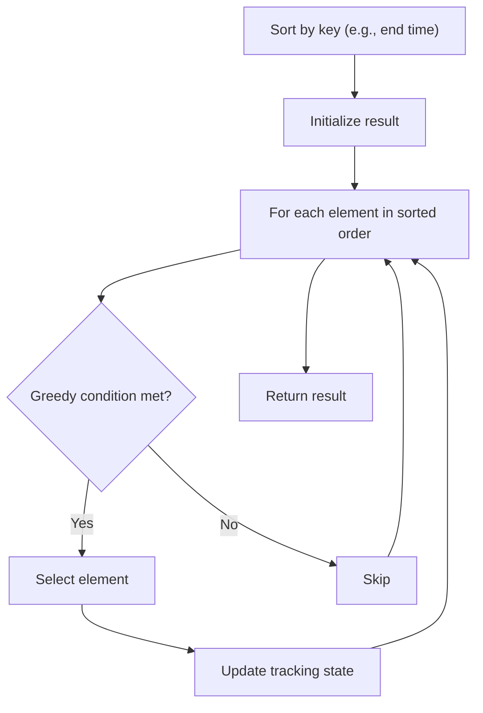

# Problem 1090: Largest Values From Labels

**Difficulty:** Medium  
**Tags:** Array, Hash Table, Greedy, Sorting, Counting  
**Pattern:** Greedy with Sorting  
**Link:** [leetcode.com/problems/largest-values-from-labels](https://leetcode.com/problems/largest-values-from-labels/)

## Description

You are given `n` item's value and label as two integer arrays `values` and `labels`. You are also given two integers `numWanted` and `useLimit`.

Your task is to find a subset of items with the **maximum sum** of their values such that:

	- The number of items is **at most** `numWanted`.
	- The number of items with the same label is **at most** `useLimit`.

Return the maximum sum.

 

Example 1:

**Input:** values = [5,4,3,2,1], labels = [1,1,2,2,3], numWanted = 3, useLimit = 1

**Output:** 9

**Explanation:**

The subset chosen is the first, third, and fifth items with the sum of values 5 + 3 + 1.

Example 2:

**Input:** values = [5,4,3,2,1], labels = [1,3,3,3,2], numWanted = 3, useLimit = 2

**Output:** 12

**Explanation:**

The subset chosen is the first, second, and third items with the sum of values 5 + 4 + 3.

Example 3:

**Input:** values = [9,8,8,7,6], labels = [0,0,0,1,1], numWanted = 3, useLimit = 1

**Output:** 16

**Explanation:**

The subset chosen is the first and fourth items with the sum of values 9 + 7.

 

**Constraints:**

	- `n == values.length == labels.length`
	- `1 <= n <= 2 * 10^4`
	- `0 <= values[i], labels[i] <= 2 * 10^4`
	- `1 <= numWanted, useLimit <= n`

## Approach: Greedy with Sorting

Sort the input by a key criterion, then greedily process elements in sorted order. The sorting ensures the greedy choice is always optimal.

## Pseudocode

```
1. Sort elements by key (start time, weight, etc.)
2. Initialize result, tracking variables
3. For each element in sorted order:
   a. Apply greedy selection rule
   b. Update result
4. Return result
```

## Algorithm Flow



## Complexity Analysis

- **Time:** O(n log n)
- **Space:** O(n)

## Solution (Python3)

```python
class Solution:
    def largestValsFromLabels(self, values: List[int], labels: List[int], numWanted: int, useLimit: int) -> int:
        # Sort + greedy - O(n log n) time
        values.sort()
        result = 0
        curr_end = 0
        for item in values:
            if isinstance(item, (list, tuple)):
                if item[0] >= curr_end:
                    result += 1
                    curr_end = item[1]
            else:
                result += 1
        return result
```

## Solution (C++)

```cpp
#include <algorithm>
#include <string>
#include <vector>
using namespace std;

class Solution {
public:
    int largestValsFromLabels(vector<int>& values, vector<int>& labels, int numWanted, int useLimit) {
        // Sort + greedy - O(n log n) time
        sort(values.begin(), values.end());
        int result = 0, curr_end = 0;
        for (auto& item : values) {
            result++;
        }
        return result;
    }
};
```
