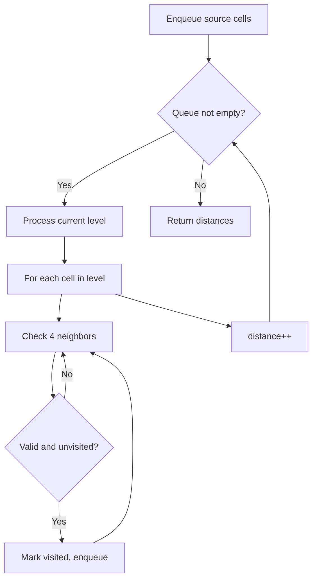
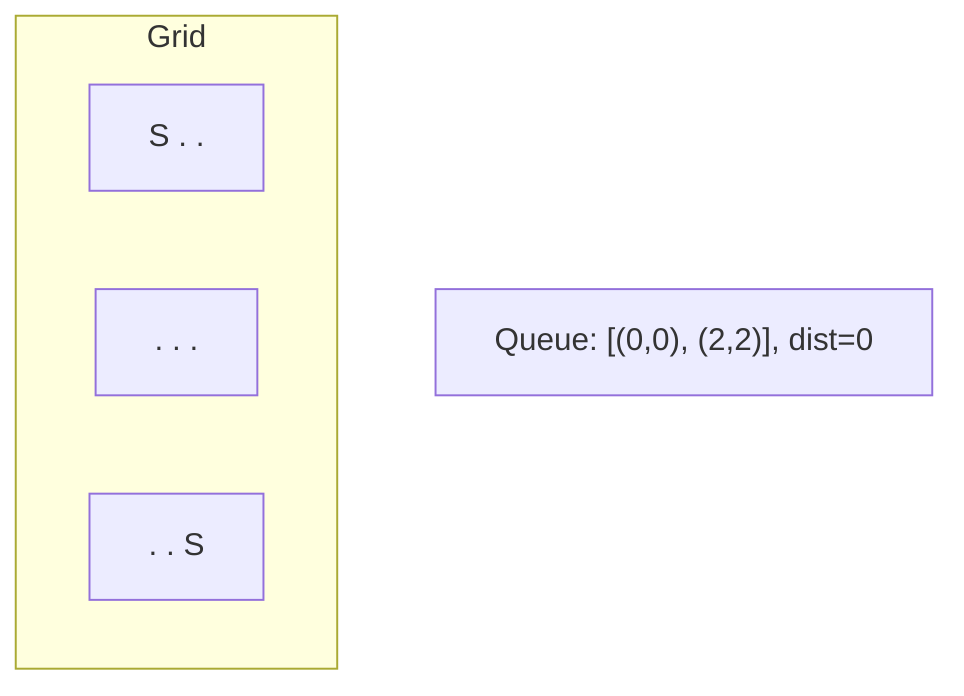
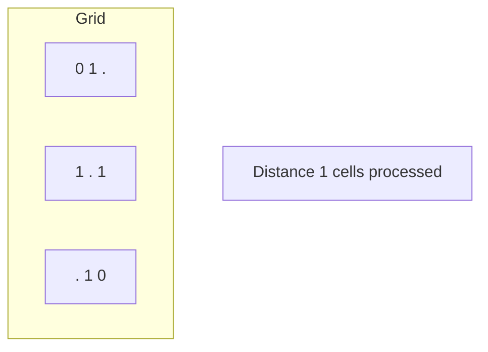
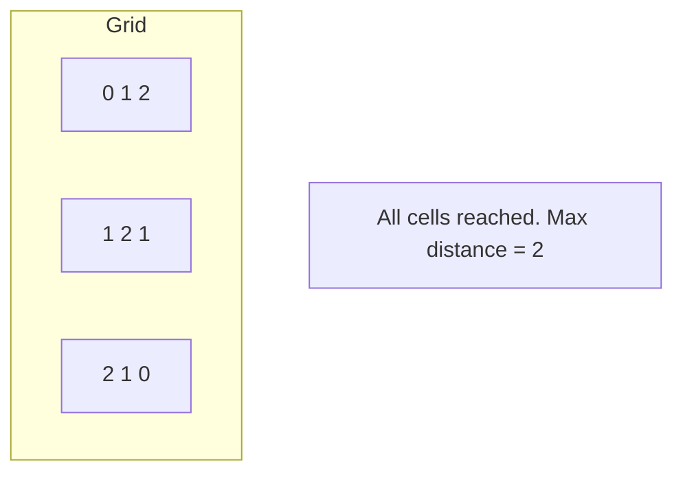

# Problem 1091: Shortest Path in Binary Matrix

**Difficulty:** Medium  
**Tags:** Array, Breadth-First Search, Matrix  
**Pattern:** BFS / Shortest Path  
**Link:** [leetcode.com/problems/shortest-path-in-binary-matrix](https://leetcode.com/problems/shortest-path-in-binary-matrix/)

## Description

Given an `n x n` binary matrix `grid`, return *the length of the shortest **clear path** in the matrix*. If there is no clear path, return `-1`.

A **clear path** in a binary matrix is a path from the **top-left** cell (i.e., `(0, 0)`) to the **bottom-right** cell (i.e., `(n - 1, n - 1)`) such that:

	- All the visited cells of the path are `0`.
	- All the adjacent cells of the path are **8-directionally** connected (i.e., they are different and they share an edge or a corner).

The **length of a clear path** is the number of visited cells of this path.

 

Example 1:

```

**Input:** grid = [[0,1],[1,0]]
**Output:** 2

```

Example 2:

```

**Input:** grid = [[0,0,0],[1,1,0],[1,1,0]]
**Output:** 4

```

Example 3:

```

**Input:** grid = [[1,0,0],[1,1,0],[1,1,0]]
**Output:** -1

```

 

**Constraints:**

	- `n == grid.length`
	- `n == grid[i].length`
	- `1 <= n <= 100`
	- `grid[i][j] is 0 or 1`

## Approach: BFS / Shortest Path

BFS from (0,0) to (n-1,n-1) allowing 8-directional movement.

## Pseudocode

```
1. Enqueue all source cells, mark visited
2. distance = 0
3. While queue not empty:
   a. Process all cells at current distance
   b. For each cell, enqueue unvisited neighbors
   c. distance++
4. Return result
```

## Algorithm Flow



## Visual State Transitions

**Multi-source BFS on Grid:**

**Frame 1: Enqueue all sources**


**Frame 2: Expand distance 1**


**Frame 3: Expand distance 2**



## Complexity Analysis

- **Time:** O(n^2)
- **Space:** O(n^2)

## Solution (Python3)

```python
from collections import deque

class Solution:
    def shortestPathBinaryMatrix(self, grid: list[list[int]]) -> int:
        n = len(grid)
        if grid[0][0] or grid[n-1][n-1]:
            return -1
        queue = deque([(0, 0, 1)])
        grid[0][0] = 1
        while queue:
            r, c, d = queue.popleft()
            if r == n-1 and c == n-1:
                return d
            for dr in [-1, 0, 1]:
                for dc in [-1, 0, 1]:
                    nr, nc = r+dr, c+dc
                    if 0 <= nr < n and 0 <= nc < n and grid[nr][nc] == 0:
                        grid[nr][nc] = 1
                        queue.append((nr, nc, d+1))
        return -1
```

## Solution (C++)

```cpp
#include <algorithm>
#include <queue>
#include <string>
#include <tuple>
#include <vector>
using namespace std;

class Solution {
public:
    int shortestPathBinaryMatrix(vector<vector<int>>& grid) {
        // BFS on grid - O(m*n) time
        if (grid.empty()) return 0;
        int rows = grid.size(), cols = grid[0].size();
        queue<tuple<int,int,int>> q;
        vector<vector<bool>> visited(rows, vector<bool>(cols, false));
        int dirs[4][2] = {{1,0},{-1,0},{0,1},{0,-1}};
        for (int r = 0; r < rows; r++)
            for (int c = 0; c < cols; c++)
                if (grid[r][c] == 1) {
                    q.push({r, c, 0});
                    visited[r][c] = true;
                }
        int steps = 0;
        while (!q.empty()) {
            auto [r, c, d] = q.front(); q.pop();
            steps = max(steps, d);
            for (auto& dir : dirs) {
                int nr = r+dir[0], nc = c+dir[1];
                if (nr>=0 && nr<rows && nc>=0 && nc<cols && !visited[nr][nc]) {
                    visited[nr][nc] = true;
                    q.push({nr, nc, d+1});
                }
            }
        }
        return steps;
    }
};
```
