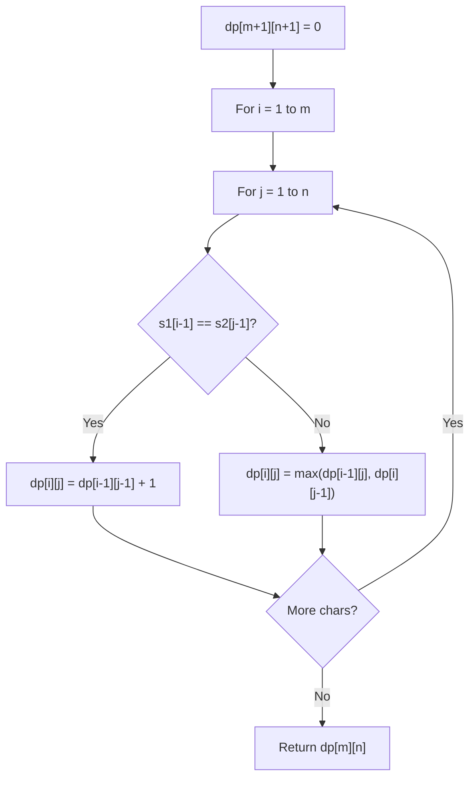

# Problem 1092: Shortest Common Supersequence 

**Difficulty:** Hard  
**Tags:** String, Dynamic Programming  
**Pattern:** Dynamic Programming (String)  
**Link:** [leetcode.com/problems/shortest-common-supersequence](https://leetcode.com/problems/shortest-common-supersequence/)

## Description

Given two strings `str1` and `str2`, return *the shortest string that has both *`str1`* and *`str2`* as **subsequences***. If there are multiple valid strings, return **any** of them.

A string `s` is a **subsequence** of string `t` if deleting some number of characters from `t` (possibly `0`) results in the string `s`.

 

Example 1:

```

**Input:** str1 = "abac", str2 = "cab"
**Output:** "cabac"
**Explanation:** 
str1 = "abac" is a subsequence of "cabac" because we can delete the first "c".
str2 = "cab" is a subsequence of "cabac" because we can delete the last "ac".
The answer provided is the shortest such string that satisfies these properties.

```

Example 2:

```

**Input:** str1 = "aaaaaaaa", str2 = "aaaaaaaa"
**Output:** "aaaaaaaa"

```

 

**Constraints:**

	- `1 <= str1.length, str2.length <= 1000`
	- `str1` and `str2` consist of lowercase English letters.

## Approach: Dynamic Programming (String)

Compare or match two strings using a 2D DP table. dp[i][j] represents the answer for substrings s1[0..i-1] and s2[0..j-1]. Common patterns: LCS, edit distance, regex matching.

## Pseudocode

```
1. Create dp[m+1][n+1]
2. Initialize base cases
3. For i from 1 to m:
   For j from 1 to n:
     If s1[i-1] == s2[j-1]: dp[i][j] = dp[i-1][j-1] + 1
     Else: dp[i][j] = best of (dp[i-1][j], dp[i][j-1], dp[i-1][j-1])
4. Return dp[m][n]
```

## Algorithm Flow



## Complexity Analysis

- **Time:** O(m * n)
- **Space:** O(m * n)

## Solution (Python3)

```python
class Solution:
    def shortestCommonSupersequence(self, str1: str, str2: str) -> str:
        # String DP - O(m*n) time and space
        m, n = len(str1), len(str2)
        dp = [[0] * (n + 1) for _ in range(m + 1)]
        for i in range(1, m + 1):
            for j in range(1, n + 1):
                if str1[i-1] == str2[j-1]:
                    dp[i][j] = dp[i-1][j-1] + 1
                else:
                    dp[i][j] = max(dp[i-1][j], dp[i][j-1])
        return dp[m][n]
```

## Solution (C++)

```cpp
#include <algorithm>
#include <string>
#include <vector>
using namespace std;

class Solution {
public:
    string shortestCommonSupersequence(string& str1, string& str2) {
        // String DP - O(m*n) time and space
        int m = str1.size(), n = str2.size();
        vector<vector<int>> dp(m + 1, vector<int>(n + 1, 0));
        for (int i = 1; i <= m; i++) {
            for (int j = 1; j <= n; j++) {
                if (str1[i-1] == str2[j-1])
                    dp[i][j] = dp[i-1][j-1] + 1;
                else
                    dp[i][j] = max(dp[i-1][j], dp[i][j-1]);
            }
        }
        return dp[m][n];
    }
};
```
