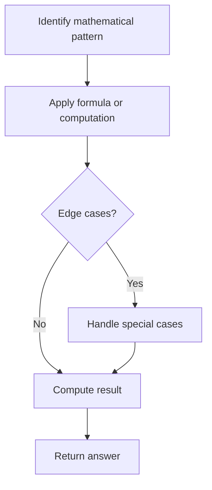

# Problem 1093: Statistics from a Large Sample

**Difficulty:** Medium  
**Tags:** Array, Math, Probability and Statistics  
**Pattern:** Math  
**Link:** [leetcode.com/problems/statistics-from-a-large-sample](https://leetcode.com/problems/statistics-from-a-large-sample/)

## Description

You are given a large sample of integers in the range `[0, 255]`. Since the sample is so large, it is represented by an array `count` where `count[k]` is the **number of times** that `k` appears in the sample.

Calculate the following statistics:

	- `minimum`: The minimum element in the sample.
	- `maximum`: The maximum element in the sample.
	- `mean`: The average of the sample, calculated as the total sum of all elements divided by the total number of elements.
	- `median`:
	
		If the sample has an odd number of elements, then the `median` is the middle element once the sample is sorted.
		- If the sample has an even number of elements, then the `median` is the average of the two middle elements once the sample is sorted.
	
	
	- `mode`: The number that appears the most in the sample. It is guaranteed to be **unique**.

Return *the statistics of the sample as an array of floating-point numbers *`[minimum, maximum, mean, median, mode]`*. Answers within *`10^-5`* of the actual answer will be accepted.*

 

Example 1:

```

**Input:** count = [0,1,3,4,0,0,0,0,0,0,0,0,0,0,0,0,0,0,0,0,0,0,0,0,0,0,0,0,0,0,0,0,0,0,0,0,0,0,0,0,0,0,0,0,0,0,0,0,0,0,0,0,0,0,0,0,0,0,0,0,0,0,0,0,0,0,0,0,0,0,0,0,0,0,0,0,0,0,0,0,0,0,0,0,0,0,0,0,0,0,0,0,0,0,0,0,0,0,0,0,0,0,0,0,0,0,0,0,0,0,0,0,0,0,0,0,0,0,0,0,0,0,0,0,0,0,0,0,0,0,0,0,0,0,0,0,0,0,0,0,0,0,0,0,0,0,0,0,0,0,0,0,0,0,0,0,0,0,0,0,0,0,0,0,0,0,0,0,0,0,0,0,0,0,0,0,0,0,0,0,0,0,0,0,0,0,0,0,0,0,0,0,0,0,0,0,0,0,0,0,0,0,0,0,0,0,0,0,0,0,0,0,0,0,0,0,0,0,0,0,0,0,0,0,0,0,0,0,0,0,0,0,0,0,0,0,0,0,0,0,0,0,0,0,0,0,0,0,0,0,0,0,0,0,0,0]
**Output:** [1.00000,3.00000,2.37500,2.50000,3.00000]
**Explanation:** The sample represented by count is [1,2,2,2,3,3,3,3].
The minimum and maximum are 1 and 3 respectively.
The mean is (1+2+2+2+3+3+3+3) / 8 = 19 / 8 = 2.375.
Since the size of the sample is even, the median is the average of the two middle elements 2 and 3, which is 2.5.
The mode is 3 as it appears the most in the sample.

```

Example 2:

```

**Input:** count = [0,4,3,2,2,0,0,0,0,0,0,0,0,0,0,0,0,0,0,0,0,0,0,0,0,0,0,0,0,0,0,0,0,0,0,0,0,0,0,0,0,0,0,0,0,0,0,0,0,0,0,0,0,0,0,0,0,0,0,0,0,0,0,0,0,0,0,0,0,0,0,0,0,0,0,0,0,0,0,0,0,0,0,0,0,0,0,0,0,0,0,0,0,0,0,0,0,0,0,0,0,0,0,0,0,0,0,0,0,0,0,0,0,0,0,0,0,0,0,0,0,0,0,0,0,0,0,0,0,0,0,0,0,0,0,0,0,0,0,0,0,0,0,0,0,0,0,0,0,0,0,0,0,0,0,0,0,0,0,0,0,0,0,0,0,0,0,0,0,0,0,0,0,0,0,0,0,0,0,0,0,0,0,0,0,0,0,0,0,0,0,0,0,0,0,0,0,0,0,0,0,0,0,0,0,0,0,0,0,0,0,0,0,0,0,0,0,0,0,0,0,0,0,0,0,0,0,0,0,0,0,0,0,0,0,0,0,0,0,0,0,0,0,0,0,0,0,0,0,0,0,0,0,0,0,0]
**Output:** [1.00000,4.00000,2.18182,2.00000,1.00000]
**Explanation:** The sample represented by count is [1,1,1,1,2,2,2,3,3,4,4].
The minimum and maximum are 1 and 4 respectively.
The mean is (1+1+1+1+2+2+2+3+3+4+4) / 11 = 24 / 11 = 2.18181818... (for display purposes, the output shows the rounded number 2.18182).
Since the size of the sample is odd, the median is the middle element 2.
The mode is 1 as it appears the most in the sample.

```

 

**Constraints:**

	- `count.length == 256`
	- `0 <= count[i] <= 10^9`
	- `1 <= sum(count) <= 10^9`
	- The mode of the sample that `count` represents is **unique**.

## Approach: Math

Apply mathematical properties, formulas, or number-theoretic concepts. Look for patterns, modular arithmetic, or closed-form solutions.

## Pseudocode

```
1. Identify the mathematical pattern or formula
2. Apply computation:
   - Modular arithmetic for large numbers
   - GCD/LCM for divisibility
   - Sieve for primes
3. Handle edge cases
4. Return result
```

## Algorithm Flow



## Complexity Analysis

- **Time:** O(n) or O(sqrt(n))
- **Space:** O(1)

## Solution (Python3)

```python
class Solution:
    def sampleStats(self, count: List[int]) -> List[float]:
        # Mathematical approach
        result = 0
        x = count
        while x != 0:
            result = result * 10 + x % 10
            x //= 10 if isinstance(x, int) else 1
        return result
```

## Solution (C++)

```cpp
#include <string>
#include <vector>
using namespace std;

class Solution {
public:
    vector<double> sampleStats(vector<int>& count) {
        // Mathematical approach
        long long result = 0;
        int x = count;
        while (x != 0) {
            result = result * 10 + x % 10;
            x /= 10;
        }
        return (int)result;
    }
};
```
